# Architecture and Design Documentation

## Overview

The Splunk MCP Integration platform is designed as a modern, cloud-native, microservices-based architecture that enables natural language interactions with Splunk Enterprise. This document provides comprehensive architectural guidance, design patterns, and implementation details for the entire system.

## Table of Contents

- [System Architecture](#system-architecture)
- [Microservices Design](#microservices-design)
- [Database Architecture](#database-architecture)
- [API Design Patterns](#api-design-patterns)
- [Security Architecture](#security-architecture)
- [Deployment Architecture](#deployment-architecture)
- [Data Flow and Integration](#data-flow-and-integration)
- [Performance and Scalability](#performance-and-scalability)
- [Monitoring and Observability](#monitoring-and-observability)
- [Design Principles](#design-principles)

## System Architecture

### High-Level Architecture Overview

The Splunk MCP Integration platform follows a layered, microservices architecture designed for scalability, maintainability, and enterprise-grade reliability.

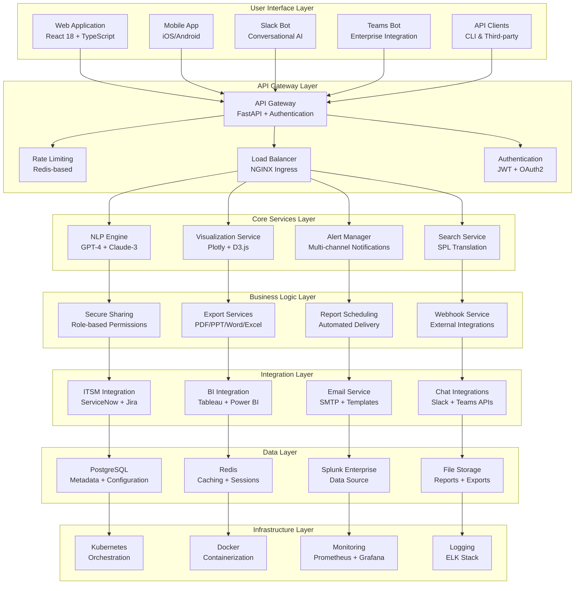

### Architecture Principles

#### 1. Microservices Architecture
- **Service Decomposition**: Each business capability is implemented as an independent service
- **Data Ownership**: Each service owns its data and database schema
- **Communication**: Services communicate via well-defined REST APIs
- **Deployment Independence**: Services can be deployed, scaled, and updated independently

#### 2. Domain-Driven Design (DDD)
- **Bounded Contexts**: Clear boundaries between different business domains
- **Ubiquitous Language**: Consistent terminology across teams and code
- **Aggregate Roots**: Well-defined entities that maintain data consistency
- **Event-Driven Communication**: Services communicate through domain events

#### 3. Cloud-Native Principles
- **Containerization**: All services are containerized using Docker
- **Orchestration**: Kubernetes manages deployment, scaling, and operations
- **Configuration Management**: External configuration through environment variables
- **Observability**: Comprehensive monitoring, logging, and tracing

### Service Communication Patterns

#### Synchronous Communication
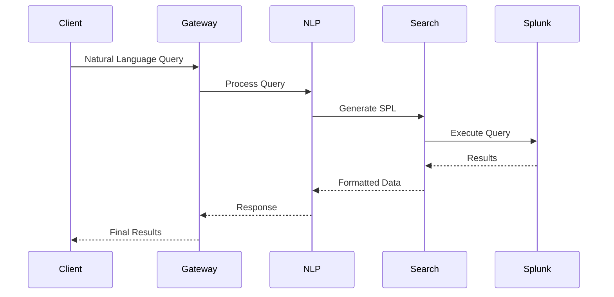

#### Asynchronous Communication
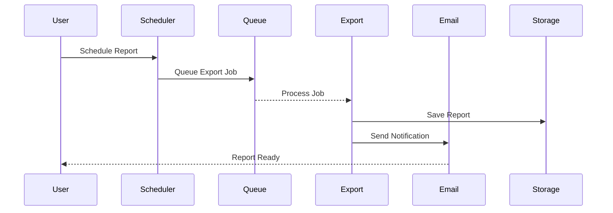

## Microservices Design

### Service Catalog

| Service | Port | Purpose | Dependencies | Database |
|---------|------|---------|--------------|----------|
| API Gateway | 8000 | Authentication, Routing, Rate Limiting | Redis, PostgreSQL | Shared |
| NLP Engine | 8001 | Natural Language Processing, SPL Translation | OpenAI/Anthropic APIs | PostgreSQL |
| Visualization | 8002 | Chart Generation, Dashboard Management | None | PostgreSQL |
| Alert Manager | 8003 | Alert Management, Notifications | Email, Slack, Teams | PostgreSQL |
| Slack Bot | 8004 | Slack Integration, Conversational AI | Slack API | PostgreSQL |
| Teams Bot | 8005 | Microsoft Teams Integration | Microsoft Bot Framework | PostgreSQL |
| Email Service | 8006 | Email Processing, Report Delivery | SMTP Server | PostgreSQL |
| Webhook Service | 8007 | External Webhook Management | None | PostgreSQL |
| BI Integration | 8008 | Tableau, Power BI Integration | BI Platform APIs | PostgreSQL |
| PDF Export | 8009 | PDF Report Generation | WeasyPrint | PostgreSQL |
| PowerPoint Export | 8011 | PowerPoint Generation | python-pptx | PostgreSQL |
| HTML Report | 8012 | Interactive HTML Reports | Plotly.js | PostgreSQL |
| Word Export | 8013 | Word Document Generation | python-docx | PostgreSQL |
| CSV Export | 8014 | CSV Data Export | pandas | PostgreSQL |
| JSON/XML Export | 8015 | Structured Data Export | lxml | PostgreSQL |
| Secure Sharing | 8016 | Resource Sharing, Access Control | None | PostgreSQL |
| Report Scheduling | 8017 | Automated Report Scheduling | Celery/Redis | PostgreSQL |
| ITSM Service | 8018 | ServiceNow, Jira Integration | ITSM APIs | PostgreSQL |

### Service Design Patterns

#### 1. Single Responsibility Principle
Each service has a single, well-defined responsibility:
- **NLP Engine**: Natural language processing and SPL translation
- **Visualization**: Chart and dashboard generation
- **Alert Manager**: Alert management and notifications
- **Export Services**: Document and data export in various formats

#### 2. Database per Service
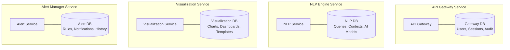

#### 3. API-First Design
All services expose well-defined REST APIs with:
- **OpenAPI 3.0 Specifications**: Comprehensive API documentation
- **Versioning**: `/api/v1/` URL prefix for backward compatibility
- **Consistent Response Format**: Standardized JSON responses
- **Error Handling**: HTTP status codes and detailed error messages

#### 4. Circuit Breaker Pattern
```python
from circuitbreaker import circuit

@circuit(failure_threshold=5, recovery_timeout=30)
def call_external_service(data):
    """Call external service with circuit breaker protection"""
    response = requests.post(external_url, json=data, timeout=10)
    response.raise_for_status()
    return response.json()
```

### Service Dependencies and Data Flow

#### Core Service Dependencies
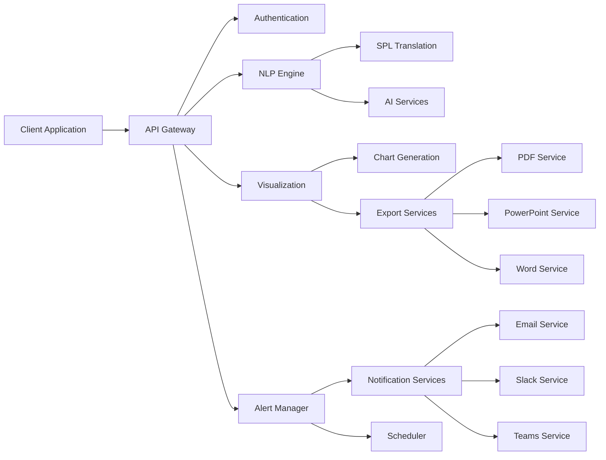

## Database Architecture

### Database Design Philosophy

#### 1. Microservice Data Isolation
Each microservice owns its data and database schema, ensuring:
- **Data Encapsulation**: No direct database access between services
- **Schema Evolution**: Services can evolve their schemas independently
- **Technology Diversity**: Different services can use different database technologies
- **Fault Isolation**: Database issues in one service don't affect others

#### 2. CQRS (Command Query Responsibility Segregation)
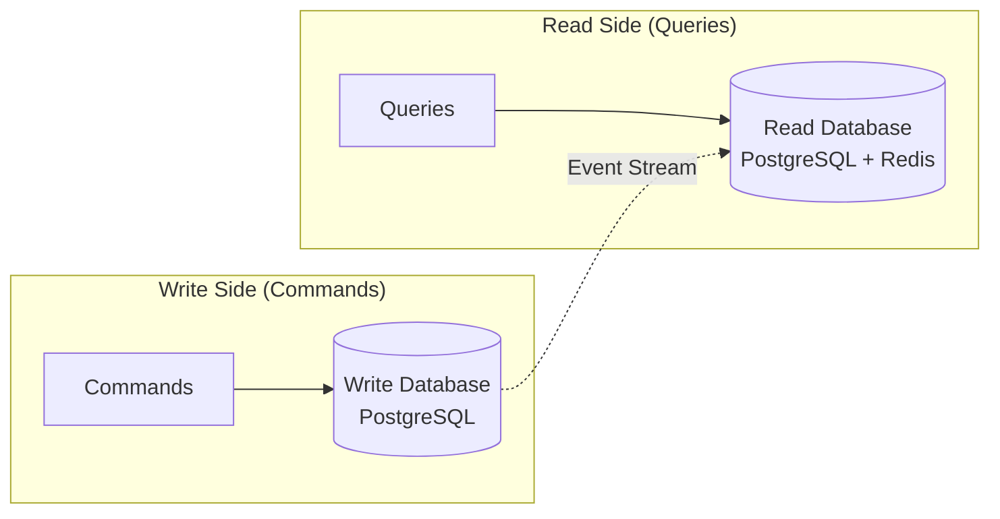

### Database Schema Design

#### Core Entities and Relationships
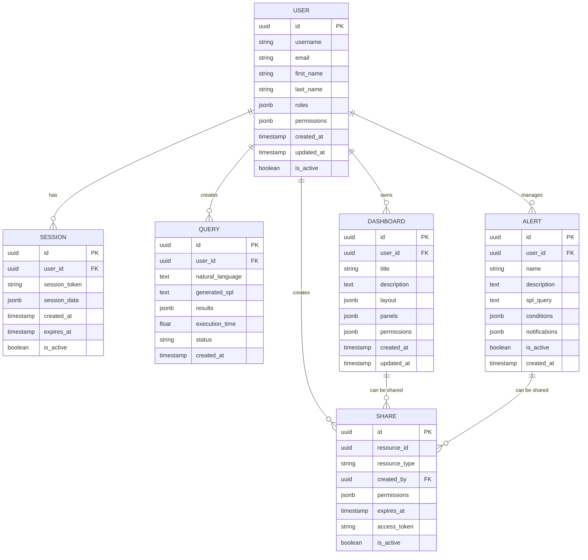

#### Service-Specific Schemas

##### API Gateway Schema
```sql
-- Users table
CREATE TABLE users (
    id UUID PRIMARY KEY DEFAULT gen_random_uuid(),
    username VARCHAR(255) UNIQUE NOT NULL,
    email VARCHAR(255) UNIQUE NOT NULL,
    first_name VARCHAR(255),
    last_name VARCHAR(255),
    password_hash VARCHAR(255),
    roles JSONB DEFAULT '[]',
    permissions JSONB DEFAULT '{}',
    preferences JSONB DEFAULT '{}',
    is_active BOOLEAN DEFAULT true,
    last_login TIMESTAMP,
    created_at TIMESTAMP DEFAULT CURRENT_TIMESTAMP,
    updated_at TIMESTAMP DEFAULT CURRENT_TIMESTAMP
);

-- Sessions table
CREATE TABLE user_sessions (
    id UUID PRIMARY KEY DEFAULT gen_random_uuid(),
    user_id UUID REFERENCES users(id) ON DELETE CASCADE,
    session_token VARCHAR(512) UNIQUE NOT NULL,
    session_data JSONB DEFAULT '{}',
    ip_address INET,
    user_agent TEXT,
    created_at TIMESTAMP DEFAULT CURRENT_TIMESTAMP,
    expires_at TIMESTAMP NOT NULL,
    is_active BOOLEAN DEFAULT true
);

-- API Keys table
CREATE TABLE api_keys (
    id UUID PRIMARY KEY DEFAULT gen_random_uuid(),
    user_id UUID REFERENCES users(id) ON DELETE CASCADE,
    name VARCHAR(255) NOT NULL,
    key_hash VARCHAR(512) UNIQUE NOT NULL,
    scopes JSONB DEFAULT '[]',
    last_used TIMESTAMP,
    usage_count INTEGER DEFAULT 0,
    is_active BOOLEAN DEFAULT true,
    created_at TIMESTAMP DEFAULT CURRENT_TIMESTAMP,
    expires_at TIMESTAMP
);
```

##### NLP Engine Schema
```sql
-- Queries table
CREATE TABLE nlp_queries (
    id UUID PRIMARY KEY DEFAULT gen_random_uuid(),
    user_id UUID NOT NULL,
    conversation_id UUID,
    natural_language TEXT NOT NULL,
    processed_intent JSONB,
    generated_spl TEXT,
    execution_results JSONB,
    execution_time FLOAT,
    accuracy_score FLOAT,
    status VARCHAR(50) DEFAULT 'pending',
    error_message TEXT,
    created_at TIMESTAMP DEFAULT CURRENT_TIMESTAMP
);

-- Query contexts table
CREATE TABLE query_contexts (
    id UUID PRIMARY KEY DEFAULT gen_random_uuid(),
    conversation_id UUID NOT NULL,
    context_data JSONB,
    user_preferences JSONB,
    session_variables JSONB,
    created_at TIMESTAMP DEFAULT CURRENT_TIMESTAMP,
    updated_at TIMESTAMP DEFAULT CURRENT_TIMESTAMP
);

-- AI model performance table
CREATE TABLE ai_model_metrics (
    id UUID PRIMARY KEY DEFAULT gen_random_uuid(),
    model_name VARCHAR(255) NOT NULL,
    query_type VARCHAR(100),
    accuracy_score FLOAT,
    response_time FLOAT,
    token_usage INTEGER,
    cost DECIMAL(10,4),
    created_at TIMESTAMP DEFAULT CURRENT_TIMESTAMP
);
```

### Data Consistency Patterns

#### 1. Eventual Consistency
For cross-service data synchronization:
```python
class EventPublisher:
    def publish_user_updated(self, user_id: str, user_data: dict):
        """Publish user update event to other services"""
        event = {
            "event_type": "user.updated",
            "user_id": user_id,
            "user_data": user_data,
            "timestamp": datetime.utcnow().isoformat()
        }
        
        # Publish to message queue
        self.message_queue.publish("user.events", event)
```

#### 2. Saga Pattern
For distributed transactions:
```python
class ShareCreationSaga:
    def create_secure_share(self, share_data):
        """Create secure share with distributed transaction"""
        try:
            # Step 1: Create share record
            share = self.create_share(share_data)
            
            # Step 2: Set up permissions
            self.setup_permissions(share.id, share_data.permissions)
            
            # Step 3: Send notifications
            self.send_notifications(share.id, share_data.recipients)
            
            # Step 4: Log audit event
            self.log_audit_event(share.id, "share.created")
            
            return share
            
        except Exception as e:
            # Compensating actions
            self.rollback_share_creation(share.id)
            raise
```

## API Design Patterns

### RESTful API Design

#### 1. Resource-Based URLs
```
# Good: Resource-based
GET    /api/v1/users
POST   /api/v1/users
GET    /api/v1/users/{id}
PUT    /api/v1/users/{id}
DELETE /api/v1/users/{id}

# Good: Nested resources
GET    /api/v1/users/{id}/dashboards
POST   /api/v1/users/{id}/dashboards
GET    /api/v1/dashboards/{id}/shares

# Bad: Action-based
POST   /api/v1/createUser
POST   /api/v1/getUserDashboards
```

#### 2. HTTP Methods and Status Codes
```python
from fastapi import HTTPException, status

class UserController:
    
    @app.get("/api/v1/users/{user_id}")
    async def get_user(user_id: str):
        user = await user_service.get_user(user_id)
        if not user:
            raise HTTPException(
                status_code=status.HTTP_404_NOT_FOUND,
                detail="User not found"
            )
        return user
    
    @app.post("/api/v1/users", status_code=status.HTTP_201_CREATED)
    async def create_user(user_data: UserCreate):
        try:
            user = await user_service.create_user(user_data)
            return user
        except ValidationError as e:
            raise HTTPException(
                status_code=status.HTTP_400_BAD_REQUEST,
                detail=str(e)
            )
```

#### 3. Standardized Response Format
```python
from pydantic import BaseModel
from typing import Optional, Any, List

class APIResponse(BaseModel):
    """Standardized API response format"""
    success: bool
    data: Optional[Any] = None
    message: Optional[str] = None
    errors: Optional[List[str]] = None
    metadata: Optional[dict] = None

# Success response
{
    "success": true,
    "data": {
        "id": "123",
        "name": "John Doe"
    },
    "metadata": {
        "timestamp": "2025-01-22T10:30:00Z",
        "version": "1.0"
    }
}

# Error response
{
    "success": false,
    "data": null,
    "message": "Validation failed",
    "errors": [
        "Email is required",
        "Password must be at least 8 characters"
    ],
    "metadata": {
        "timestamp": "2025-01-22T10:30:00Z",
        "correlation_id": "abc-123-def"
    }
}
```

### API Versioning Strategy

#### 1. URL Path Versioning
```python
# Version 1
@app.get("/api/v1/users/{user_id}")
async def get_user_v1(user_id: str):
    return await user_service.get_user_basic(user_id)

# Version 2 - with additional fields
@app.get("/api/v2/users/{user_id}")
async def get_user_v2(user_id: str):
    return await user_service.get_user_detailed(user_id)
```

#### 2. Header Versioning
```python
from fastapi import Header

@app.get("/api/users/{user_id}")
async def get_user(user_id: str, api_version: str = Header("v1")):
    if api_version == "v2":
        return await user_service.get_user_detailed(user_id)
    else:
        return await user_service.get_user_basic(user_id)
```

### API Documentation Standards

#### OpenAPI Specification
```python
from fastapi import FastAPI
from pydantic import BaseModel, Field

app = FastAPI(
    title="Splunk MCP Integration API",
    description="Natural language interface for Splunk Enterprise",
    version="1.0.0",
    docs_url="/docs",
    redoc_url="/redoc"
)

class UserResponse(BaseModel):
    """User response model"""
    id: str = Field(..., description="Unique user identifier")
    username: str = Field(..., description="Username")
    email: str = Field(..., description="Email address")
    roles: List[str] = Field(default=[], description="User roles")
    
    class Config:
        schema_extra = {
            "example": {
                "id": "123e4567-e89b-12d3-a456-426614174000",
                "username": "john.doe",
                "email": "john.doe@company.com",
                "roles": ["analyst", "dashboard_viewer"]
            }
        }
```

## Security Architecture

### Defense in Depth Strategy

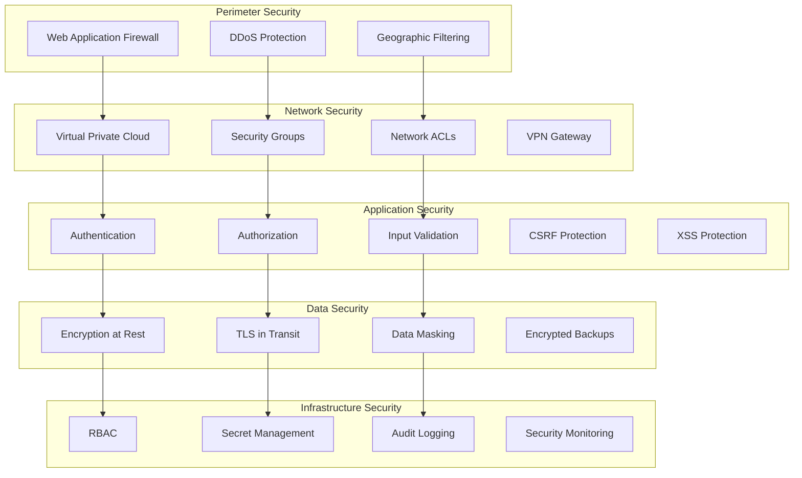

### Authentication and Authorization

#### 1. Multi-Factor Authentication Flow
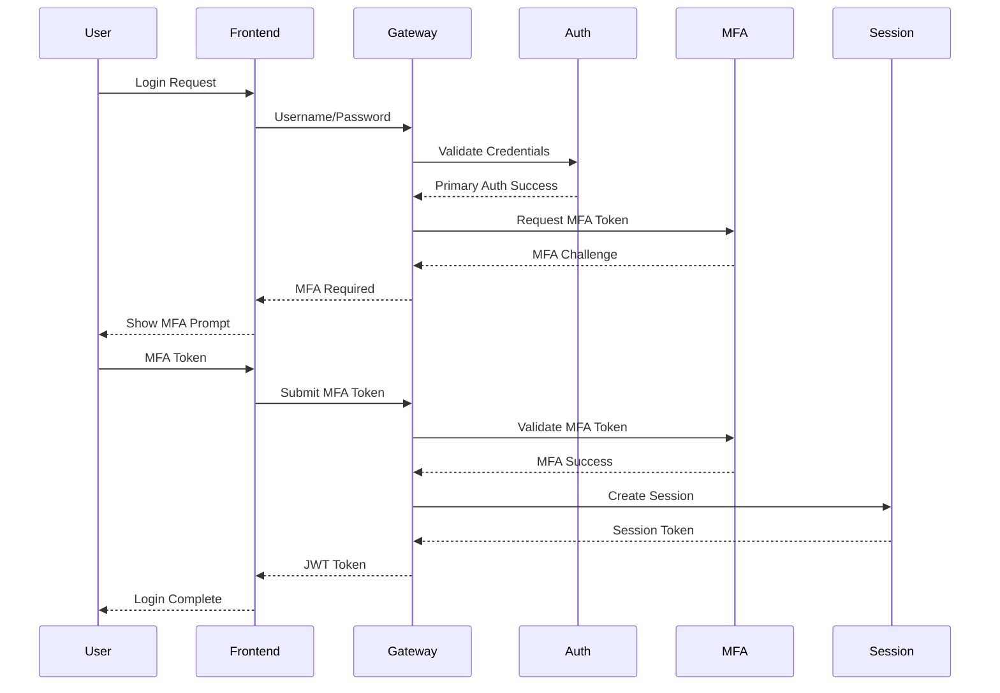

#### 2. Role-Based Access Control (RBAC)
```python
from enum import Enum
from typing import List, Set

class Permission(Enum):
    READ_DASHBOARD = "dashboard:read"
    CREATE_DASHBOARD = "dashboard:create"
    EDIT_DASHBOARD = "dashboard:edit"
    DELETE_DASHBOARD = "dashboard:delete"
    EXECUTE_QUERY = "query:execute"
    CREATE_ALERT = "alert:create"
    MANAGE_USERS = "user:manage"
    VIEW_ADMIN = "admin:view"

class Role:
    def __init__(self, name: str, permissions: Set[Permission]):
        self.name = name
        self.permissions = permissions

# Predefined roles
ROLES = {
    "admin": Role("admin", {
        Permission.READ_DASHBOARD,
        Permission.CREATE_DASHBOARD,
        Permission.EDIT_DASHBOARD,
        Permission.DELETE_DASHBOARD,
        Permission.EXECUTE_QUERY,
        Permission.CREATE_ALERT,
        Permission.MANAGE_USERS,
        Permission.VIEW_ADMIN
    }),
    "analyst": Role("analyst", {
        Permission.READ_DASHBOARD,
        Permission.CREATE_DASHBOARD,
        Permission.EDIT_DASHBOARD,
        Permission.EXECUTE_QUERY,
        Permission.CREATE_ALERT
    }),
    "viewer": Role("viewer", {
        Permission.READ_DASHBOARD,
        Permission.EXECUTE_QUERY
    })
}

class AuthorizationService:
    def check_permission(self, user_roles: List[str], 
                        required_permission: Permission) -> bool:
        """Check if user has required permission"""
        user_permissions = set()
        
        for role_name in user_roles:
            role = ROLES.get(role_name)
            if role:
                user_permissions.update(role.permissions)
        
        return required_permission in user_permissions
```

### Data Protection

#### 1. Encryption Implementation
```python
from cryptography.fernet import Fernet
from cryptography.hazmat.primitives import hashes
from cryptography.hazmat.primitives.kdf.pbkdf2 import PBKDF2HMAC
import base64
import os

class EncryptionService:
    def __init__(self, password: bytes):
        salt = os.urandom(16)
        kdf = PBKDF2HMAC(
            algorithm=hashes.SHA256(),
            length=32,
            salt=salt,
            iterations=100000,
        )
        key = base64.urlsafe_b64encode(kdf.derive(password))
        self.cipher_suite = Fernet(key)
    
    def encrypt_data(self, data: str) -> str:
        """Encrypt sensitive data"""
        encrypted_data = self.cipher_suite.encrypt(data.encode())
        return base64.urlsafe_b64encode(encrypted_data).decode()
    
    def decrypt_data(self, encrypted_data: str) -> str:
        """Decrypt sensitive data"""
        decoded_data = base64.urlsafe_b64decode(encrypted_data.encode())
        decrypted_data = self.cipher_suite.decrypt(decoded_data)
        return decrypted_data.decode()
```

#### 2. Input Validation and Sanitization
```python
from pydantic import BaseModel, validator, Field
import re

class QueryRequest(BaseModel):
    query: str = Field(..., min_length=1, max_length=10000)
    user_id: str = Field(..., regex=r'^[a-f0-9-]{36}$')
    
    @validator('query')
    def validate_query(cls, v):
        # Prevent SQL injection attempts
        dangerous_patterns = [
            r';\s*drop\s+table',
            r';\s*delete\s+from',
            r';\s*insert\s+into',
            r';\s*update\s+',
            r'union\s+select',
            r'<script',
            r'javascript:',
            r'vbscript:'
        ]
        
        for pattern in dangerous_patterns:
            if re.search(pattern, v, re.IGNORECASE):
                raise ValueError("Query contains potentially dangerous content")
        
        return v.strip()
    
    @validator('user_id')
    def validate_user_id(cls, v):
        # Ensure valid UUID format
        try:
            uuid.UUID(v)
            return v
        except ValueError:
            raise ValueError("Invalid user ID format")
```

## Deployment Architecture

### Container Architecture

#### 1. Multi-Stage Docker Builds
```dockerfile
# Multi-stage Dockerfile for Python services
FROM python:3.11-slim as builder

# Install system dependencies
RUN apt-get update && apt-get install -y \
    gcc \
    && rm -rf /var/lib/apt/lists/*

# Install Python dependencies
COPY requirements.txt .
RUN pip install --user -r requirements.txt

# Production stage
FROM python:3.11-slim as production

# Copy Python dependencies from builder stage
COPY --from=builder /root/.local /root/.local

# Create non-root user
RUN useradd --create-home --shell /bin/bash app
WORKDIR /home/app
USER app

# Copy application code
COPY --chown=app:app . .

# Health check
HEALTHCHECK --interval=30s --timeout=30s --start-period=5s --retries=3 \
    CMD curl -f http://localhost:8000/health || exit 1

# Expose port and run application
EXPOSE 8000
CMD ["uvicorn", "main:app", "--host", "0.0.0.0", "--port", "8000"]
```

#### 2. Kubernetes Deployment Strategy
```yaml
# Service deployment with rolling updates
apiVersion: apps/v1
kind: Deployment
metadata:
  name: nlp-engine
  namespace: splunk-mcp
spec:
  replicas: 3
  strategy:
    type: RollingUpdate
    rollingUpdate:
      maxUnavailable: 1
      maxSurge: 1
  selector:
    matchLabels:
      app: nlp-engine
  template:
    metadata:
      labels:
        app: nlp-engine
        version: v1.0.0
    spec:
      serviceAccountName: nlp-engine
      securityContext:
        runAsNonRoot: true
        runAsUser: 1000
        fsGroup: 1000
      containers:
      - name: nlp-engine
        image: splunk-mcp/nlp-engine:v1.0.0
        ports:
        - containerPort: 8001
        env:
        - name: DATABASE_URL
          valueFrom:
            secretKeyRef:
              name: database-secrets
              key: url
        - name: OPENAI_API_KEY
          valueFrom:
            secretKeyRef:
              name: ai-secrets
              key: openai-key
        resources:
          requests:
            memory: "512Mi"
            cpu: "250m"
          limits:
            memory: "1Gi"
            cpu: "500m"
        livenessProbe:
          httpGet:
            path: /health
            port: 8001
          initialDelaySeconds: 30
          periodSeconds: 30
        readinessProbe:
          httpGet:
            path: /ready
            port: 8001
          initialDelaySeconds: 5
          periodSeconds: 5
```

### Infrastructure as Code

#### 1. Terraform Configuration
```hcl
# AWS EKS Cluster
resource "aws_eks_cluster" "splunk_mcp" {
  name     = "splunk-mcp-cluster"
  role_arn = aws_iam_role.eks_cluster.arn
  version  = "1.28"

  vpc_config {
    subnet_ids              = aws_subnet.private[*].id
    endpoint_private_access = true
    endpoint_public_access  = true
    public_access_cidrs     = ["0.0.0.0/0"]
  }

  encryption_config {
    provider {
      key_arn = aws_kms_key.eks.arn
    }
    resources = ["secrets"]
  }

  enabled_cluster_log_types = [
    "api",
    "audit",
    "authenticator",
    "controllerManager",
    "scheduler"
  ]

  depends_on = [
    aws_iam_role_policy_attachment.eks_cluster_policy,
    aws_iam_role_policy_attachment.eks_vpc_resource_controller
  ]
}

# RDS PostgreSQL
resource "aws_db_instance" "postgresql" {
  identifier                = "splunk-mcp-postgres"
  engine                   = "postgres"
  engine_version           = "15.4"
  instance_class           = "db.r5.xlarge"
  allocated_storage        = 100
  max_allocated_storage    = 1000
  storage_encrypted        = true
  kms_key_id              = aws_kms_key.rds.arn
  
  db_name  = "splunk_mcp"
  username = "postgres"
  password = random_password.db_password.result
  
  vpc_security_group_ids = [aws_security_group.rds.id]
  db_subnet_group_name   = aws_db_subnet_group.main.name
  
  backup_retention_period = 7
  backup_window          = "03:00-04:00"
  maintenance_window     = "sun:04:00-sun:05:00"
  
  skip_final_snapshot = false
  final_snapshot_identifier = "splunk-mcp-postgres-final-snapshot"
  
  tags = {
    Name        = "Splunk MCP PostgreSQL"
    Environment = var.environment
  }
}
```

### High Availability and Disaster Recovery

#### 1. Multi-AZ Deployment
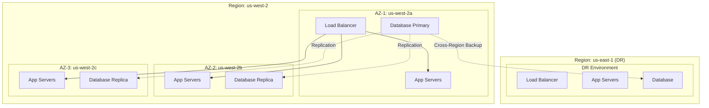

#### 2. Backup and Recovery Strategy
```yaml
# Velero backup configuration
apiVersion: velero.io/v1
kind: Schedule
metadata:
  name: daily-backup
  namespace: velero
spec:
  schedule: "0 2 * * *"  # Daily at 2 AM
  template:
    includedNamespaces:
    - splunk-mcp-prod
    - splunk-mcp-staging
    excludedResources:
    - secrets
    - configmaps
    ttl: "720h"  # 30 days retention
    storageLocation: aws-s3-backup
    snapshotVolumes: true
```

## Performance and Scalability

### Horizontal Pod Autoscaling

```yaml
apiVersion: autoscaling/v2
kind: HorizontalPodAutoscaler
metadata:
  name: nlp-engine-hpa
  namespace: splunk-mcp
spec:
  scaleTargetRef:
    apiVersion: apps/v1
    kind: Deployment
    name: nlp-engine
  minReplicas: 2
  maxReplicas: 10
  metrics:
  - type: Resource
    resource:
      name: cpu
      target:
        type: Utilization
        averageUtilization: 70
  - type: Resource
    resource:
      name: memory
      target:
        type: Utilization
        averageUtilization: 80
  behavior:
    scaleUp:
      stabilizationWindowSeconds: 60
      policies:
      - type: Percent
        value: 100
        periodSeconds: 15
    scaleDown:
      stabilizationWindowSeconds: 300
      policies:
      - type: Percent
        value: 10
        periodSeconds: 60
```

### Caching Strategy

#### 1. Multi-Level Caching
```python
from redis import Redis
from typing import Optional, Any
import json
import hashlib

class CacheService:
    def __init__(self, redis_client: Redis):
        self.redis = redis_client
        self.default_ttl = 3600  # 1 hour
        
    def get(self, key: str) -> Optional[Any]:
        """Get value from cache"""
        try:
            value = self.redis.get(key)
            if value:
                return json.loads(value)
            return None
        except Exception:
            return None
    
    def set(self, key: str, value: Any, ttl: int = None) -> bool:
        """Set value in cache"""
        try:
            ttl = ttl or self.default_ttl
            serialized_value = json.dumps(value, default=str)
            return self.redis.setex(key, ttl, serialized_value)
        except Exception:
            return False
    
    def generate_query_key(self, query: str, user_id: str) -> str:
        """Generate cache key for query results"""
        query_hash = hashlib.md5(query.encode()).hexdigest()
        return f"query:{user_id}:{query_hash}"
    
    def cache_query_result(self, query: str, user_id: str, 
                          result: Any, ttl: int = 1800):
        """Cache query results for 30 minutes"""
        key = self.generate_query_key(query, user_id)
        self.set(key, result, ttl)
```

#### 2. Cache Invalidation Strategy
```python
class CacheInvalidation:
    def __init__(self, cache_service: CacheService):
        self.cache = cache_service
    
    def invalidate_user_queries(self, user_id: str):
        """Invalidate all cached queries for a user"""
        pattern = f"query:{user_id}:*"
        keys = self.cache.redis.keys(pattern)
        if keys:
            self.cache.redis.delete(*keys)
    
    def invalidate_dashboard_cache(self, dashboard_id: str):
        """Invalidate dashboard-related cache"""
        patterns = [
            f"dashboard:{dashboard_id}:*",
            f"chart:{dashboard_id}:*",
            f"query:*:dashboard_{dashboard_id}"
        ]
        
        for pattern in patterns:
            keys = self.cache.redis.keys(pattern)
            if keys:
                self.cache.redis.delete(*keys)
```

## Monitoring and Observability

### Metrics Collection

#### 1. Prometheus Metrics
```python
from prometheus_client import Counter, Histogram, Gauge, generate_latest
import time

# Define metrics
REQUEST_COUNT = Counter(
    'http_requests_total',
    'Total HTTP requests',
    ['method', 'endpoint', 'status']
)

REQUEST_LATENCY = Histogram(
    'http_request_duration_seconds',
    'HTTP request latency',
    ['method', 'endpoint']
)

ACTIVE_USERS = Gauge(
    'active_users',
    'Number of active users'
)

QUERY_ACCURACY = Histogram(
    'nlp_query_accuracy',
    'NLP query translation accuracy',
    ['query_type']
)

class MetricsMiddleware:
    def __init__(self, app):
        self.app = app
    
    async def __call__(self, scope, receive, send):
        if scope["type"] == "http":
            start_time = time.time()
            
            # Process request
            await self.app(scope, receive, send)
            
            # Record metrics
            duration = time.time() - start_time
            method = scope["method"]
            path = scope["path"]
            
            REQUEST_LATENCY.labels(
                method=method,
                endpoint=path
            ).observe(duration)
```

#### 2. Custom Business Metrics
```python
class BusinessMetrics:
    def __init__(self):
        self.successful_queries = Counter(
            'successful_queries_total',
            'Total successful queries',
            ['user_type', 'query_complexity']
        )
        
        self.dashboard_views = Counter(
            'dashboard_views_total',
            'Total dashboard views',
            ['dashboard_type']
        )
        
        self.alert_triggers = Counter(
            'alert_triggers_total',
            'Total alert triggers',
            ['alert_type', 'severity']
        )
    
    def record_successful_query(self, user_type: str, complexity: str):
        self.successful_queries.labels(
            user_type=user_type,
            query_complexity=complexity
        ).inc()
    
    def record_dashboard_view(self, dashboard_type: str):
        self.dashboard_views.labels(
            dashboard_type=dashboard_type
        ).inc()
```

### Distributed Tracing

#### 1. OpenTelemetry Implementation
```python
from opentelemetry import trace
from opentelemetry.exporter.jaeger.thrift import JaegerExporter
from opentelemetry.sdk.trace import TracerProvider
from opentelemetry.sdk.trace.export import BatchSpanProcessor

# Initialize tracing
trace.set_tracer_provider(TracerProvider())
tracer = trace.get_tracer(__name__)

jaeger_exporter = JaegerExporter(
    agent_host_name="jaeger-agent",
    agent_port=6831,
)

span_processor = BatchSpanProcessor(jaeger_exporter)
trace.get_tracer_provider().add_span_processor(span_processor)

class TracingService:
    def __init__(self):
        self.tracer = trace.get_tracer(__name__)
    
    async def process_nlp_query(self, query: str, user_id: str):
        with self.tracer.start_as_current_span("nlp.process_query") as span:
            span.set_attribute("query.length", len(query))
            span.set_attribute("user.id", user_id)
            
            # Process query
            with self.tracer.start_as_current_span("nlp.parse_intent"):
                intent = await self.parse_intent(query)
                span.set_attribute("intent.type", intent.type)
            
            with self.tracer.start_as_current_span("nlp.generate_spl"):
                spl_query = await self.generate_spl(intent)
                span.set_attribute("spl.length", len(spl_query))
            
            return spl_query
```

### Logging Strategy

#### 1. Structured Logging
```python
import structlog
import json
from datetime import datetime

# Configure structured logging
structlog.configure(
    processors=[
        structlog.stdlib.filter_by_level,
        structlog.stdlib.add_logger_name,
        structlog.stdlib.add_log_level,
        structlog.stdlib.PositionalArgumentsFormatter(),
        structlog.processors.TimeStamper(fmt="iso"),
        structlog.processors.StackInfoRenderer(),
        structlog.processors.format_exc_info,
        structlog.processors.UnicodeDecoder(),
        structlog.processors.JSONRenderer()
    ],
    context_class=dict,
    logger_factory=structlog.stdlib.LoggerFactory(),
    wrapper_class=structlog.stdlib.BoundLogger,
    cache_logger_on_first_use=True,
)

logger = structlog.get_logger()

class LoggingService:
    def __init__(self, service_name: str):
        self.logger = logger.bind(service=service_name)
    
    def log_query_execution(self, query_id: str, user_id: str, 
                           query: str, duration: float, success: bool):
        self.logger.info(
            "Query executed",
            query_id=query_id,
            user_id=user_id,
            query_length=len(query),
            duration_ms=duration * 1000,
            success=success
        )
    
    def log_security_event(self, event_type: str, user_id: str, 
                          ip_address: str, details: dict):
        self.logger.warning(
            "Security event",
            event_type=event_type,
            user_id=user_id,
            ip_address=ip_address,
            details=details
        )
```

## Design Principles

### 1. SOLID Principles

#### Single Responsibility Principle (SRP)
```python
# Bad: Multiple responsibilities
class UserManager:
    def create_user(self, user_data):
        # Validate user data
        # Save to database
        # Send email notification
        # Log audit event
        pass

# Good: Single responsibility
class UserValidator:
    def validate(self, user_data):
        # Only validation logic
        pass

class UserRepository:
    def save(self, user):
        # Only database operations
        pass

class NotificationService:
    def send_welcome_email(self, user):
        # Only email sending
        pass

class AuditLogger:
    def log_user_creation(self, user):
        # Only audit logging
        pass
```

#### Dependency Inversion Principle (DIP)
```python
from abc import ABC, abstractmethod

# Abstract interface
class QueryRepository(ABC):
    @abstractmethod
    async def save_query(self, query: Query) -> str:
        pass
    
    @abstractmethod
    async def get_query(self, query_id: str) -> Query:
        pass

# Concrete implementation
class PostgreSQLQueryRepository(QueryRepository):
    def __init__(self, db_connection):
        self.db = db_connection
    
    async def save_query(self, query: Query) -> str:
        # PostgreSQL-specific implementation
        pass
    
    async def get_query(self, query_id: str) -> Query:
        # PostgreSQL-specific implementation
        pass

# Service depends on abstraction, not concrete implementation
class QueryService:
    def __init__(self, repository: QueryRepository):
        self.repository = repository  # Depends on interface
    
    async def process_query(self, query_data: dict) -> str:
        query = Query(**query_data)
        return await self.repository.save_query(query)
```

### 2. Domain-Driven Design (DDD)

#### Bounded Contexts
```python
# User Management Context
class UserManagement:
    class User:
        def __init__(self, user_id: str, username: str, email: str):
            self.user_id = user_id
            self.username = username
            self.email = email
    
    class UserService:
        def create_user(self, user_data: dict) -> User:
            pass

# Query Processing Context
class QueryProcessing:
    class Query:
        def __init__(self, query_id: str, natural_language: str, spl: str):
            self.query_id = query_id
            self.natural_language = natural_language
            self.spl = spl
    
    class QueryService:
        def process_natural_language(self, text: str) -> Query:
            pass

# Dashboard Context
class Dashboard:
    class Dashboard:
        def __init__(self, dashboard_id: str, title: str, panels: List):
            self.dashboard_id = dashboard_id
            self.title = title
            self.panels = panels
    
    class DashboardService:
        def create_dashboard(self, dashboard_data: dict) -> Dashboard:
            pass
```

#### Aggregates and Domain Events
```python
from dataclasses import dataclass
from typing import List
from datetime import datetime

@dataclass
class DomainEvent:
    event_id: str
    event_type: str
    aggregate_id: str
    occurred_at: datetime
    data: dict

class AggregateRoot:
    def __init__(self):
        self._domain_events: List[DomainEvent] = []
    
    def add_domain_event(self, event: DomainEvent):
        self._domain_events.append(event)
    
    def get_domain_events(self) -> List[DomainEvent]:
        return self._domain_events.copy()
    
    def clear_domain_events(self):
        self._domain_events.clear()

class Dashboard(AggregateRoot):
    def __init__(self, dashboard_id: str, title: str, owner_id: str):
        super().__init__()
        self.dashboard_id = dashboard_id
        self.title = title
        self.owner_id = owner_id
        self.panels = []
        self.created_at = datetime.utcnow()
        
        # Domain event
        self.add_domain_event(DomainEvent(
            event_id=str(uuid.uuid4()),
            event_type="dashboard.created",
            aggregate_id=dashboard_id,
            occurred_at=self.created_at,
            data={"title": title, "owner_id": owner_id}
        ))
    
    def add_panel(self, panel: Panel):
        self.panels.append(panel)
        
        # Domain event
        self.add_domain_event(DomainEvent(
            event_id=str(uuid.uuid4()),
            event_type="dashboard.panel_added",
            aggregate_id=self.dashboard_id,
            occurred_at=datetime.utcnow(),
            data={"panel_id": panel.panel_id, "panel_type": panel.type}
        ))
```

### 3. Clean Architecture

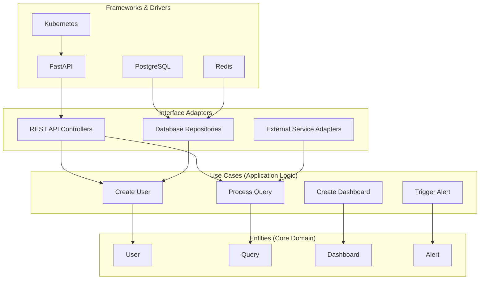

### 4. Twelve-Factor App Principles

#### Configuration Management
```python
import os
from typing import Optional

class Settings:
    """Application settings following 12-factor principles"""
    
    # Database configuration
    DATABASE_URL: str = os.getenv("DATABASE_URL", "postgresql://localhost/splunk_mcp")
    DATABASE_POOL_SIZE: int = int(os.getenv("DATABASE_POOL_SIZE", "10"))
    
    # Redis configuration
    REDIS_URL: str = os.getenv("REDIS_URL", "redis://localhost:6379")
    REDIS_POOL_SIZE: int = int(os.getenv("REDIS_POOL_SIZE", "10"))
    
    # API configuration
    API_HOST: str = os.getenv("API_HOST", "0.0.0.0")
    API_PORT: int = int(os.getenv("API_PORT", "8000"))
    API_WORKERS: int = int(os.getenv("API_WORKERS", "4"))
    
    # Security configuration
    JWT_SECRET_KEY: str = os.getenv("JWT_SECRET_KEY", "your-secret-key")
    JWT_ALGORITHM: str = os.getenv("JWT_ALGORITHM", "HS256")
    JWT_EXPIRATION_HOURS: int = int(os.getenv("JWT_EXPIRATION_HOURS", "24"))
    
    # External services
    OPENAI_API_KEY: Optional[str] = os.getenv("OPENAI_API_KEY")
    ANTHROPIC_API_KEY: Optional[str] = os.getenv("ANTHROPIC_API_KEY")
    SPLUNK_API_URL: str = os.getenv("SPLUNK_API_URL", "https://localhost:8089")
    
    # Feature flags
    ENABLE_AI_FEATURES: bool = os.getenv("ENABLE_AI_FEATURES", "true").lower() == "true"
    ENABLE_CACHING: bool = os.getenv("ENABLE_CACHING", "true").lower() == "true"
    DEBUG_MODE: bool = os.getenv("DEBUG_MODE", "false").lower() == "true"

settings = Settings()
```

---

*This architecture documentation provides the foundation for building, deploying, and maintaining the Splunk MCP Integration platform. It should be regularly updated to reflect architectural changes and improvements.*

*Last Updated: January 22, 2025*  
*Version: 1.0*