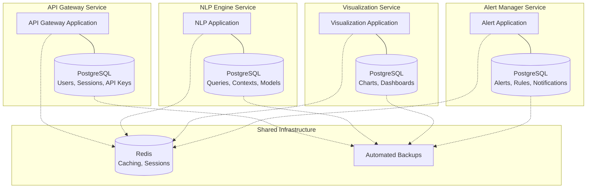
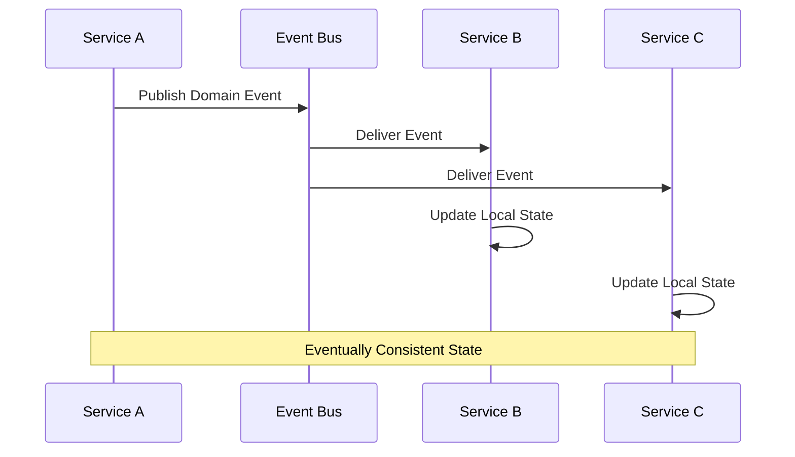
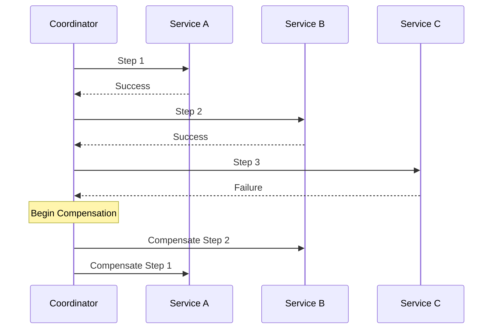
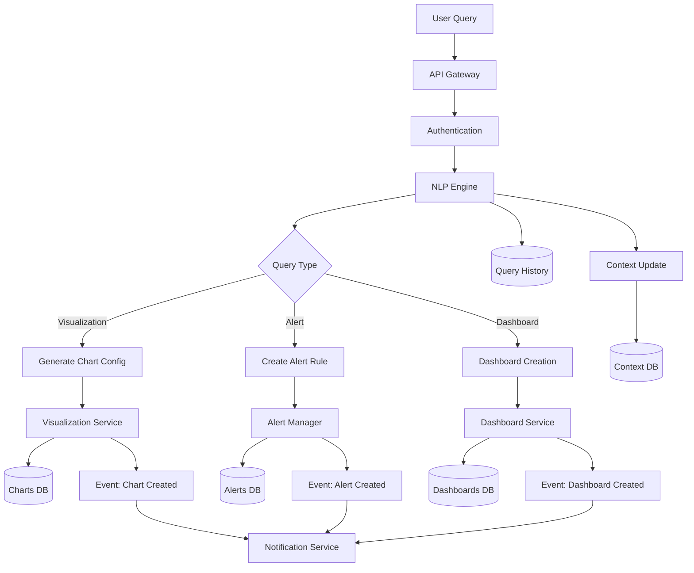
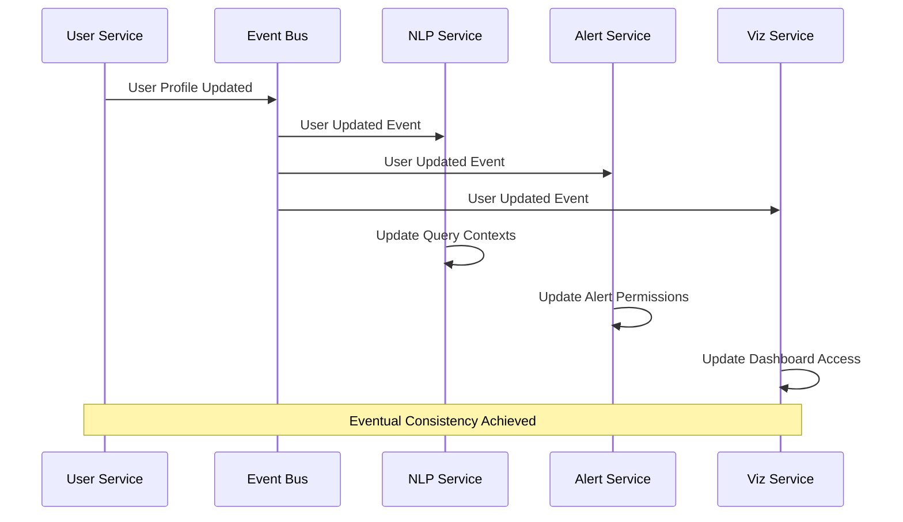
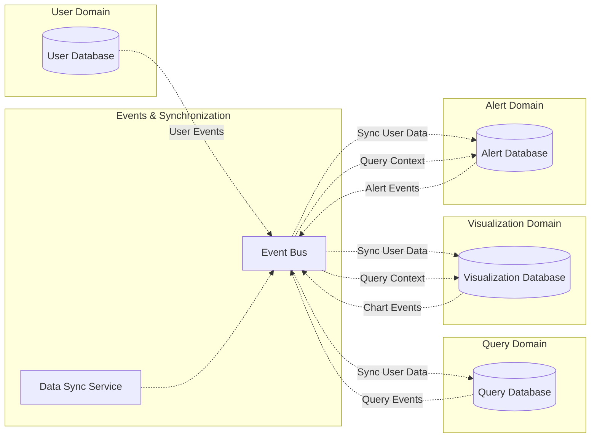
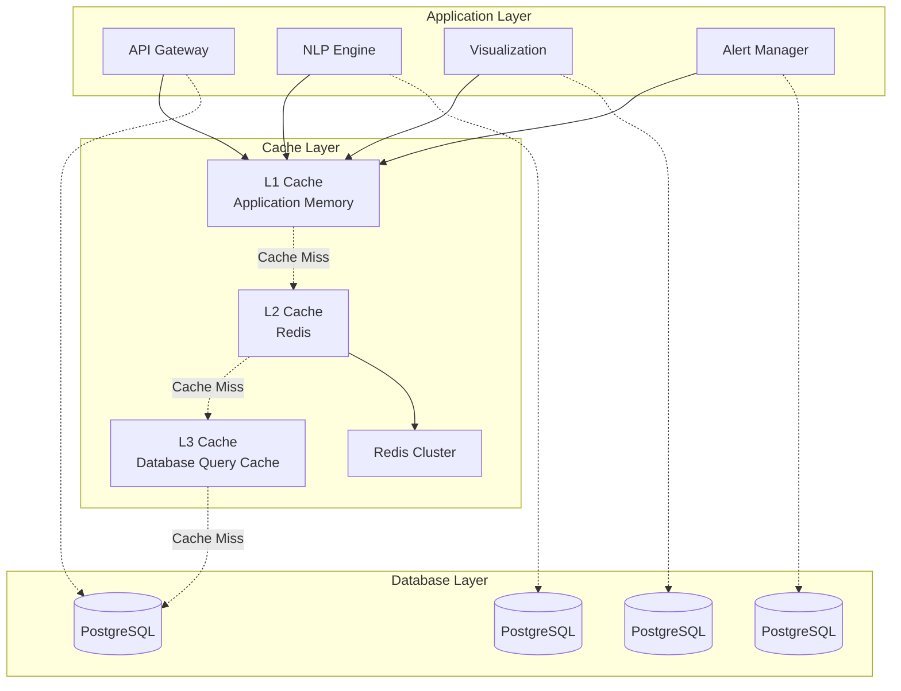

# Database Design and Data Flow

## Overview

The Splunk MCP Integration platform implements a distributed database architecture where each microservice owns its data and database schema. This document outlines the database design patterns, data models, relationships, and data flow across the system.

## Database Architecture Principles

### 1. Database per Service Pattern

Each microservice maintains its own database to ensure:
- **Data Encapsulation**: Services own their data completely
- **Technology Diversity**: Different services can use optimal database technologies
- **Independent Evolution**: Schema changes don't affect other services
- **Fault Isolation**: Database issues in one service don't cascade



### 2. Data Consistency Strategies

#### Eventual Consistency Model


#### Saga Pattern for Transactions


## Core Data Models

### 1. User Management Domain

#### API Gateway Database Schema
```sql
-- Users table
CREATE TABLE users (
    id UUID PRIMARY KEY DEFAULT gen_random_uuid(),
    username VARCHAR(255) UNIQUE NOT NULL,
    email VARCHAR(255) UNIQUE NOT NULL,
    first_name VARCHAR(255),
    last_name VARCHAR(255),
    password_hash VARCHAR(255),
    roles JSONB DEFAULT '[]',
    permissions JSONB DEFAULT '{}',
    preferences JSONB DEFAULT '{}',
    splunk_username VARCHAR(255),
    is_active BOOLEAN DEFAULT true,
    last_login TIMESTAMP,
    failed_login_attempts INTEGER DEFAULT 0,
    account_locked_until TIMESTAMP,
    password_changed_at TIMESTAMP DEFAULT CURRENT_TIMESTAMP,
    created_at TIMESTAMP DEFAULT CURRENT_TIMESTAMP,
    updated_at TIMESTAMP DEFAULT CURRENT_TIMESTAMP
);

-- User sessions table
CREATE TABLE user_sessions (
    id UUID PRIMARY KEY DEFAULT gen_random_uuid(),
    user_id UUID REFERENCES users(id) ON DELETE CASCADE,
    session_token VARCHAR(512) UNIQUE NOT NULL,
    session_data JSONB DEFAULT '{}',
    ip_address INET,
    user_agent TEXT,
    location JSONB,
    device_info JSONB,
    created_at TIMESTAMP DEFAULT CURRENT_TIMESTAMP,
    expires_at TIMESTAMP NOT NULL,
    last_accessed TIMESTAMP DEFAULT CURRENT_TIMESTAMP,
    is_active BOOLEAN DEFAULT true
);

-- API keys table
CREATE TABLE api_keys (
    id UUID PRIMARY KEY DEFAULT gen_random_uuid(),
    user_id UUID REFERENCES users(id) ON DELETE CASCADE,
    name VARCHAR(255) NOT NULL,
    key_hash VARCHAR(512) UNIQUE NOT NULL,
    scopes JSONB DEFAULT '[]',
    rate_limit_per_hour INTEGER DEFAULT 1000,
    last_used TIMESTAMP,
    usage_count INTEGER DEFAULT 0,
    is_active BOOLEAN DEFAULT true,
    created_at TIMESTAMP DEFAULT CURRENT_TIMESTAMP,
    expires_at TIMESTAMP
);

-- Role permissions table
CREATE TABLE role_permissions (
    id UUID PRIMARY KEY DEFAULT gen_random_uuid(),
    role_name VARCHAR(255) NOT NULL,
    resource_type VARCHAR(255) NOT NULL,
    permissions JSONB NOT NULL,
    conditions JSONB DEFAULT '{}',
    created_at TIMESTAMP DEFAULT CURRENT_TIMESTAMP,
    updated_at TIMESTAMP DEFAULT CURRENT_TIMESTAMP,
    UNIQUE(role_name, resource_type)
);

-- Audit log table
CREATE TABLE audit_logs (
    id UUID PRIMARY KEY DEFAULT gen_random_uuid(),
    user_id UUID,
    session_id UUID,
    event_type VARCHAR(255) NOT NULL,
    resource_type VARCHAR(255),
    resource_id VARCHAR(255),
    event_data JSONB,
    ip_address INET,
    user_agent TEXT,
    correlation_id UUID,
    created_at TIMESTAMP DEFAULT CURRENT_TIMESTAMP
);

-- Indexes for performance
CREATE INDEX idx_users_email ON users(email);
CREATE INDEX idx_users_username ON users(username);
CREATE INDEX idx_users_active ON users(is_active) WHERE is_active = true;
CREATE INDEX idx_sessions_token ON user_sessions(session_token);
CREATE INDEX idx_sessions_user_active ON user_sessions(user_id, is_active);
CREATE INDEX idx_sessions_expires ON user_sessions(expires_at);
CREATE INDEX idx_api_keys_hash ON api_keys(key_hash);
CREATE INDEX idx_api_keys_user_active ON api_keys(user_id, is_active);
CREATE INDEX idx_audit_logs_user_time ON audit_logs(user_id, created_at);
CREATE INDEX idx_audit_logs_event_type ON audit_logs(event_type);
CREATE INDEX idx_audit_logs_correlation ON audit_logs(correlation_id);
```

### 2. Query Processing Domain

#### NLP Engine Database Schema
```sql
-- NLP queries table
CREATE TABLE nlp_queries (
    id UUID PRIMARY KEY DEFAULT gen_random_uuid(),
    user_id UUID NOT NULL,
    conversation_id UUID,
    natural_language TEXT NOT NULL,
    processed_intent JSONB,
    confidence_score FLOAT,
    extracted_entities JSONB,
    generated_spl TEXT,
    execution_results JSONB,
    execution_time FLOAT,
    accuracy_score FLOAT,
    status VARCHAR(50) DEFAULT 'pending',
    error_message TEXT,
    feedback_score INTEGER,
    feedback_comment TEXT,
    created_at TIMESTAMP DEFAULT CURRENT_TIMESTAMP,
    completed_at TIMESTAMP
);

-- Query contexts table
CREATE TABLE query_contexts (
    id UUID PRIMARY KEY DEFAULT gen_random_uuid(),
    conversation_id UUID NOT NULL,
    user_id UUID NOT NULL,
    context_data JSONB,
    user_preferences JSONB,
    session_variables JSONB,
    last_queries JSONB,
    index_preferences JSONB,
    time_range_preferences JSONB,
    created_at TIMESTAMP DEFAULT CURRENT_TIMESTAMP,
    updated_at TIMESTAMP DEFAULT CURRENT_TIMESTAMP
);

-- AI model metrics table
CREATE TABLE ai_model_metrics (
    id UUID PRIMARY KEY DEFAULT gen_random_uuid(),
    model_name VARCHAR(255) NOT NULL,
    model_version VARCHAR(100),
    query_type VARCHAR(100),
    accuracy_score FLOAT,
    response_time FLOAT,
    token_usage INTEGER,
    cost DECIMAL(10,4),
    input_length INTEGER,
    output_length INTEGER,
    success BOOLEAN DEFAULT true,
    error_type VARCHAR(255),
    created_at TIMESTAMP DEFAULT CURRENT_TIMESTAMP
);

-- SPL templates table
CREATE TABLE spl_templates (
    id UUID PRIMARY KEY DEFAULT gen_random_uuid(),
    template_name VARCHAR(255) UNIQUE NOT NULL,
    template_pattern TEXT NOT NULL,
    intent_types JSONB,
    parameters JSONB,
    example_queries JSONB,
    success_rate FLOAT DEFAULT 0.0,
    usage_count INTEGER DEFAULT 0,
    is_active BOOLEAN DEFAULT true,
    created_at TIMESTAMP DEFAULT CURRENT_TIMESTAMP,
    updated_at TIMESTAMP DEFAULT CURRENT_TIMESTAMP
);

-- Query performance cache
CREATE TABLE query_performance_cache (
    id UUID PRIMARY KEY DEFAULT gen_random_uuid(),
    query_hash VARCHAR(64) UNIQUE NOT NULL,
    spl_query TEXT NOT NULL,
    execution_time FLOAT,
    result_count INTEGER,
    memory_usage BIGINT,
    indexes_used JSONB,
    optimization_suggestions JSONB,
    last_executed TIMESTAMP DEFAULT CURRENT_TIMESTAMP,
    hit_count INTEGER DEFAULT 1
);

-- Indexes for NLP Engine
CREATE INDEX idx_nlp_queries_user_time ON nlp_queries(user_id, created_at DESC);
CREATE INDEX idx_nlp_queries_conversation ON nlp_queries(conversation_id, created_at);
CREATE INDEX idx_nlp_queries_status ON nlp_queries(status) WHERE status != 'completed';
CREATE INDEX idx_query_contexts_conversation ON query_contexts(conversation_id);
CREATE INDEX idx_query_contexts_user ON query_contexts(user_id, updated_at DESC);
CREATE INDEX idx_ai_metrics_model_time ON ai_model_metrics(model_name, created_at DESC);
CREATE INDEX idx_spl_templates_active ON spl_templates(is_active) WHERE is_active = true;
CREATE INDEX idx_query_cache_hash ON query_performance_cache(query_hash);
```

### 3. Visualization Domain

#### Visualization Service Database Schema
```sql
-- Charts table
CREATE TABLE charts (
    id UUID PRIMARY KEY DEFAULT gen_random_uuid(),
    user_id UUID NOT NULL,
    title VARCHAR(255) NOT NULL,
    description TEXT,
    chart_type VARCHAR(100) NOT NULL,
    chart_config JSONB NOT NULL,
    data_source JSONB NOT NULL,
    spl_query TEXT,
    query_id UUID,
    styling JSONB DEFAULT '{}',
    interactive_config JSONB DEFAULT '{}',
    export_formats JSONB DEFAULT '["png", "svg", "pdf"]',
    is_public BOOLEAN DEFAULT false,
    view_count INTEGER DEFAULT 0,
    last_viewed TIMESTAMP,
    created_at TIMESTAMP DEFAULT CURRENT_TIMESTAMP,
    updated_at TIMESTAMP DEFAULT CURRENT_TIMESTAMP
);

-- Dashboards table
CREATE TABLE dashboards (
    id UUID PRIMARY KEY DEFAULT gen_random_uuid(),
    user_id UUID NOT NULL,
    title VARCHAR(255) NOT NULL,
    description TEXT,
    layout JSONB NOT NULL,
    panels JSONB NOT NULL,
    theme VARCHAR(50) DEFAULT 'default',
    auto_refresh_interval INTEGER,
    permissions JSONB DEFAULT '{"public": false, "shared_with": []}',
    tags JSONB DEFAULT '[]',
    view_count INTEGER DEFAULT 0,
    last_viewed TIMESTAMP,
    is_template BOOLEAN DEFAULT false,
    template_category VARCHAR(100),
    created_at TIMESTAMP DEFAULT CURRENT_TIMESTAMP,
    updated_at TIMESTAMP DEFAULT CURRENT_TIMESTAMP
);

-- Dashboard panels table (normalized for better querying)
CREATE TABLE dashboard_panels (
    id UUID PRIMARY KEY DEFAULT gen_random_uuid(),
    dashboard_id UUID REFERENCES dashboards(id) ON DELETE CASCADE,
    panel_type VARCHAR(100) NOT NULL,
    title VARCHAR(255),
    position JSONB NOT NULL,
    size JSONB NOT NULL,
    config JSONB NOT NULL,
    chart_id UUID REFERENCES charts(id) ON DELETE SET NULL,
    data_source JSONB,
    refresh_interval INTEGER,
    created_at TIMESTAMP DEFAULT CURRENT_TIMESTAMP,
    updated_at TIMESTAMP DEFAULT CURRENT_TIMESTAMP
);

-- Chart templates table
CREATE TABLE chart_templates (
    id UUID PRIMARY KEY DEFAULT gen_random_uuid(),
    name VARCHAR(255) UNIQUE NOT NULL,
    description TEXT,
    chart_type VARCHAR(100) NOT NULL,
    template_config JSONB NOT NULL,
    default_styling JSONB DEFAULT '{}',
    suggested_data_types JSONB,
    usage_count INTEGER DEFAULT 0,
    rating FLOAT DEFAULT 0.0,
    rating_count INTEGER DEFAULT 0,
    is_featured BOOLEAN DEFAULT false,
    created_by UUID,
    created_at TIMESTAMP DEFAULT CURRENT_TIMESTAMP,
    updated_at TIMESTAMP DEFAULT CURRENT_TIMESTAMP
);

-- Dashboard themes table
CREATE TABLE dashboard_themes (
    id UUID PRIMARY KEY DEFAULT gen_random_uuid(),
    name VARCHAR(255) UNIQUE NOT NULL,
    display_name VARCHAR(255) NOT NULL,
    description TEXT,
    css_variables JSONB NOT NULL,
    color_palette JSONB NOT NULL,
    font_config JSONB DEFAULT '{}',
    is_default BOOLEAN DEFAULT false,
    is_active BOOLEAN DEFAULT true,
    created_at TIMESTAMP DEFAULT CURRENT_TIMESTAMP
);

-- Visualization exports table
CREATE TABLE visualization_exports (
    id UUID PRIMARY KEY DEFAULT gen_random_uuid(),
    user_id UUID NOT NULL,
    resource_type VARCHAR(50) NOT NULL,
    resource_id UUID NOT NULL,
    export_format VARCHAR(20) NOT NULL,
    file_path TEXT,
    file_size BIGINT,
    generation_time FLOAT,
    status VARCHAR(50) DEFAULT 'pending',
    error_message TEXT,
    download_count INTEGER DEFAULT 0,
    expires_at TIMESTAMP,
    created_at TIMESTAMP DEFAULT CURRENT_TIMESTAMP
);

-- Indexes for Visualization Service
CREATE INDEX idx_charts_user_time ON charts(user_id, created_at DESC);
CREATE INDEX idx_charts_type ON charts(chart_type);
CREATE INDEX idx_charts_public ON charts(is_public) WHERE is_public = true;
CREATE INDEX idx_dashboards_user_time ON dashboards(user_id, created_at DESC);
CREATE INDEX idx_dashboards_template ON dashboards(is_template, template_category) WHERE is_template = true;
CREATE INDEX idx_dashboard_panels_dashboard ON dashboard_panels(dashboard_id);
CREATE INDEX idx_chart_templates_type ON chart_templates(chart_type);
CREATE INDEX idx_chart_templates_featured ON chart_templates(is_featured) WHERE is_featured = true;
CREATE INDEX idx_exports_user_status ON visualization_exports(user_id, status);
CREATE INDEX idx_exports_expires ON visualization_exports(expires_at) WHERE expires_at IS NOT NULL;
```

### 4. Alert Management Domain

#### Alert Manager Database Schema
```sql
-- Alerts table
CREATE TABLE alerts (
    id UUID PRIMARY KEY DEFAULT gen_random_uuid(),
    user_id UUID NOT NULL,
    name VARCHAR(255) NOT NULL,
    description TEXT,
    spl_query TEXT NOT NULL,
    query_id UUID,
    conditions JSONB NOT NULL,
    schedule_config JSONB NOT NULL,
    notification_config JSONB NOT NULL,
    escalation_config JSONB DEFAULT '{}',
    severity VARCHAR(20) DEFAULT 'medium',
    priority INTEGER DEFAULT 5,
    tags JSONB DEFAULT '[]',
    is_enabled BOOLEAN DEFAULT true,
    last_triggered TIMESTAMP,
    trigger_count INTEGER DEFAULT 0,
    success_rate FLOAT DEFAULT 1.0,
    created_at TIMESTAMP DEFAULT CURRENT_TIMESTAMP,
    updated_at TIMESTAMP DEFAULT CURRENT_TIMESTAMP
);

-- Alert rules table (normalized conditions)
CREATE TABLE alert_rules (
    id UUID PRIMARY KEY DEFAULT gen_random_uuid(),
    alert_id UUID REFERENCES alerts(id) ON DELETE CASCADE,
    rule_type VARCHAR(100) NOT NULL,
    field_name VARCHAR(255),
    operator VARCHAR(50) NOT NULL,
    threshold_value NUMERIC,
    threshold_unit VARCHAR(50),
    time_window_minutes INTEGER,
    condition_logic VARCHAR(20) DEFAULT 'AND',
    is_active BOOLEAN DEFAULT true,
    created_at TIMESTAMP DEFAULT CURRENT_TIMESTAMP
);

-- Alert executions table
CREATE TABLE alert_executions (
    id UUID PRIMARY KEY DEFAULT gen_random_uuid(),
    alert_id UUID REFERENCES alerts(id) ON DELETE CASCADE,
    execution_time TIMESTAMP DEFAULT CURRENT_TIMESTAMP,
    status VARCHAR(50) NOT NULL,
    result_count INTEGER,
    triggered BOOLEAN DEFAULT false,
    execution_duration FLOAT,
    result_data JSONB,
    error_message TEXT,
    next_execution TIMESTAMP
);

-- Alert notifications table
CREATE TABLE alert_notifications (
    id UUID PRIMARY KEY DEFAULT gen_random_uuid(),
    alert_id UUID REFERENCES alerts(id) ON DELETE CASCADE,
    execution_id UUID REFERENCES alert_executions(id) ON DELETE CASCADE,
    notification_type VARCHAR(50) NOT NULL,
    recipient VARCHAR(255) NOT NULL,
    subject VARCHAR(500),
    message TEXT,
    status VARCHAR(50) DEFAULT 'pending',
    sent_at TIMESTAMP,
    delivery_attempts INTEGER DEFAULT 0,
    error_message TEXT,
    created_at TIMESTAMP DEFAULT CURRENT_TIMESTAMP
);

-- Alert escalations table
CREATE TABLE alert_escalations (
    id UUID PRIMARY KEY DEFAULT gen_random_uuid(),
    alert_id UUID REFERENCES alerts(id) ON DELETE CASCADE,
    escalation_level INTEGER NOT NULL,
    trigger_after_minutes INTEGER NOT NULL,
    escalation_config JSONB NOT NULL,
    last_triggered TIMESTAMP,
    trigger_count INTEGER DEFAULT 0,
    is_active BOOLEAN DEFAULT true,
    created_at TIMESTAMP DEFAULT CURRENT_TIMESTAMP
);

-- Alert correlation groups table
CREATE TABLE alert_correlation_groups (
    id UUID PRIMARY KEY DEFAULT gen_random_uuid(),
    group_name VARCHAR(255) NOT NULL,
    correlation_rules JSONB NOT NULL,
    suppression_window_minutes INTEGER DEFAULT 60,
    max_alerts_per_window INTEGER DEFAULT 10,
    created_at TIMESTAMP DEFAULT CURRENT_TIMESTAMP,
    updated_at TIMESTAMP DEFAULT CURRENT_TIMESTAMP
);

-- Alert group memberships table
CREATE TABLE alert_group_memberships (
    id UUID PRIMARY KEY DEFAULT gen_random_uuid(),
    alert_id UUID REFERENCES alerts(id) ON DELETE CASCADE,
    group_id UUID REFERENCES alert_correlation_groups(id) ON DELETE CASCADE,
    weight FLOAT DEFAULT 1.0,
    created_at TIMESTAMP DEFAULT CURRENT_TIMESTAMP,
    UNIQUE(alert_id, group_id)
);

-- Indexes for Alert Manager
CREATE INDEX idx_alerts_user_enabled ON alerts(user_id, is_enabled);
CREATE INDEX idx_alerts_next_execution ON alert_executions(next_execution) WHERE next_execution IS NOT NULL;
CREATE INDEX idx_alert_rules_alert ON alert_rules(alert_id, is_active);
CREATE INDEX idx_alert_executions_alert_time ON alert_executions(alert_id, execution_time DESC);
CREATE INDEX idx_alert_notifications_status ON alert_notifications(status, created_at);
CREATE INDEX idx_alert_escalations_alert ON alert_escalations(alert_id, escalation_level);
CREATE INDEX idx_group_memberships_alert ON alert_group_memberships(alert_id);
CREATE INDEX idx_group_memberships_group ON alert_group_memberships(group_id);
```

## Data Flow Patterns

### 1. Query Processing Flow



### 2. User Data Synchronization Flow



### 3. Cross-Service Data Dependencies



## Caching Strategy

### 1. Redis Caching Architecture



### 2. Cache Implementation Patterns

```python
import redis
import json
import hashlib
from typing import Optional, Any, Dict
from datetime import timedelta

class CacheManager:
    def __init__(self, redis_client: redis.Redis):
        self.redis = redis_client
        self.default_ttl = 3600  # 1 hour
    
    def generate_key(self, prefix: str, **kwargs) -> str:
        """Generate cache key from parameters"""
        key_parts = [prefix]
        
        for key, value in sorted(kwargs.items()):
            if isinstance(value, dict):
                value = json.dumps(value, sort_keys=True)
            key_parts.append(f"{key}:{value}")
        
        key_string = ":".join(key_parts)
        
        # Hash long keys to prevent Redis key length issues
        if len(key_string) > 250:
            key_hash = hashlib.md5(key_string.encode()).hexdigest()
            return f"{prefix}:hash:{key_hash}"
        
        return key_string
    
    async def get(self, key: str) -> Optional[Any]:
        """Get value from cache"""
        try:
            value = await self.redis.get(key)
            if value:
                return json.loads(value)
            return None
        except Exception as e:
            logger.warning(f"Cache get error for key {key}: {e}")
            return None
    
    async def set(self, key: str, value: Any, ttl: Optional[int] = None) -> bool:
        """Set value in cache"""
        try:
            ttl = ttl or self.default_ttl
            serialized_value = json.dumps(value, default=str)
            return await self.redis.setex(key, ttl, serialized_value)
        except Exception as e:
            logger.warning(f"Cache set error for key {key}: {e}")
            return False
    
    async def delete(self, key: str) -> bool:
        """Delete value from cache"""
        try:
            return await self.redis.delete(key) > 0
        except Exception as e:
            logger.warning(f"Cache delete error for key {key}: {e}")
            return False
    
    async def invalidate_pattern(self, pattern: str):
        """Invalidate all keys matching pattern"""
        try:
            keys = await self.redis.keys(pattern)
            if keys:
                await self.redis.delete(*keys)
        except Exception as e:
            logger.warning(f"Cache invalidation error for pattern {pattern}: {e}")

# Service-specific cache implementations
class QueryCacheService:
    def __init__(self, cache_manager: CacheManager):
        self.cache = cache_manager
        self.query_ttl = 1800  # 30 minutes
        self.context_ttl = 3600  # 1 hour
    
    async def cache_query_result(self, user_id: str, query: str, 
                                result: Dict[Any, Any]) -> bool:
        """Cache query results"""
        cache_key = self.cache.generate_key(
            "query_result",
            user_id=user_id,
            query_hash=hashlib.md5(query.encode()).hexdigest()
        )
        
        return await self.cache.set(cache_key, result, self.query_ttl)
    
    async def get_cached_query_result(self, user_id: str, 
                                     query: str) -> Optional[Dict[Any, Any]]:
        """Get cached query results"""
        cache_key = self.cache.generate_key(
            "query_result",
            user_id=user_id,
            query_hash=hashlib.md5(query.encode()).hexdigest()
        )
        
        return await self.cache.get(cache_key)
    
    async def cache_user_context(self, conversation_id: str, 
                                context: Dict[Any, Any]) -> bool:
        """Cache user conversation context"""
        cache_key = self.cache.generate_key(
            "user_context",
            conversation_id=conversation_id
        )
        
        return await self.cache.set(cache_key, context, self.context_ttl)
    
    async def invalidate_user_cache(self, user_id: str):
        """Invalidate all cache entries for user"""
        patterns = [
            f"query_result:user_id:{user_id}:*",
            f"user_context:*:user_id:{user_id}:*",
            f"dashboard:user_id:{user_id}:*"
        ]
        
        for pattern in patterns:
            await self.cache.invalidate_pattern(pattern)

class VisualizationCacheService:
    def __init__(self, cache_manager: CacheManager):
        self.cache = cache_manager
        self.chart_ttl = 3600  # 1 hour
        self.dashboard_ttl = 1800  # 30 minutes
    
    async def cache_chart_config(self, chart_id: str, 
                                config: Dict[Any, Any]) -> bool:
        """Cache chart configuration"""
        cache_key = self.cache.generate_key("chart_config", chart_id=chart_id)
        return await self.cache.set(cache_key, config, self.chart_ttl)
    
    async def cache_dashboard_layout(self, dashboard_id: str, 
                                   layout: Dict[Any, Any]) -> bool:
        """Cache dashboard layout"""
        cache_key = self.cache.generate_key("dashboard_layout", dashboard_id=dashboard_id)
        return await self.cache.set(cache_key, layout, self.dashboard_ttl)
    
    async def invalidate_dashboard_cache(self, dashboard_id: str):
        """Invalidate dashboard and related chart cache"""
        patterns = [
            f"dashboard_layout:dashboard_id:{dashboard_id}",
            f"chart_config:dashboard_id:{dashboard_id}:*"
        ]
        
        for pattern in patterns:
            await self.cache.invalidate_pattern(pattern)
```

## Data Migration and Schema Evolution

### 1. Database Migration Strategy

```python
from typing import List, Dict, Any
import asyncpg
from datetime import datetime

class Migration:
    def __init__(self, version: str, description: str):
        self.version = version
        self.description = description
        self.applied_at: Optional[datetime] = None
    
    async def up(self, connection: asyncpg.Connection):
        """Apply migration"""
        raise NotImplementedError("up() method must be implemented")
    
    async def down(self, connection: asyncpg.Connection):
        """Rollback migration"""
        raise NotImplementedError("down() method must be implemented")

class MigrationManager:
    def __init__(self, database_url: str):
        self.database_url = database_url
        self.migrations: List[Migration] = []
    
    async def initialize_migration_table(self):
        """Create migration tracking table"""
        conn = await asyncpg.connect(self.database_url)
        try:
            await conn.execute("""
                CREATE TABLE IF NOT EXISTS schema_migrations (
                    version VARCHAR(50) PRIMARY KEY,
                    description TEXT NOT NULL,
                    applied_at TIMESTAMP DEFAULT CURRENT_TIMESTAMP,
                    checksum VARCHAR(64)
                )
            """)
        finally:
            await conn.close()
    
    def add_migration(self, migration: Migration):
        """Add migration to be executed"""
        self.migrations.append(migration)
    
    async def get_applied_migrations(self) -> List[str]:
        """Get list of applied migration versions"""
        conn = await asyncpg.connect(self.database_url)
        try:
            rows = await conn.fetch(
                "SELECT version FROM schema_migrations ORDER BY applied_at"
            )
            return [row['version'] for row in rows]
        finally:
            await conn.close()
    
    async def apply_migrations(self):
        """Apply pending migrations"""
        await self.initialize_migration_table()
        applied_versions = await self.get_applied_migrations()
        
        conn = await asyncpg.connect(self.database_url)
        try:
            for migration in self.migrations:
                if migration.version not in applied_versions:
                    print(f"Applying migration {migration.version}: {migration.description}")
                    
                    async with conn.transaction():
                        await migration.up(conn)
                        await conn.execute(
                            """
                            INSERT INTO schema_migrations (version, description)
                            VALUES ($1, $2)
                            """,
                            migration.version,
                            migration.description
                        )
                    
                    print(f"Migration {migration.version} applied successfully")
        finally:
            await conn.close()

# Example migration
class AddUserPreferencesMigration(Migration):
    def __init__(self):
        super().__init__("20250122_001", "Add user preferences and notification settings")
    
    async def up(self, connection: asyncpg.Connection):
        """Add preferences columns to users table"""
        await connection.execute("""
            ALTER TABLE users 
            ADD COLUMN IF NOT EXISTS notification_preferences JSONB DEFAULT '{}',
            ADD COLUMN IF NOT EXISTS ui_preferences JSONB DEFAULT '{}',
            ADD COLUMN IF NOT EXISTS dashboard_preferences JSONB DEFAULT '{}'
        """)
        
        await connection.execute("""
            CREATE INDEX IF NOT EXISTS idx_users_notification_prefs 
            ON users USING GIN (notification_preferences)
        """)
    
    async def down(self, connection: asyncpg.Connection):
        """Remove preferences columns"""
        await connection.execute("""
            ALTER TABLE users 
            DROP COLUMN IF EXISTS notification_preferences,
            DROP COLUMN IF EXISTS ui_preferences,
            DROP COLUMN IF EXISTS dashboard_preferences
        """)
        
        await connection.execute("""
            DROP INDEX IF EXISTS idx_users_notification_prefs
        """)

# Service schema evolution example
class NLPServiceMigrations:
    @staticmethod
    def get_migrations() -> List[Migration]:
        return [
            AddQueryFeedbackMigration(),
            AddAIModelMetricsMigration(),
            AddQueryPerformanceCacheMigration(),
            AddContextEnhancementsMigration()
        ]

class AddQueryFeedbackMigration(Migration):
    def __init__(self):
        super().__init__("20250122_nlp_001", "Add query feedback and rating system")
    
    async def up(self, connection: asyncpg.Connection):
        await connection.execute("""
            ALTER TABLE nlp_queries 
            ADD COLUMN IF NOT EXISTS feedback_score INTEGER CHECK (feedback_score >= 1 AND feedback_score <= 5),
            ADD COLUMN IF NOT EXISTS feedback_comment TEXT,
            ADD COLUMN IF NOT EXISTS accuracy_score FLOAT CHECK (accuracy_score >= 0.0 AND accuracy_score <= 1.0)
        """)
        
        await connection.execute("""
            CREATE INDEX IF NOT EXISTS idx_nlp_queries_feedback 
            ON nlp_queries (feedback_score, created_at) 
            WHERE feedback_score IS NOT NULL
        """)
    
    async def down(self, connection: asyncpg.Connection):
        await connection.execute("""
            ALTER TABLE nlp_queries 
            DROP COLUMN IF EXISTS feedback_score,
            DROP COLUMN IF EXISTS feedback_comment,
            DROP COLUMN IF EXISTS accuracy_score
        """)
```

### 2. Zero-Downtime Schema Changes

```python
class ZeroDowntimeMigration:
    """Base class for zero-downtime migrations"""
    
    async def expand_phase(self, connection: asyncpg.Connection):
        """Expand: Add new columns/tables without removing old ones"""
        pass
    
    async def migrate_phase(self, connection: asyncpg.Connection):
        """Migrate: Copy data from old to new structure"""
        pass
    
    async def contract_phase(self, connection: asyncpg.Connection):
        """Contract: Remove old columns/tables"""
        pass

class RenameColumnMigration(ZeroDowntimeMigration):
    def __init__(self, table: str, old_column: str, new_column: str, column_type: str):
        self.table = table
        self.old_column = old_column
        self.new_column = new_column
        self.column_type = column_type
    
    async def expand_phase(self, connection: asyncpg.Connection):
        """Add new column"""
        await connection.execute(f"""
            ALTER TABLE {self.table} 
            ADD COLUMN IF NOT EXISTS {self.new_column} {self.column_type}
        """)
        
        # Create trigger to sync data during transition
        await connection.execute(f"""
            CREATE OR REPLACE FUNCTION sync_{self.table}_{self.new_column}()
            RETURNS TRIGGER AS $$
            BEGIN
                NEW.{self.new_column} = NEW.{self.old_column};
                RETURN NEW;
            END;
            $$ LANGUAGE plpgsql;
        """)
        
        await connection.execute(f"""
            CREATE TRIGGER sync_{self.table}_{self.new_column}_trigger
            BEFORE INSERT OR UPDATE ON {self.table}
            FOR EACH ROW EXECUTE FUNCTION sync_{self.table}_{self.new_column}();
        """)
    
    async def migrate_phase(self, connection: asyncpg.Connection):
        """Copy existing data to new column"""
        await connection.execute(f"""
            UPDATE {self.table} 
            SET {self.new_column} = {self.old_column}
            WHERE {self.new_column} IS NULL
        """)
    
    async def contract_phase(self, connection: asyncpg.Connection):
        """Remove old column and cleanup"""
        await connection.execute(f"""
            DROP TRIGGER IF EXISTS sync_{self.table}_{self.new_column}_trigger ON {self.table}
        """)
        
        await connection.execute(f"""
            DROP FUNCTION IF EXISTS sync_{self.table}_{self.new_column}()
        """)
        
        await connection.execute(f"""
            ALTER TABLE {self.table} DROP COLUMN IF EXISTS {self.old_column}
        """)
```

## Data Backup and Recovery

### 1. Backup Strategy

```yaml
# Backup configuration
backup_strategy:
  frequency:
    full_backup: "daily at 02:00 UTC"
    incremental_backup: "every 4 hours"
    transaction_log_backup: "every 15 minutes"
  
  retention:
    daily_backups: 30 days
    weekly_backups: 12 weeks
    monthly_backups: 12 months
    yearly_backups: 7 years
  
  storage:
    primary: "AWS S3 bucket with versioning"
    secondary: "Azure Blob Storage (cross-cloud)"
    encryption: "AES-256 with customer-managed keys"
  
  verification:
    integrity_check: "daily"
    restore_test: "weekly"
    disaster_recovery_test: "monthly"
```

### 2. Automated Backup Implementation

```python
import asyncio
import asyncpg
import boto3
from datetime import datetime, timedelta
import subprocess
import os

class DatabaseBackupManager:
    def __init__(self, config: Dict[str, Any]):
        self.config = config
        self.s3_client = boto3.client('s3')
        self.bucket_name = config['backup_bucket']
    
    async def create_full_backup(self, service_name: str, database_url: str):
        """Create full database backup"""
        timestamp = datetime.utcnow().strftime('%Y%m%d_%H%M%S')
        backup_filename = f"{service_name}_full_{timestamp}.sql"
        backup_path = f"/tmp/{backup_filename}"
        
        try:
            # Create database dump
            cmd = [
                'pg_dump',
                database_url,
                '-f', backup_path,
                '--verbose',
                '--no-password',
                '--format=custom',
                '--compress=9'
            ]
            
            result = subprocess.run(cmd, capture_output=True, text=True)
            
            if result.returncode != 0:
                raise Exception(f"pg_dump failed: {result.stderr}")
            
            # Upload to S3
            s3_key = f"backups/{service_name}/full/{backup_filename}"
            
            with open(backup_path, 'rb') as backup_file:
                self.s3_client.upload_fileobj(
                    backup_file,
                    self.bucket_name,
                    s3_key,
                    ExtraArgs={
                        'ServerSideEncryption': 'aws:kms',
                        'Metadata': {
                            'service': service_name,
                            'backup_type': 'full',
                            'created_at': timestamp
                        }
                    }
                )
            
            # Cleanup local file
            os.remove(backup_path)
            
            # Record backup metadata
            await self.record_backup_metadata(service_name, 'full', s3_key, timestamp)
            
            return s3_key
            
        except Exception as e:
            if os.path.exists(backup_path):
                os.remove(backup_path)
            raise
    
    async def create_incremental_backup(self, service_name: str, database_url: str):
        """Create incremental backup using WAL files"""
        timestamp = datetime.utcnow().strftime('%Y%m%d_%H%M%S')
        
        # Get WAL files since last backup
        last_backup_time = await self.get_last_backup_time(service_name)
        
        conn = await asyncpg.connect(database_url)
        try:
            # Get current WAL position
            current_wal = await conn.fetchval("SELECT pg_current_wal_lsn()")
            
            # Archive WAL files
            wal_files = await self.archive_wal_files(service_name, last_backup_time)
            
            # Record incremental backup
            await self.record_backup_metadata(
                service_name, 
                'incremental', 
                f"wal/{service_name}/{timestamp}",
                timestamp,
                {'wal_files': wal_files, 'wal_lsn': str(current_wal)}
            )
            
        finally:
            await conn.close()
    
    async def restore_database(self, service_name: str, target_time: datetime):
        """Restore database to specific point in time"""
        # Find appropriate full backup
        full_backup = await self.find_backup_before_time(service_name, 'full', target_time)
        
        if not full_backup:
            raise Exception("No full backup found before target time")
        
        # Download and restore full backup
        restore_path = f"/tmp/restore_{service_name}_{datetime.utcnow().strftime('%Y%m%d_%H%M%S')}.sql"
        
        try:
            # Download backup from S3
            self.s3_client.download_file(
                self.bucket_name,
                full_backup['s3_key'],
                restore_path
            )
            
            # Restore database
            cmd = [
                'pg_restore',
                '--clean',
                '--if-exists',
                '--verbose',
                '--dbname', self.config['restore_database_url'],
                restore_path
            ]
            
            result = subprocess.run(cmd, capture_output=True, text=True)
            
            if result.returncode != 0:
                raise Exception(f"pg_restore failed: {result.stderr}")
            
            # Apply WAL files for point-in-time recovery
            await self.apply_wal_files(service_name, full_backup['created_at'], target_time)
            
        finally:
            if os.path.exists(restore_path):
                os.remove(restore_path)
    
    async def verify_backup_integrity(self, service_name: str, backup_key: str):
        """Verify backup integrity"""
        temp_restore_db = f"backup_verify_{service_name}_{int(datetime.utcnow().timestamp())}"
        
        try:
            # Create temporary database
            admin_conn = await asyncpg.connect(self.config['admin_database_url'])
            await admin_conn.execute(f"CREATE DATABASE {temp_restore_db}")
            await admin_conn.close()
            
            # Download and restore backup
            restore_path = f"/tmp/verify_{backup_key.split('/')[-1]}"
            
            self.s3_client.download_file(self.bucket_name, backup_key, restore_path)
            
            cmd = [
                'pg_restore',
                '--dbname', f"{self.config['database_host']}/{temp_restore_db}",
                restore_path
            ]
            
            result = subprocess.run(cmd, capture_output=True, text=True)
            
            # Verify data integrity
            verify_conn = await asyncpg.connect(
                f"{self.config['database_host']}/{temp_restore_db}"
            )
            
            # Run integrity checks
            table_count = await verify_conn.fetchval(
                "SELECT COUNT(*) FROM information_schema.tables WHERE table_schema = 'public'"
            )
            
            if table_count == 0:
                raise Exception("Backup verification failed: No tables found")
            
            await verify_conn.close()
            
            return True
            
        except Exception as e:
            logger.error(f"Backup verification failed for {backup_key}: {e}")
            return False
            
        finally:
            # Cleanup
            if os.path.exists(restore_path):
                os.remove(restore_path)
            
            try:
                admin_conn = await asyncpg.connect(self.config['admin_database_url'])
                await admin_conn.execute(f"DROP DATABASE IF EXISTS {temp_restore_db}")
                await admin_conn.close()
            except Exception:
                pass
```

---

*This database design document provides comprehensive guidance for data modeling, consistency patterns, caching strategies, and backup procedures. It should be updated as the data architecture evolves and new patterns are implemented.*

*Last Updated: January 22, 2025*  
*Version: 1.0*