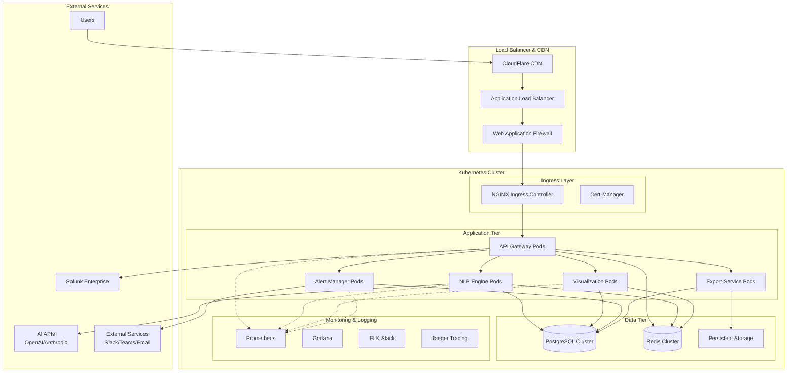
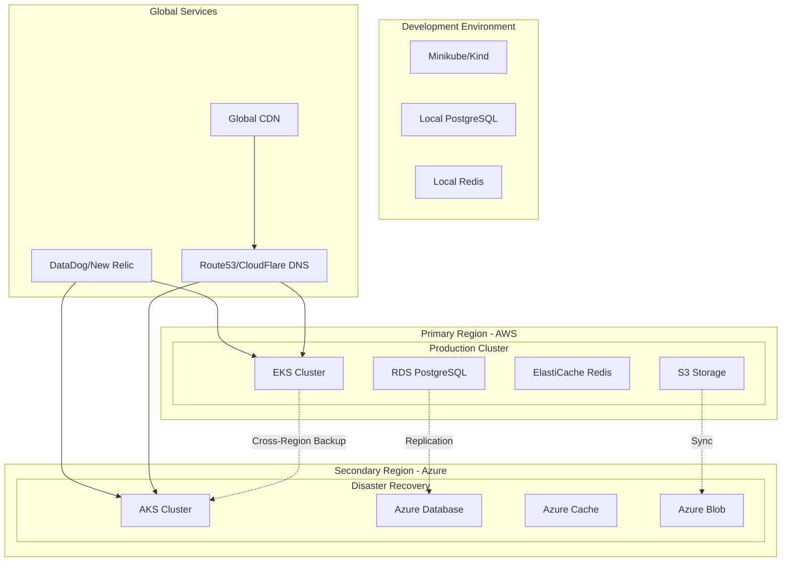

# Deployment Architecture

## Overview

The Splunk MCP Integration platform is designed for cloud-native deployment with support for both containerized and traditional deployment models. This document outlines the deployment architecture, infrastructure requirements, scaling strategies, and operational considerations for production environments.

## Deployment Models

### 1. Cloud-Native Kubernetes Deployment (Recommended)



### 2. Multi-Cloud Deployment Strategy



## Infrastructure Components

### 1. Kubernetes Cluster Configuration

#### Cluster Specifications
```yaml
# Production EKS Cluster Configuration
apiVersion: eksctl.io/v1alpha5
kind: ClusterConfig

metadata:
  name: splunk-mcp-prod
  region: us-west-2
  version: "1.28"

# VPC Configuration
vpc:
  cidr: 10.0.0.0/16
  clusterEndpoints:
    privateAccess: true
    publicAccess: true
    publicAccessCIDRs: ["203.0.113.0/24"]  # Restrict to office IPs

# Node Groups
nodeGroups:
  - name: system-nodes
    instanceType: t3.medium
    minSize: 2
    maxSize: 4
    desiredCapacity: 2
    volumeSize: 50
    ssh:
      allow: false
    labels:
      node-class: system
    taints:
      - key: CriticalAddonsOnly
        effect: NoSchedule
    iam:
      withAddonPolicies:
        imageBuilder: true
        autoScaler: true
        certManager: true
        efs: true
        ebs: true
        albIngress: true
        cloudWatch: true

  - name: application-nodes
    instanceType: c5.xlarge
    minSize: 3
    maxSize: 20
    desiredCapacity: 6
    volumeSize: 100
    ssh:
      allow: false
    labels:
      node-class: application
    privateNetworking: true
    iam:
      withAddonPolicies:
        imageBuilder: true
        autoScaler: true
        cloudWatch: true

  - name: data-nodes
    instanceType: r5.xlarge
    minSize: 2
    maxSize: 6
    desiredCapacity: 2
    volumeSize: 200
    ssh:
      allow: false
    labels:
      node-class: data
    privateNetworking: true
    iam:
      withAddonPolicies:
        imageBuilder: true
        autoScaler: true
        ebs: true

# Cluster Addons
addons:
  - name: aws-ebs-csi-driver
    version: latest
  - name: aws-efs-csi-driver
    version: latest
  - name: coredns
    version: latest
  - name: kube-proxy
    version: latest

# CloudWatch Logging
cloudWatch:
  clusterLogging:
    enableTypes: ["api", "audit", "authenticator", "controllerManager", "scheduler"]
```

#### Resource Management Strategy
```yaml
# Resource quotas per namespace
apiVersion: v1
kind: ResourceQuota
metadata:
  name: production-quota
  namespace: splunk-mcp-prod
spec:
  hard:
    requests.cpu: "50"
    requests.memory: 100Gi
    limits.cpu: "100"
    limits.memory: 200Gi
    persistentvolumeclaims: "20"
    services.loadbalancers: "5"
    pods: "50"

---
apiVersion: v1
kind: LimitRange
metadata:
  name: production-limits
  namespace: splunk-mcp-prod
spec:
  limits:
  - default:
      cpu: "500m"
      memory: "1Gi"
    defaultRequest:
      cpu: "100m"
      memory: "128Mi"
    type: Container
  - max:
      cpu: "4"
      memory: "8Gi"
    min:
      cpu: "50m"
      memory: "64Mi"
    type: Container
```

### 2. Application Deployment Manifests

#### API Gateway Deployment
```yaml
apiVersion: apps/v1
kind: Deployment
metadata:
  name: api-gateway
  namespace: splunk-mcp-prod
  labels:
    app: api-gateway
    version: v1.0.0
    component: gateway
spec:
  replicas: 3
  strategy:
    type: RollingUpdate
    rollingUpdate:
      maxUnavailable: 1
      maxSurge: 1
  selector:
    matchLabels:
      app: api-gateway
  template:
    metadata:
      labels:
        app: api-gateway
        version: v1.0.0
        component: gateway
      annotations:
        prometheus.io/scrape: "true"
        prometheus.io/port: "9000"
        prometheus.io/path: "/metrics"
    spec:
      serviceAccountName: api-gateway
      securityContext:
        runAsNonRoot: true
        runAsUser: 1001
        fsGroup: 1001
        seccompProfile:
          type: RuntimeDefault
      containers:
      - name: api-gateway
        image: splunk-mcp/api-gateway:v1.0.0
        imagePullPolicy: IfNotPresent
        ports:
        - containerPort: 8000
          name: http
          protocol: TCP
        - containerPort: 9000
          name: metrics
          protocol: TCP
        env:
        - name: DATABASE_URL
          valueFrom:
            secretKeyRef:
              name: database-credentials
              key: url
        - name: REDIS_URL
          valueFrom:
            secretKeyRef:
              name: redis-credentials
              key: url
        - name: JWT_SECRET_KEY
          valueFrom:
            secretKeyRef:
              name: jwt-secrets
              key: secret-key
        - name: LOG_LEVEL
          value: "INFO"
        - name: ENVIRONMENT
          value: "production"
        resources:
          requests:
            memory: "512Mi"
            cpu: "250m"
          limits:
            memory: "1Gi"
            cpu: "500m"
        livenessProbe:
          httpGet:
            path: /health/live
            port: 8000
          initialDelaySeconds: 30
          periodSeconds: 30
          timeoutSeconds: 5
          failureThreshold: 3
        readinessProbe:
          httpGet:
            path: /health/ready
            port: 8000
          initialDelaySeconds: 5
          periodSeconds: 10
          timeoutSeconds: 5
          failureThreshold: 3
        startupProbe:
          httpGet:
            path: /health/startup
            port: 8000
          initialDelaySeconds: 10
          periodSeconds: 5
          timeoutSeconds: 5
          failureThreshold: 10
        securityContext:
          allowPrivilegeEscalation: false
          readOnlyRootFilesystem: true
          runAsNonRoot: true
          runAsUser: 1001
          capabilities:
            drop:
            - ALL
        volumeMounts:
        - name: tmp
          mountPath: /tmp
        - name: logs
          mountPath: /app/logs
      volumes:
      - name: tmp
        emptyDir:
          sizeLimit: 1Gi
      - name: logs
        emptyDir:
          sizeLimit: 5Gi
      nodeSelector:
        node-class: application
      tolerations:
      - key: node-class
        operator: Equal
        value: application
        effect: NoSchedule
      affinity:
        podAntiAffinity:
          preferredDuringSchedulingIgnoredDuringExecution:
          - weight: 100
            podAffinityTerm:
              labelSelector:
                matchExpressions:
                - key: app
                  operator: In
                  values:
                  - api-gateway
              topologyKey: kubernetes.io/hostname

---
apiVersion: v1
kind: Service
metadata:
  name: api-gateway
  namespace: splunk-mcp-prod
  labels:
    app: api-gateway
  annotations:
    service.beta.kubernetes.io/aws-load-balancer-type: nlb
    service.beta.kubernetes.io/aws-load-balancer-backend-protocol: http
spec:
  type: LoadBalancer
  ports:
  - port: 80
    targetPort: 8000
    protocol: TCP
    name: http
  selector:
    app: api-gateway

---
apiVersion: autoscaling/v2
kind: HorizontalPodAutoscaler
metadata:
  name: api-gateway-hpa
  namespace: splunk-mcp-prod
spec:
  scaleTargetRef:
    apiVersion: apps/v1
    kind: Deployment
    name: api-gateway
  minReplicas: 3
  maxReplicas: 15
  metrics:
  - type: Resource
    resource:
      name: cpu
      target:
        type: Utilization
        averageUtilization: 70
  - type: Resource
    resource:
      name: memory
      target:
        type: Utilization
        averageUtilization: 80
  behavior:
    scaleUp:
      stabilizationWindowSeconds: 60
      policies:
      - type: Percent
        value: 100
        periodSeconds: 15
    scaleDown:
      stabilizationWindowSeconds: 300
      policies:
      - type: Percent
        value: 10
        periodSeconds: 60
```

### 3. Database Infrastructure

#### PostgreSQL High Availability Setup
```yaml
# PostgreSQL Primary-Replica Configuration
apiVersion: postgresql.cnpg.io/v1
kind: Cluster
metadata:
  name: postgresql-cluster
  namespace: splunk-mcp-prod
spec:
  instances: 3
  
  postgresql:
    parameters:
      max_connections: "200"
      shared_buffers: "256MB"
      effective_cache_size: "1GB"
      maintenance_work_mem: "64MB"
      checkpoint_completion_target: "0.9"
      wal_buffers: "16MB"
      default_statistics_target: "100"
      random_page_cost: "1.1"
      effective_io_concurrency: "200"
      work_mem: "4MB"
      min_wal_size: "1GB"
      max_wal_size: "4GB"
      max_worker_processes: "8"
      max_parallel_workers_per_gather: "4"
      max_parallel_workers: "8"
      max_parallel_maintenance_workers: "4"
      log_statement: "all"
      log_duration: "on"
      log_checkpoints: "on"
      log_connections: "on"
      log_disconnections: "on"
      log_lock_waits: "on"
      log_temp_files: "0"
  
  bootstrap:
    initdb:
      database: splunk_mcp
      owner: splunk_mcp_user
      secret:
        name: postgresql-credentials
      postInitSQL:
        - CREATE EXTENSION IF NOT EXISTS "pgcrypto";
        - CREATE EXTENSION IF NOT EXISTS "pg_stat_statements";
  
  storage:
    size: 500Gi
    storageClass: fast-ssd
  
  monitoring:
    enabled: true
  
  backup:
    barmanObjectStore:
      destinationPath: "s3://splunk-mcp-backups/postgresql"
      s3Credentials:
        accessKeyId:
          name: backup-credentials
          key: ACCESS_KEY_ID
        secretAccessKey:
          name: backup-credentials
          key: SECRET_ACCESS_KEY
      wal:
        retention: "7d"
      data:
        retention: "30d"
      tags:
        environment: "production"
        application: "splunk-mcp"

---
# Redis Cluster Configuration
apiVersion: redis.redis.opstreelabs.in/v1beta1
kind: RedisCluster
metadata:
  name: redis-cluster
  namespace: splunk-mcp-prod
spec:
  clusterSize: 6
  clusterVersion: v7
  persistenceEnabled: true
  redisSecret:
    name: redis-credentials
    key: password
  redisConfig:
    maxmemory: "1gb"
    maxmemory-policy: "allkeys-lru"
    save: "900 1 300 10 60 10000"
    appendonly: "yes"
    appendfsync: "everysec"
    tcp-keepalive: "60"
    timeout: "300"
  storage:
    volumeClaimTemplate:
      spec:
        accessModes: ["ReadWriteOnce"]
        resources:
          requests:
            storage: 100Gi
        storageClassName: fast-ssd
  resources:
    requests:
      cpu: "100m"
      memory: "1Gi"
    limits:
      cpu: "500m"
      memory: "2Gi"
  nodeSelector:
    node-class: data
  tolerations:
  - key: node-class
    operator: Equal
    value: data
    effect: NoSchedule
```

## Scaling and Performance

### 1. Auto-Scaling Configuration

#### Cluster Auto-Scaling
```yaml
apiVersion: v1
kind: ConfigMap
metadata:
  name: cluster-autoscaler-status
  namespace: kube-system
  labels:
    k8s-app: cluster-autoscaler
data:
  nodes.max: "50"
  nodes.min: "3"
  scale-down-delay-after-add: "10m"
  scale-down-unneeded-time: "10m"
  scale-down-utilization-threshold: "0.5"

---
apiVersion: apps/v1
kind: Deployment
metadata:
  name: cluster-autoscaler
  namespace: kube-system
  labels:
    app: cluster-autoscaler
spec:
  selector:
    matchLabels:
      app: cluster-autoscaler
  template:
    metadata:
      labels:
        app: cluster-autoscaler
      annotations:
        prometheus.io/scrape: 'true'
        prometheus.io/port: '8085'
    spec:
      serviceAccount: cluster-autoscaler
      containers:
      - image: k8s.gcr.io/autoscaling/cluster-autoscaler:v1.28.0
        name: cluster-autoscaler
        resources:
          limits:
            cpu: 100m
            memory: 300Mi
          requests:
            cpu: 100m
            memory: 300Mi
        command:
        - ./cluster-autoscaler
        - --v=4
        - --stderrthreshold=info
        - --cloud-provider=aws
        - --skip-nodes-with-local-storage=false
        - --expander=least-waste
        - --node-group-auto-discovery=asg:tag=k8s.io/cluster-autoscaler/enabled,k8s.io/cluster-autoscaler/splunk-mcp-prod
        - --balance-similar-node-groups
        - --scale-down-enabled=true
        - --scale-down-delay-after-add=10m
        - --scale-down-unneeded-time=10m
        - --scale-down-utilization-threshold=0.5
        env:
        - name: AWS_REGION
          value: us-west-2
```

#### Application Auto-Scaling Policies
```yaml
# Custom metrics scaling for NLP Engine
apiVersion: autoscaling/v2
kind: HorizontalPodAutoscaler
metadata:
  name: nlp-engine-hpa
  namespace: splunk-mcp-prod
spec:
  scaleTargetRef:
    apiVersion: apps/v1
    kind: Deployment
    name: nlp-engine
  minReplicas: 2
  maxReplicas: 20
  metrics:
  - type: Resource
    resource:
      name: cpu
      target:
        type: Utilization
        averageUtilization: 70
  - type: Resource
    resource:
      name: memory
      target:
        type: Utilization
        averageUtilization: 80
  - type: Pods
    pods:
      metric:
        name: queue_size
      target:
        type: AverageValue
        averageValue: "50"
  - type: External
    external:
      metric:
        name: openai_api_latency
      target:
        type: Value
        value: "2000m"
  behavior:
    scaleUp:
      stabilizationWindowSeconds: 60
      policies:
      - type: Percent
        value: 100
        periodSeconds: 15
      - type: Pods
        value: 4
        periodSeconds: 15
      selectPolicy: Max
    scaleDown:
      stabilizationWindowSeconds: 300
      policies:
      - type: Percent
        value: 10
        periodSeconds: 60
      - type: Pods
        value: 2
        periodSeconds: 60
      selectPolicy: Min

---
# Vertical Pod Autoscaler for right-sizing
apiVersion: autoscaling.k8s.io/v1
kind: VerticalPodAutoscaler
metadata:
  name: visualization-vpa
  namespace: splunk-mcp-prod
spec:
  targetRef:
    apiVersion: apps/v1
    kind: Deployment
    name: visualization
  updatePolicy:
    updateMode: "Auto"
  resourcePolicy:
    containerPolicies:
    - containerName: visualization
      maxAllowed:
        cpu: 2
        memory: 4Gi
      minAllowed:
        cpu: 100m
        memory: 128Mi
      controlledResources: ["cpu", "memory"]
```

### 2. Performance Optimization

#### Resource Allocation Strategy
```python
from typing import Dict, Any
import yaml

class ResourceCalculator:
    """Calculate optimal resource allocation for services"""
    
    def __init__(self):
        self.base_resources = {
            "api-gateway": {
                "cpu_request": "250m",
                "memory_request": "512Mi",
                "cpu_limit": "1000m", 
                "memory_limit": "1Gi"
            },
            "nlp-engine": {
                "cpu_request": "500m",
                "memory_request": "1Gi",
                "cpu_limit": "2000m",
                "memory_limit": "4Gi"
            },
            "visualization": {
                "cpu_request": "250m",
                "memory_request": "512Mi",
                "cpu_limit": "1000m",
                "memory_limit": "2Gi"
            },
            "alert-manager": {
                "cpu_request": "200m",
                "memory_request": "256Mi",
                "cpu_limit": "500m",
                "memory_limit": "1Gi"
            }
        }
        
        self.scaling_factors = {
            "development": 0.5,
            "staging": 0.7,
            "production": 1.0,
            "high-load": 1.5
        }
    
    def calculate_resources(self, service: str, environment: str, 
                          expected_load: str = "normal") -> Dict[str, str]:
        """Calculate resources based on environment and load"""
        base = self.base_resources.get(service, {})
        factor = self.scaling_factors.get(environment, 1.0)
        
        # Apply load-based adjustments
        load_factors = {
            "low": 0.7,
            "normal": 1.0,
            "high": 1.3,
            "peak": 1.8
        }
        load_factor = load_factors.get(expected_load, 1.0)
        
        total_factor = factor * load_factor
        
        return {
            "cpu_request": self._scale_cpu(base.get("cpu_request", "100m"), total_factor),
            "memory_request": self._scale_memory(base.get("memory_request", "128Mi"), total_factor),
            "cpu_limit": self._scale_cpu(base.get("cpu_limit", "500m"), total_factor),
            "memory_limit": self._scale_memory(base.get("memory_limit", "512Mi"), total_factor)
        }
    
    def _scale_cpu(self, cpu_str: str, factor: float) -> str:
        """Scale CPU resource string"""
        if cpu_str.endswith('m'):
            cpu_value = int(cpu_str[:-1])
            scaled_value = int(cpu_value * factor)
            return f"{scaled_value}m"
        else:
            cpu_value = float(cpu_str)
            scaled_value = cpu_value * factor
            return f"{scaled_value:.1f}"
    
    def _scale_memory(self, memory_str: str, factor: float) -> str:
        """Scale memory resource string"""
        units = {"Ki": 1024, "Mi": 1024**2, "Gi": 1024**3}
        
        for unit, multiplier in units.items():
            if memory_str.endswith(unit):
                memory_value = int(memory_str[:-len(unit)])
                scaled_bytes = int(memory_value * multiplier * factor)
                
                # Convert back to appropriate unit
                if scaled_bytes >= 1024**3:
                    return f"{scaled_bytes // (1024**3)}Gi"
                elif scaled_bytes >= 1024**2:
                    return f"{scaled_bytes // (1024**2)}Mi"
                else:
                    return f"{scaled_bytes // 1024}Ki"
        
        return memory_str

# Performance tuning configuration
class PerformanceTuning:
    """Performance tuning configurations for different workloads"""
    
    @staticmethod
    def get_jvm_tuning(service: str, memory_limit: str) -> Dict[str, str]:
        """Get JVM tuning parameters for Java services"""
        # Extract memory value in MB
        memory_mb = int(memory_limit.replace('Mi', '').replace('Gi', '000'))
        
        heap_size = int(memory_mb * 0.7)  # 70% for heap
        
        return {
            "JAVA_OPTS": f"-Xmx{heap_size}m -Xms{heap_size//2}m "
                        f"-XX:+UseG1GC -XX:MaxGCPauseMillis=200 "
                        f"-XX:+UnlockExperimentalVMOptions -XX:+UseZGC"
        }
    
    @staticmethod
    def get_python_tuning(service: str) -> Dict[str, str]:
        """Get Python tuning parameters"""
        return {
            "PYTHONUNBUFFERED": "1",
            "PYTHONDONTWRITEBYTECODE": "1",
            "PYTHONUTF8": "1",
            "PYTHONOPTIMIZE": "2" if service in ["nlp-engine", "visualization"] else "1"
        }
    
    @staticmethod
    def get_fastapi_tuning(expected_load: str) -> Dict[str, str]:
        """Get FastAPI/Uvicorn tuning parameters"""
        worker_configs = {
            "low": {"workers": "2", "worker_connections": "100"},
            "normal": {"workers": "4", "worker_connections": "200"},
            "high": {"workers": "8", "worker_connections": "500"},
            "peak": {"workers": "16", "worker_connections": "1000"}
        }
        
        config = worker_configs.get(expected_load, worker_configs["normal"])
        
        return {
            "UVICORN_WORKERS": config["workers"],
            "UVICORN_WORKER_CONNECTIONS": config["worker_connections"],
            "UVICORN_BACKLOG": "2048",
            "UVICORN_KEEP_ALIVE": "5"
        }
```

## Monitoring and Observability

### 1. Monitoring Stack Configuration

#### Prometheus Configuration
```yaml
apiVersion: v1
kind: ConfigMap
metadata:
  name: prometheus-config
  namespace: monitoring
data:
  prometheus.yml: |
    global:
      scrape_interval: 15s
      evaluation_interval: 15s
      external_labels:
        cluster: 'splunk-mcp-prod'
        region: 'us-west-2'
    
    rule_files:
      - "alert_rules.yml"
      - "recording_rules.yml"
    
    alerting:
      alertmanagers:
        - static_configs:
            - targets:
              - alertmanager:9093
    
    scrape_configs:
      # Kubernetes API Server
      - job_name: 'kubernetes-apiservers'
        kubernetes_sd_configs:
        - role: endpoints
        scheme: https
        tls_config:
          ca_file: /var/run/secrets/kubernetes.io/serviceaccount/ca.crt
        bearer_token_file: /var/run/secrets/kubernetes.io/serviceaccount/token
        relabel_configs:
        - source_labels: [__meta_kubernetes_namespace, __meta_kubernetes_service_name, __meta_kubernetes_endpoint_port_name]
          action: keep
          regex: default;kubernetes;https
      
      # Application metrics
      - job_name: 'api-gateway'
        kubernetes_sd_configs:
        - role: endpoints
          namespaces:
            names:
            - splunk-mcp-prod
        relabel_configs:
        - source_labels: [__meta_kubernetes_service_label_app]
          action: keep
          regex: api-gateway
        - source_labels: [__meta_kubernetes_endpoint_port_name]
          action: keep
          regex: metrics
      
      - job_name: 'nlp-engine'
        kubernetes_sd_configs:
        - role: endpoints
          namespaces:
            names:
            - splunk-mcp-prod
        relabel_configs:
        - source_labels: [__meta_kubernetes_service_label_app]
          action: keep
          regex: nlp-engine
        - source_labels: [__meta_kubernetes_endpoint_port_name]
          action: keep
          regex: metrics
      
      # Database metrics
      - job_name: 'postgresql'
        static_configs:
        - targets: ['postgresql-exporter:9187']
        scrape_interval: 30s
      
      - job_name: 'redis'
        static_configs:
        - targets: ['redis-exporter:9121']
        scrape_interval: 30s
      
      # Node metrics
      - job_name: 'node-exporter'
        kubernetes_sd_configs:
        - role: endpoints
        relabel_configs:
        - source_labels: [__meta_kubernetes_endpoints_name]
          regex: node-exporter
          action: keep

  alert_rules.yml: |
    groups:
    - name: application.rules
      rules:
      - alert: HighErrorRate
        expr: rate(http_requests_total{status=~"5.."}[5m]) > 0.1
        for: 2m
        labels:
          severity: critical
        annotations:
          summary: "High error rate detected"
          description: "Error rate is {{ $value }} for {{ $labels.service }}"
      
      - alert: HighLatency
        expr: histogram_quantile(0.95, rate(http_request_duration_seconds_bucket[5m])) > 2
        for: 5m
        labels:
          severity: warning
        annotations:
          summary: "High latency detected"
          description: "95th percentile latency is {{ $value }}s for {{ $labels.service }}"
      
      - alert: PodCrashLooping
        expr: rate(kube_pod_container_status_restarts_total[15m]) > 0
        for: 0m
        labels:
          severity: critical
        annotations:
          summary: "Pod is crash looping"
          description: "Pod {{ $labels.pod }} is crash looping"
    
    - name: infrastructure.rules
      rules:
      - alert: NodeHighCPU
        expr: 100 - (avg by(instance) (rate(node_cpu_seconds_total{mode="idle"}[5m])) * 100) > 80
        for: 5m
        labels:
          severity: warning
        annotations:
          summary: "Node CPU usage is high"
          description: "Node {{ $labels.instance }} CPU usage is {{ $value }}%"
      
      - alert: NodeHighMemory
        expr: (1 - (node_memory_MemAvailable_bytes / node_memory_MemTotal_bytes)) * 100 > 85
        for: 5m
        labels:
          severity: warning
        annotations:
          summary: "Node memory usage is high"
          description: "Node {{ $labels.instance }} memory usage is {{ $value }}%"
      
      - alert: DatabaseDown
        expr: up{job="postgresql"} == 0
        for: 1m
        labels:
          severity: critical
        annotations:
          summary: "Database is down"
          description: "PostgreSQL database is not reachable"
```

#### Grafana Dashboard Configuration
```json
{
  "dashboard": {
    "id": null,
    "title": "Splunk MCP Integration - Application Metrics",
    "tags": ["splunk-mcp", "application"],
    "timezone": "browser",
    "panels": [
      {
        "id": 1,
        "title": "Request Rate",
        "type": "stat",
        "targets": [
          {
            "expr": "sum(rate(http_requests_total[5m]))",
            "legendFormat": "Requests/sec"
          }
        ],
        "fieldConfig": {
          "defaults": {
            "unit": "reqps"
          }
        }
      },
      {
        "id": 2,
        "title": "Error Rate",
        "type": "stat",
        "targets": [
          {
            "expr": "sum(rate(http_requests_total{status=~\"5..\"}[5m])) / sum(rate(http_requests_total[5m])) * 100",
            "legendFormat": "Error Rate %"
          }
        ],
        "fieldConfig": {
          "defaults": {
            "unit": "percent",
            "thresholds": {
              "steps": [
                {"color": "green", "value": 0},
                {"color": "yellow", "value": 1},
                {"color": "red", "value": 5}
              ]
            }
          }
        }
      },
      {
        "id": 3,
        "title": "Response Time",
        "type": "timeseries",
        "targets": [
          {
            "expr": "histogram_quantile(0.50, rate(http_request_duration_seconds_bucket[5m]))",
            "legendFormat": "50th percentile"
          },
          {
            "expr": "histogram_quantile(0.95, rate(http_request_duration_seconds_bucket[5m]))",
            "legendFormat": "95th percentile"
          },
          {
            "expr": "histogram_quantile(0.99, rate(http_request_duration_seconds_bucket[5m]))",
            "legendFormat": "99th percentile"
          }
        ],
        "fieldConfig": {
          "defaults": {
            "unit": "s"
          }
        }
      }
    ],
    "time": {
      "from": "now-1h",
      "to": "now"
    },
    "refresh": "5s"
  }
}
```

### 2. Logging Architecture

#### ELK Stack Configuration
```yaml
# Elasticsearch
apiVersion: elasticsearch.k8s.elastic.co/v1
kind: Elasticsearch
metadata:
  name: elasticsearch
  namespace: logging
spec:
  version: 8.11.0
  nodeSets:
  - name: masters
    count: 3
    config:
      node.roles: ["master"]
      xpack.security.enabled: true
      xpack.security.transport.ssl.enabled: true
      xpack.security.http.ssl.enabled: true
    podTemplate:
      spec:
        containers:
        - name: elasticsearch
          resources:
            requests:
              memory: 2Gi
              cpu: 1
            limits:
              memory: 4Gi
              cpu: 2
          env:
          - name: ES_JAVA_OPTS
            value: "-Xms2g -Xmx2g"
    volumeClaimTemplates:
    - metadata:
        name: elasticsearch-data
      spec:
        accessModes:
        - ReadWriteOnce
        resources:
          requests:
            storage: 100Gi
        storageClassName: fast-ssd
  
  - name: data
    count: 6
    config:
      node.roles: ["data", "ingest"]
      xpack.security.enabled: true
    podTemplate:
      spec:
        containers:
        - name: elasticsearch
          resources:
            requests:
              memory: 4Gi
              cpu: 2
            limits:
              memory: 8Gi
              cpu: 4
          env:
          - name: ES_JAVA_OPTS
            value: "-Xms4g -Xmx4g"
    volumeClaimTemplates:
    - metadata:
        name: elasticsearch-data
      spec:
        accessModes:
        - ReadWriteOnce
        resources:
          requests:
            storage: 500Gi
        storageClassName: fast-ssd

---
# Kibana
apiVersion: kibana.k8s.elastic.co/v1
kind: Kibana
metadata:
  name: kibana
  namespace: logging
spec:
  version: 8.11.0
  count: 2
  elasticsearchRef:
    name: elasticsearch
  config:
    server.ssl.enabled: true
    elasticsearch.ssl.verificationMode: certificate
  podTemplate:
    spec:
      containers:
      - name: kibana
        resources:
          requests:
            memory: 1Gi
            cpu: 500m
          limits:
            memory: 2Gi
            cpu: 1

---
# Logstash
apiVersion: apps/v1
kind: Deployment
metadata:
  name: logstash
  namespace: logging
spec:
  replicas: 3
  selector:
    matchLabels:
      app: logstash
  template:
    metadata:
      labels:
        app: logstash
    spec:
      containers:
      - name: logstash
        image: docker.elastic.co/logstash/logstash:8.11.0
        resources:
          requests:
            memory: 2Gi
            cpu: 1
          limits:
            memory: 4Gi
            cpu: 2
        env:
        - name: LS_JAVA_OPTS
          value: "-Xmx2g -Xms2g"
        volumeMounts:
        - name: logstash-config
          mountPath: /usr/share/logstash/pipeline
        - name: logstash-settings
          mountPath: /usr/share/logstash/config
      volumes:
      - name: logstash-config
        configMap:
          name: logstash-config
      - name: logstash-settings
        configMap:
          name: logstash-settings
```

## Disaster Recovery and Backup

### 1. Backup Strategy

#### Database Backup Configuration
```yaml
# PostgreSQL Backup Job
apiVersion: batch/v1
kind: CronJob
metadata:
  name: postgresql-backup
  namespace: splunk-mcp-prod
spec:
  schedule: "0 2 * * *"  # Daily at 2 AM
  jobTemplate:
    spec:
      template:
        spec:
          restartPolicy: OnFailure
          containers:
          - name: backup
            image: postgres:15
            env:
            - name: PGPASSWORD
              valueFrom:
                secretKeyRef:
                  name: postgresql-credentials
                  key: password
            - name: PGHOST
              value: postgresql-cluster-rw
            - name: PGUSER
              value: postgres
            - name: PGDATABASE
              value: splunk_mcp
            - name: AWS_ACCESS_KEY_ID
              valueFrom:
                secretKeyRef:
                  name: backup-credentials
                  key: access-key-id
            - name: AWS_SECRET_ACCESS_KEY
              valueFrom:
                secretKeyRef:
                  name: backup-credentials
                  key: secret-access-key
            command:
            - /bin/bash
            - -c
            - |
              BACKUP_FILE="postgresql-backup-$(date +%Y%m%d-%H%M%S).sql.gz"
              pg_dump -h $PGHOST -U $PGUSER -d $PGDATABASE | gzip > /tmp/$BACKUP_FILE
              aws s3 cp /tmp/$BACKUP_FILE s3://splunk-mcp-backups/postgresql/$BACKUP_FILE
              echo "Backup completed: $BACKUP_FILE"

---
# Application Data Backup
apiVersion: batch/v1
kind: CronJob
metadata:
  name: application-backup
  namespace: splunk-mcp-prod
spec:
  schedule: "0 3 * * *"  # Daily at 3 AM
  jobTemplate:
    spec:
      template:
        spec:
          restartPolicy: OnFailure
          containers:
          - name: backup
            image: splunk-mcp/backup-tool:latest
            env:
            - name: DATABASE_URL
              valueFrom:
                secretKeyRef:
                  name: database-credentials
                  key: url
            - name: REDIS_URL
              valueFrom:
                secretKeyRef:
                  name: redis-credentials
                  key: url
            - name: BACKUP_STORAGE_URL
              value: "s3://splunk-mcp-backups/application"
            command:
            - /app/backup.sh
            volumeMounts:
            - name: backup-config
              mountPath: /app/config
          volumes:
          - name: backup-config
            configMap:
              name: backup-config
```

### 2. Disaster Recovery Plan

#### Cross-Region Replication
```python
import asyncio
import boto3
from typing import Dict, Any, List

class DisasterRecoveryManager:
    """Disaster recovery management system"""
    
    def __init__(self, primary_region: str, dr_region: str):
        self.primary_region = primary_region
        self.dr_region = dr_region
        self.s3_primary = boto3.client('s3', region_name=primary_region)
        self.s3_dr = boto3.client('s3', region_name=dr_region)
        self.rds_primary = boto3.client('rds', region_name=primary_region)
        self.rds_dr = boto3.client('rds', region_name=dr_region)
    
    async def setup_cross_region_replication(self):
        """Set up cross-region replication for critical data"""
        
        # Set up S3 cross-region replication
        await self._setup_s3_replication()
        
        # Set up RDS cross-region backup
        await self._setup_rds_cross_region_backup()
        
        # Set up EKS disaster recovery cluster
        await self._setup_eks_dr_cluster()
    
    async def _setup_s3_replication(self):
        """Configure S3 cross-region replication"""
        replication_config = {
            'Role': 'arn:aws:iam::ACCOUNT:role/replication-role',
            'Rules': [
                {
                    'ID': 'ReplicateAll',
                    'Status': 'Enabled',
                    'Priority': 1,
                    'Filter': {'Prefix': ''},
                    'Destination': {
                        'Bucket': f'arn:aws:s3:::splunk-mcp-backups-{self.dr_region}',
                        'StorageClass': 'STANDARD_IA'
                    }
                }
            ]
        }
        
        self.s3_primary.put_bucket_replication(
            Bucket='splunk-mcp-backups',
            ReplicationConfiguration=replication_config
        )
    
    async def failover_to_dr(self, failover_type: str = "planned"):
        """Execute failover to disaster recovery environment"""
        
        print(f"Initiating {failover_type} failover to DR region: {self.dr_region}")
        
        # Step 1: Update DNS to point to DR region
        await self._update_dns_to_dr()
        
        # Step 2: Promote DR database to primary
        await self._promote_dr_database()
        
        # Step 3: Scale up DR Kubernetes cluster
        await self._scale_up_dr_cluster()
        
        # Step 4: Update application configuration
        await self._update_app_config_for_dr()
        
        # Step 5: Verify DR environment health
        health_status = await self._verify_dr_health()
        
        if health_status["healthy"]:
            print("Failover completed successfully")
            await self._notify_stakeholders("Failover completed", health_status)
        else:
            print("Failover completed with issues")
            await self._notify_stakeholders("Failover completed with issues", health_status)
    
    async def failback_to_primary(self):
        """Execute failback to primary region"""
        
        print(f"Initiating failback to primary region: {self.primary_region}")
        
        # Step 1: Sync data from DR to primary
        await self._sync_data_to_primary()
        
        # Step 2: Update DNS back to primary
        await self._update_dns_to_primary()
        
        # Step 3: Scale down DR cluster
        await self._scale_down_dr_cluster()
        
        # Step 4: Verify primary environment
        health_status = await self._verify_primary_health()
        
        if health_status["healthy"]:
            print("Failback completed successfully")
        else:
            print("Failback completed with issues")
    
    async def _verify_dr_health(self) -> Dict[str, Any]:
        """Verify disaster recovery environment health"""
        health_checks = {
            "database": await self._check_database_health(),
            "api_gateway": await self._check_service_health("api-gateway"),
            "nlp_engine": await self._check_service_health("nlp-engine"),
            "visualization": await self._check_service_health("visualization"),
            "redis": await self._check_redis_health()
        }
        
        healthy_services = sum(1 for status in health_checks.values() if status)
        total_services = len(health_checks)
        
        return {
            "healthy": healthy_services == total_services,
            "health_percentage": (healthy_services / total_services) * 100,
            "service_status": health_checks
        }
```

## Security and Compliance

### 1. Security Configuration

#### Pod Security Standards
```yaml
apiVersion: v1
kind: Namespace
metadata:
  name: splunk-mcp-prod
  labels:
    pod-security.kubernetes.io/enforce: restricted
    pod-security.kubernetes.io/audit: restricted
    pod-security.kubernetes.io/warn: restricted

---
apiVersion: v1
kind: SecurityContext
metadata:
  name: restricted-security-context
spec:
  runAsNonRoot: true
  runAsUser: 1001
  runAsGroup: 1001
  fsGroup: 1001
  seccompProfile:
    type: RuntimeDefault
  supplementalGroups: []
  seLinuxOptions:
    level: "s0:c123,c456"

---
# Network Policies
apiVersion: networking.k8s.io/v1
kind: NetworkPolicy
metadata:
  name: default-deny-all
  namespace: splunk-mcp-prod
spec:
  podSelector: {}
  policyTypes:
  - Ingress
  - Egress

---
apiVersion: networking.k8s.io/v1
kind: NetworkPolicy
metadata:
  name: allow-ingress-to-api-gateway
  namespace: splunk-mcp-prod
spec:
  podSelector:
    matchLabels:
      app: api-gateway
  policyTypes:
  - Ingress
  ingress:
  - from:
    - namespaceSelector:
        matchLabels:
          name: ingress-nginx
    ports:
    - protocol: TCP
      port: 8000
```

### 2. Compliance Configuration

#### RBAC Configuration
```yaml
# Service Account for API Gateway
apiVersion: v1
kind: ServiceAccount
metadata:
  name: api-gateway
  namespace: splunk-mcp-prod
  annotations:
    eks.amazonaws.com/role-arn: arn:aws:iam::ACCOUNT:role/api-gateway-role

---
# Role for API Gateway
apiVersion: rbac.authorization.k8s.io/v1
kind: Role
metadata:
  namespace: splunk-mcp-prod
  name: api-gateway-role
rules:
- apiGroups: [""]
  resources: ["secrets", "configmaps"]
  verbs: ["get", "list"]
- apiGroups: [""]
  resources: ["pods"]
  verbs: ["get", "list"]

---
# RoleBinding for API Gateway
apiVersion: rbac.authorization.k8s.io/v1
kind: RoleBinding
metadata:
  name: api-gateway-binding
  namespace: splunk-mcp-prod
subjects:
- kind: ServiceAccount
  name: api-gateway
  namespace: splunk-mcp-prod
roleRef:
  kind: Role
  name: api-gateway-role
  apiGroup: rbac.authorization.k8s.io

---
# ClusterRole for monitoring
apiVersion: rbac.authorization.k8s.io/v1
kind: ClusterRole
metadata:
  name: prometheus-monitoring
rules:
- apiGroups: [""]
  resources: ["nodes", "nodes/proxy", "services", "endpoints", "pods"]
  verbs: ["get", "list", "watch"]
- apiGroups: ["extensions"]
  resources: ["ingresses"]
  verbs: ["get", "list", "watch"]
- nonResourceURLs: ["/metrics"]
  verbs: ["get"]
```

---

*This deployment architecture document provides comprehensive guidance for deploying, scaling, and operating the Splunk MCP Integration platform in production environments. It should be regularly updated to reflect infrastructure changes and operational improvements.*

*Last Updated: January 22, 2025*  
*Version: 1.0*