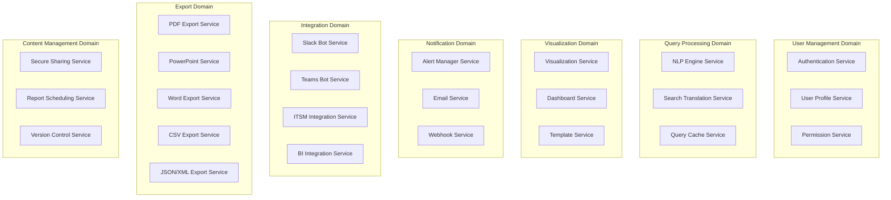

# Microservices Architecture

## Overview

The Splunk MCP Integration platform implements a microservices architecture pattern, decomposing the application into loosely coupled, independently deployable services. Each service is responsible for a specific business capability and maintains its own data store.

## Microservices Principles

### 1. Service Decomposition Strategy

#### Business Capability Decomposition


#### Domain Boundaries
Each domain represents a bounded context with:
- **Clear Responsibility**: Single business purpose
- **Data Ownership**: Exclusive data management
- **Independent Evolution**: Can change without affecting others
- **Team Ownership**: Dedicated development team

### 2. Service Characteristics

#### Core Service Properties
| Property | Description | Implementation |
|----------|-------------|----------------|
| **Autonomy** | Independent development and deployment | Docker containers, separate CI/CD pipelines |
| **Decentralization** | Decentralized data management | Service-specific databases |
| **Resilience** | Fault tolerance and graceful degradation | Circuit breakers, timeouts, retries |
| **Observability** | Comprehensive monitoring and logging | Metrics, tracing, structured logging |
| **Scalability** | Independent scaling based on demand | Kubernetes HPA, resource management |

## Service Catalog

### Core Services

#### 1. API Gateway Service
```yaml
Service Name: api-gateway
Port: 8000
Database: Shared PostgreSQL
Dependencies: Redis, All backend services

Responsibilities:
  - Request routing and load balancing
  - Authentication and authorization
  - Rate limiting and throttling
  - API versioning and documentation
  - Cross-cutting concerns (CORS, security headers)

Key Components:
  - Authentication middleware
  - Rate limiting service
  - Request/response transformation
  - Circuit breaker implementation
  - Audit logging service

API Endpoints:
  - /auth/** - Authentication endpoints
  - /api/v1/** - Versioned API routing
  - /health - Health check endpoint
  - /metrics - Prometheus metrics
```

#### 2. NLP Engine Service
```yaml
Service Name: nlp-engine
Port: 8001
Database: PostgreSQL (nlp_queries, query_contexts, ai_model_metrics)
Dependencies: OpenAI/Anthropic APIs, Redis

Responsibilities:
  - Natural language query understanding
  - Intent classification and entity extraction
  - SPL query generation and optimization
  - Query context management
  - AI model performance tracking

Key Components:
  - Query parser and tokenizer
  - Intent classification engine
  - Entity extraction service
  - SPL generator with templates
  - Context management service
  - AI model abstraction layer

Data Models:
  - NLP Query: natural_language, processed_intent, generated_spl
  - Query Context: conversation_id, context_data, user_preferences
  - AI Metrics: model_name, accuracy_score, response_time, cost
```

#### 3. Visualization Service
```yaml
Service Name: visualization
Port: 8002
Database: PostgreSQL (charts, dashboards, templates)
Dependencies: None (stateless chart generation)

Responsibilities:
  - Chart generation (Plotly, D3.js)
  - Dashboard layout management
  - Interactive visualization features
  - Chart export (PNG, SVG, PDF)
  - Template management

Key Components:
  - Chart generation engine
  - Dashboard layout engine
  - Export service
  - Template manager
  - Interactive features handler

Chart Types:
  - Line, Bar, Pie, Scatter plots
  - Heatmaps, Treemaps, Sankey diagrams
  - Time series visualizations
  - Statistical charts (box plots, histograms)
  - Custom interactive dashboards
```

#### 4. Alert Manager Service
```yaml
Service Name: alert-manager
Port: 8003
Database: PostgreSQL (alerts, alert_rules, notifications, escalations)
Dependencies: Email Service, Slack/Teams APIs, Webhook Service

Responsibilities:
  - Alert rule management
  - Alert condition evaluation
  - Multi-channel notifications
  - Alert escalation workflows
  - Alert correlation and deduplication

Key Components:
  - Rule engine for alert conditions
  - Notification dispatcher
  - Escalation workflow manager
  - Alert correlation engine
  - Performance metrics collector

Notification Channels:
  - Email (HTML/plain text)
  - Slack (rich messages, mentions)
  - Microsoft Teams (adaptive cards)
  - SMS (via external providers)
  - Webhooks (custom integrations)
  - PagerDuty integration
```

### Integration Services

#### 5. Slack Bot Service
```yaml
Service Name: slack-bot
Port: 8004
Database: PostgreSQL (slack_users, slack_sessions, slack_conversations)
Dependencies: Slack API, NLP Engine, Visualization Service

Responsibilities:
  - Slack workspace integration
  - Conversational AI interface
  - Natural language query processing
  - Rich message formatting
  - Session and context management

Key Features:
  - App mentions and direct messages
  - Slash commands (/splunk, /splunk-help)
  - Interactive buttons and menus
  - File upload for charts/reports
  - Real-time typing indicators

Integration Points:
  - NLP Engine: Query processing
  - Visualization: Chart embedding
  - Export Services: Report generation
  - Alert Manager: Alert notifications
```

#### 6. Microsoft Teams Bot Service
```yaml
Service Name: teams-bot
Port: 8005
Database: PostgreSQL (teams_users, teams_sessions, teams_activities)
Dependencies: Microsoft Bot Framework, NLP Engine

Responsibilities:
  - Microsoft Teams integration
  - Bot Framework implementation
  - Adaptive Cards for rich interactions
  - Proactive messaging capabilities
  - Multi-tenant support

Key Features:
  - Personal and team conversations
  - Adaptive Cards with actions
  - Proactive notifications
  - File attachments and sharing
  - Meeting integration

Enterprise Features:
  - Azure AD integration
  - Tenant-specific configurations
  - Compliance and governance
  - Activity logging and reporting
```

#### 7. ITSM Integration Service
```yaml
Service Name: itsm-service
Port: 8018
Database: PostgreSQL (itsm_integrations, itsm_tickets, itsm_workflows)
Dependencies: ServiceNow API, Jira API, Splunk Data

Responsibilities:
  - ServiceNow integration
  - Jira project management
  - Bidirectional synchronization
  - Workflow automation
  - Incident correlation

Key Components:
  - ServiceNow manager (CRUD operations)
  - Jira manager (issue management)
  - Sync manager (conflict resolution)
  - Workflow engine (automation)
  - Field mapping service

Supported Operations:
  - Create/update/search tickets
  - Automatic ticket creation from alerts
  - Status synchronization
  - Comment and attachment sync
  - Custom field mapping
```

#### 8. BI Integration Service
```yaml
Service Name: bi-integration-service
Port: 8008
Database: PostgreSQL (bi_integrations, workbooks, datasets)
Dependencies: Tableau Server API, Power BI API

Responsibilities:
  - Tableau Server integration
  - Microsoft Power BI integration
  - Workbook and report publishing
  - Dataset refresh automation
  - Data source management

Key Features:
  - Workbook publishing from Splunk data
  - Automated data refresh schedules
  - Report distribution and sharing
  - Performance monitoring
  - Access control and permissions

Integration Capabilities:
  - Tableau Server REST API
  - Power BI REST API
  - OAuth 2.0 authentication
  - Metadata management
  - Usage analytics
```

### Export Services

#### 9. PDF Export Service
```yaml
Service Name: pdf-export-service
Port: 8009
Database: PostgreSQL (pdf_jobs, pdf_templates, pdf_analytics)
Dependencies: WeasyPrint, Visualization Service

Responsibilities:
  - High-quality PDF generation
  - Template-based report creation
  - Chart and image embedding
  - Custom layout management
  - Batch processing capabilities

Key Features:
  - HTML to PDF conversion
  - Custom page layouts and styling
  - Chart integration from Visualization Service
  - Template management system
  - Background job processing

Template System:
  - Jinja2 template engine
  - Custom CSS styling
  - Dynamic content generation
  - Variable substitution
  - Conditional content blocks
```

#### 10. PowerPoint Export Service
```yaml
Service Name: powerpoint-export-service
Port: 8011
Database: PostgreSQL (ppt_jobs, ppt_templates, ppt_slides)
Dependencies: python-pptx, Visualization Service

Responsibilities:
  - PowerPoint presentation generation
  - Slide layout management
  - Chart and image embedding
  - Theme and template support
  - Animation and transition effects

Key Features:
  - Multiple export formats (PPTX, PDF, PNG)
  - Pre-defined slide layouts
  - Chart embedding from Visualization
  - Theme customization
  - Bulk presentation generation

Slide Layouts:
  - Title slide
  - Title and content
  - Two content columns
  - Comparison layouts
  - Chart-focused layouts
```

#### 11. HTML Report Service
```yaml
Service Name: html-report-service
Port: 8012
Database: PostgreSQL (html_jobs, html_templates, html_metrics)
Dependencies: Plotly.js, Bootstrap, DataTables

Responsibilities:
  - Interactive HTML report generation
  - Responsive design templates
  - Client-side interactivity
  - Print-friendly layouts
  - Real-time data updates

Key Features:
  - Interactive charts with Plotly.js
  - Responsive table with DataTables
  - Theme switching capabilities
  - Export functionality (PDF, Excel)
  - Cross-filtering between components

Template Features:
  - Modern responsive design
  - Dark/light theme support
  - Custom branding options
  - Print-optimized CSS
  - Progressive enhancement
```

#### 12. Word Export Service
```yaml
Service Name: word-export-service
Port: 8013
Database: PostgreSQL (word_jobs, word_templates, word_analytics)
Dependencies: python-docx, matplotlib

Responsibilities:
  - Word document generation
  - Professional report formatting
  - Chart and table embedding
  - Template-based creation
  - Corporate branding support

Key Features:
  - Professional document templates
  - Chart embedding via matplotlib
  - Advanced table formatting
  - Header/footer customization
  - Watermark and branding support

Document Elements:
  - Styled headings and paragraphs
  - Embedded charts and images
  - Professional tables
  - Table of contents generation
  - Cross-references and bookmarks
```

### Communication Services

#### 13. Email Service
```yaml
Service Name: email-service
Port: 8006
Database: PostgreSQL (email_queue, email_templates, email_metrics)
Dependencies: SMTP Server, Template Engine

Responsibilities:
  - Email processing and delivery
  - Template-based email generation
  - Attachment handling
  - Delivery tracking and analytics
  - Queue management

Key Features:
  - HTML and plain text emails
  - Template engine with variables
  - Attachment support (up to 25MB)
  - Delivery status tracking
  - Bounce and error handling

Email Types:
  - Welcome and onboarding emails
  - Report delivery notifications
  - Alert notifications
  - Password reset and security
  - System status updates
```

#### 14. Webhook Service
```yaml
Service Name: webhook-service
Port: 8007
Database: PostgreSQL (webhooks, webhook_events, webhook_deliveries)
Dependencies: None (outbound HTTP client)

Responsibilities:
  - Webhook endpoint management
  - Event-driven notifications
  - Delivery reliability and retries
  - Payload signing and security
  - Analytics and monitoring

Key Features:
  - Custom webhook endpoints
  - Event filtering and routing
  - Retry logic with exponential backoff
  - HMAC signature verification
  - Delivery analytics and monitoring

Event Types:
  - Query completed
  - Alert triggered
  - Dashboard created/updated
  - Report generated
  - User actions and system events
```

### Content Management Services

#### 15. Secure Sharing Service
```yaml
Service Name: secure-sharing-service
Port: 8016
Database: PostgreSQL (shares, share_permissions, share_analytics)
Dependencies: None (stateless sharing logic)

Responsibilities:
  - Secure resource sharing
  - Access control and permissions
  - Expiration and lifecycle management
  - Analytics and tracking
  - Multi-channel sharing

Key Features:
  - Token-based secure access
  - Role-based permissions
  - Expiration policies (time, views, downloads)
  - Password protection
  - Domain and user restrictions

Sharing Types:
  - Dashboards and visualizations
  - Reports and exports
  - Query results
  - Alert configurations
  - Scheduled reports
```

#### 16. Report Scheduling Service
```yaml
Service Name: report-scheduling-service
Port: 8017
Database: PostgreSQL (schedules, executions, subscriptions)
Dependencies: Celery/Redis, Export Services, Email Service

Responsibilities:
  - Automated report scheduling
  - Subscription management
  - Multi-format report generation
  - Delivery coordination
  - Performance monitoring

Key Features:
  - Cron-based scheduling
  - Multi-format exports (PDF, Excel, PowerPoint)
  - Email and webhook delivery
  - User subscription management
  - Retry and error handling

Scheduling Options:
  - Daily, weekly, monthly schedules
  - Custom cron expressions
  - Timezone support
  - Holiday calendars
  - Conditional execution based on data
```

## Service Communication Patterns

### 1. Synchronous Communication

#### REST API Communication
```python
import httpx
from typing import Optional, Dict, Any

class ServiceClient:
    def __init__(self, base_url: str, timeout: int = 30):
        self.base_url = base_url
        self.timeout = timeout
        self.client = httpx.AsyncClient(timeout=timeout)
    
    async def post(self, endpoint: str, data: Dict[Any, Any], 
                   headers: Optional[Dict[str, str]] = None) -> Dict[Any, Any]:
        """Make POST request to another service"""
        url = f"{self.base_url}{endpoint}"
        
        try:
            response = await self.client.post(
                url, 
                json=data, 
                headers=headers or {}
            )
            response.raise_for_status()
            return response.json()
            
        except httpx.HTTPError as e:
            raise ServiceCommunicationError(f"Service call failed: {e}")
    
    async def get(self, endpoint: str, params: Optional[Dict[str, Any]] = None,
                  headers: Optional[Dict[str, str]] = None) -> Dict[Any, Any]:
        """Make GET request to another service"""
        url = f"{self.base_url}{endpoint}"
        
        try:
            response = await self.client.get(
                url,
                params=params or {},
                headers=headers or {}
            )
            response.raise_for_status()
            return response.json()
            
        except httpx.HTTPError as e:
            raise ServiceCommunicationError(f"Service call failed: {e}")

# Usage example
class NLPService:
    def __init__(self):
        self.visualization_client = ServiceClient("http://visualization:8002")
        self.search_client = ServiceClient("http://search:8003")
    
    async def process_visualization_query(self, query: str, user_id: str):
        # Generate SPL
        spl_result = await self.search_client.post("/generate-spl", {
            "query": query,
            "user_id": user_id
        })
        
        # Create visualization
        viz_result = await self.visualization_client.post("/create-chart", {
            "data": spl_result["data"],
            "chart_type": spl_result["recommended_chart"],
            "user_id": user_id
        })
        
        return viz_result
```

#### Circuit Breaker Pattern
```python
from circuitbreaker import circuit
import asyncio

class CircuitBreakerService:
    def __init__(self, service_client: ServiceClient):
        self.client = service_client
    
    @circuit(failure_threshold=5, recovery_timeout=30, expected_exception=ServiceCommunicationError)
    async def call_with_circuit_breaker(self, endpoint: str, data: Dict[Any, Any]):
        """Call service with circuit breaker protection"""
        return await self.client.post(endpoint, data)
    
    async def call_with_fallback(self, endpoint: str, data: Dict[Any, Any], 
                                fallback_response: Dict[Any, Any]):
        """Call service with fallback on failure"""
        try:
            return await self.call_with_circuit_breaker(endpoint, data)
        except Exception:
            return fallback_response
```

### 2. Asynchronous Communication

#### Event-Driven Architecture
```python
import asyncio
import json
from typing import Dict, Any, List, Callable
from dataclasses import dataclass
from datetime import datetime

@dataclass
class DomainEvent:
    event_id: str
    event_type: str
    aggregate_id: str
    event_data: Dict[Any, Any]
    occurred_at: datetime
    version: int = 1

class EventBus:
    def __init__(self):
        self.handlers: Dict[str, List[Callable]] = {}
        self.message_queue = None  # Redis/RabbitMQ client
    
    def subscribe(self, event_type: str, handler: Callable):
        """Subscribe to domain events"""
        if event_type not in self.handlers:
            self.handlers[event_type] = []
        self.handlers[event_type].append(handler)
    
    async def publish(self, event: DomainEvent):
        """Publish domain event to message queue"""
        event_data = {
            "event_id": event.event_id,
            "event_type": event.event_type,
            "aggregate_id": event.aggregate_id,
            "event_data": event.event_data,
            "occurred_at": event.occurred_at.isoformat(),
            "version": event.version
        }
        
        # Publish to message queue
        await self.message_queue.publish(
            exchange="domain.events",
            routing_key=event.event_type,
            message=json.dumps(event_data)
        )
        
        # Handle locally subscribed handlers
        if event.event_type in self.handlers:
            for handler in self.handlers[event.event_type]:
                try:
                    await handler(event)
                except Exception as e:
                    # Log error but don't fail the publish
                    logger.error(f"Event handler failed: {e}")

# Event handlers in different services
class AlertManagerEventHandlers:
    def __init__(self, event_bus: EventBus):
        self.event_bus = event_bus
        self.setup_handlers()
    
    def setup_handlers(self):
        self.event_bus.subscribe("query.completed", self.handle_query_completed)
        self.event_bus.subscribe("dashboard.created", self.handle_dashboard_created)
    
    async def handle_query_completed(self, event: DomainEvent):
        """Handle query completion for alert evaluation"""
        query_data = event.event_data
        
        # Check if query results trigger any alerts
        if self.should_trigger_alert(query_data):
            await self.trigger_alert(query_data)
    
    async def handle_dashboard_created(self, event: DomainEvent):
        """Handle dashboard creation for automatic alert setup"""
        dashboard_data = event.event_data
        
        # Suggest alerts based on dashboard content
        suggested_alerts = self.suggest_alerts(dashboard_data)
        await self.notify_user_about_suggested_alerts(suggested_alerts)

class EmailServiceEventHandlers:
    def __init__(self, event_bus: EventBus):
        self.event_bus = event_bus
        self.setup_handlers()
    
    def setup_handlers(self):
        self.event_bus.subscribe("user.registered", self.handle_user_registered)
        self.event_bus.subscribe("report.generated", self.handle_report_generated)
        self.event_bus.subscribe("alert.triggered", self.handle_alert_triggered)
    
    async def handle_user_registered(self, event: DomainEvent):
        """Send welcome email to new user"""
        user_data = event.event_data
        await self.send_welcome_email(user_data)
    
    async def handle_report_generated(self, event: DomainEvent):
        """Send report delivery notification"""
        report_data = event.event_data
        await self.send_report_notification(report_data)
    
    async def handle_alert_triggered(self, event: DomainEvent):
        """Send alert notification email"""
        alert_data = event.event_data
        await self.send_alert_email(alert_data)
```

#### Message Queue Integration
```python
import aio_pika
import json
from typing import Dict, Any

class MessageQueueService:
    def __init__(self, rabbitmq_url: str):
        self.rabbitmq_url = rabbitmq_url
        self.connection = None
        self.channel = None
    
    async def connect(self):
        """Establish connection to RabbitMQ"""
        self.connection = await aio_pika.connect_robust(self.rabbitmq_url)
        self.channel = await self.connection.channel()
        
        # Declare exchanges
        await self.channel.declare_exchange(
            "domain.events", 
            aio_pika.ExchangeType.TOPIC,
            durable=True
        )
        
        await self.channel.declare_exchange(
            "notifications",
            aio_pika.ExchangeType.DIRECT,
            durable=True
        )
    
    async def publish_event(self, event_type: str, event_data: Dict[Any, Any]):
        """Publish domain event"""
        message_body = json.dumps(event_data)
        message = aio_pika.Message(
            message_body.encode(),
            delivery_mode=aio_pika.DeliveryMode.PERSISTENT
        )
        
        await self.channel.default_exchange.publish(
            message,
            routing_key=f"domain.events.{event_type}"
        )
    
    async def consume_events(self, queue_name: str, event_handler: Callable):
        """Consume domain events"""
        queue = await self.channel.declare_queue(
            queue_name,
            durable=True
        )
        
        async def message_handler(message: aio_pika.IncomingMessage):
            async with message.process():
                event_data = json.loads(message.body.decode())
                await event_handler(event_data)
        
        await queue.consume(message_handler)

# Service-specific message consumers
class VisualizationServiceConsumer:
    def __init__(self, message_queue: MessageQueueService):
        self.message_queue = message_queue
    
    async def start_consuming(self):
        """Start consuming relevant events"""
        await self.message_queue.consume_events(
            "visualization.query_completed",
            self.handle_query_completed
        )
        
        await self.message_queue.consume_events(
            "visualization.dashboard_requested",
            self.handle_dashboard_requested
        )
    
    async def handle_query_completed(self, event_data: Dict[Any, Any]):
        """Handle query completion for automatic visualization"""
        if event_data.get("auto_visualize", False):
            chart_data = await self.generate_chart(event_data["query_results"])
            
            # Publish chart created event
            await self.message_queue.publish_event("chart.created", {
                "chart_id": chart_data["id"],
                "query_id": event_data["query_id"],
                "user_id": event_data["user_id"],
                "chart_type": chart_data["type"]
            })
```

## Service Discovery and Load Balancing

### 1. Kubernetes Service Discovery
```yaml
# Service discovery through Kubernetes DNS
apiVersion: v1
kind: Service
metadata:
  name: nlp-engine
  namespace: splunk-mcp
  labels:
    app: nlp-engine
    version: v1.0.0
spec:
  ports:
  - port: 8001
    targetPort: 8001
    protocol: TCP
    name: http
  selector:
    app: nlp-engine
  type: ClusterIP

---
# Service discovery configuration
apiVersion: v1
kind: ConfigMap
metadata:
  name: service-discovery
  namespace: splunk-mcp
data:
  services.yaml: |
    services:
      nlp-engine:
        url: "http://nlp-engine.splunk-mcp.svc.cluster.local:8001"
        health_check: "/health"
        timeout: 30
      visualization:
        url: "http://visualization.splunk-mcp.svc.cluster.local:8002"
        health_check: "/health"
        timeout: 20
      alert-manager:
        url: "http://alert-manager.splunk-mcp.svc.cluster.local:8003"
        health_check: "/health"
        timeout: 15
```

### 2. Load Balancing Strategies
```python
import random
from typing import List, Dict, Any
from enum import Enum

class LoadBalancingStrategy(Enum):
    ROUND_ROBIN = "round_robin"
    WEIGHTED_ROUND_ROBIN = "weighted_round_robin"
    LEAST_CONNECTIONS = "least_connections"
    RANDOM = "random"
    HEALTH_BASED = "health_based"

class ServiceInstance:
    def __init__(self, url: str, weight: int = 1, health_score: float = 1.0):
        self.url = url
        self.weight = weight
        self.health_score = health_score
        self.active_connections = 0
        self.is_healthy = True

class LoadBalancer:
    def __init__(self, strategy: LoadBalancingStrategy = LoadBalancingStrategy.ROUND_ROBIN):
        self.strategy = strategy
        self.instances: List[ServiceInstance] = []
        self.round_robin_index = 0
    
    def add_instance(self, instance: ServiceInstance):
        """Add service instance to load balancer"""
        self.instances.append(instance)
    
    def get_instance(self) -> ServiceInstance:
        """Get next service instance based on strategy"""
        healthy_instances = [i for i in self.instances if i.is_healthy]
        
        if not healthy_instances:
            raise Exception("No healthy instances available")
        
        if self.strategy == LoadBalancingStrategy.ROUND_ROBIN:
            return self._round_robin(healthy_instances)
        elif self.strategy == LoadBalancingStrategy.WEIGHTED_ROUND_ROBIN:
            return self._weighted_round_robin(healthy_instances)
        elif self.strategy == LoadBalancingStrategy.LEAST_CONNECTIONS:
            return self._least_connections(healthy_instances)
        elif self.strategy == LoadBalancingStrategy.RANDOM:
            return random.choice(healthy_instances)
        elif self.strategy == LoadBalancingStrategy.HEALTH_BASED:
            return self._health_based(healthy_instances)
    
    def _round_robin(self, instances: List[ServiceInstance]) -> ServiceInstance:
        """Round robin load balancing"""
        instance = instances[self.round_robin_index % len(instances)]
        self.round_robin_index += 1
        return instance
    
    def _weighted_round_robin(self, instances: List[ServiceInstance]) -> ServiceInstance:
        """Weighted round robin based on instance weight"""
        total_weight = sum(i.weight for i in instances)
        target = random.randint(1, total_weight)
        
        current_weight = 0
        for instance in instances:
            current_weight += instance.weight
            if current_weight >= target:
                return instance
        
        return instances[-1]  # Fallback
    
    def _least_connections(self, instances: List[ServiceInstance]) -> ServiceInstance:
        """Route to instance with least active connections"""
        return min(instances, key=lambda i: i.active_connections)
    
    def _health_based(self, instances: List[ServiceInstance]) -> ServiceInstance:
        """Route based on health scores"""
        best_instance = max(instances, key=lambda i: i.health_score)
        return best_instance

# Service registry with health monitoring
class ServiceRegistry:
    def __init__(self):
        self.services: Dict[str, LoadBalancer] = {}
        self.health_monitor = HealthMonitor()
    
    def register_service(self, service_name: str, instance: ServiceInstance):
        """Register service instance"""
        if service_name not in self.services:
            self.services[service_name] = LoadBalancer()
        
        self.services[service_name].add_instance(instance)
        self.health_monitor.monitor_instance(instance)
    
    def get_service_instance(self, service_name: str) -> ServiceInstance:
        """Get healthy service instance"""
        if service_name not in self.services:
            raise Exception(f"Service {service_name} not registered")
        
        return self.services[service_name].get_instance()

class HealthMonitor:
    def __init__(self):
        self.monitored_instances: List[ServiceInstance] = []
    
    def monitor_instance(self, instance: ServiceInstance):
        """Add instance to health monitoring"""
        self.monitored_instances.append(instance)
    
    async def check_health(self):
        """Periodic health check for all instances"""
        for instance in self.monitored_instances:
            try:
                response = await httpx.get(f"{instance.url}/health", timeout=5)
                instance.is_healthy = response.status_code == 200
                
                # Update health score based on response time
                instance.health_score = min(1.0, 1.0 / max(0.1, response.elapsed.total_seconds()))
                
            except Exception:
                instance.is_healthy = False
                instance.health_score = 0.0
```

## Data Consistency Patterns

### 1. Saga Pattern for Distributed Transactions
```python
from enum import Enum
from typing import List, Dict, Any, Optional
from dataclasses import dataclass
import asyncio

class SagaStatus(Enum):
    PENDING = "pending"
    COMPLETED = "completed"
    FAILED = "failed"
    COMPENSATING = "compensating"

@dataclass
class SagaStep:
    step_id: str
    service_name: str
    action: str
    payload: Dict[Any, Any]
    compensation_action: Optional[str] = None
    compensation_payload: Optional[Dict[Any, Any]] = None
    status: str = "pending"
    result: Optional[Dict[Any, Any]] = None
    error: Optional[str] = None

class SagaOrchestrator:
    def __init__(self, service_registry: ServiceRegistry):
        self.service_registry = service_registry
        self.active_sagas: Dict[str, 'Saga'] = {}
    
    async def execute_saga(self, saga_id: str, steps: List[SagaStep]) -> bool:
        """Execute saga with compensation on failure"""
        saga = Saga(saga_id, steps)
        self.active_sagas[saga_id] = saga
        
        try:
            # Execute forward steps
            for step in saga.steps:
                await self._execute_step(step)
                
                if step.status == "failed":
                    # Compensate all completed steps
                    await self._compensate_saga(saga)
                    return False
            
            saga.status = SagaStatus.COMPLETED
            return True
            
        except Exception as e:
            await self._compensate_saga(saga)
            return False
        finally:
            del self.active_sagas[saga_id]
    
    async def _execute_step(self, step: SagaStep):
        """Execute individual saga step"""
        try:
            service_instance = self.service_registry.get_service_instance(step.service_name)
            
            # Make service call
            response = await httpx.post(
                f"{service_instance.url}/{step.action}",
                json=step.payload,
                timeout=30
            )
            
            if response.status_code == 200:
                step.status = "completed"
                step.result = response.json()
            else:
                step.status = "failed"
                step.error = f"HTTP {response.status_code}: {response.text}"
                
        except Exception as e:
            step.status = "failed"
            step.error = str(e)
    
    async def _compensate_saga(self, saga: 'Saga'):
        """Execute compensation actions for completed steps"""
        saga.status = SagaStatus.COMPENSATING
        
        # Compensate in reverse order
        for step in reversed(saga.steps):
            if step.status == "completed" and step.compensation_action:
                await self._execute_compensation(step)
        
        saga.status = SagaStatus.FAILED
    
    async def _execute_compensation(self, step: SagaStep):
        """Execute compensation action for a step"""
        try:
            service_instance = self.service_registry.get_service_instance(step.service_name)
            
            await httpx.post(
                f"{service_instance.url}/{step.compensation_action}",
                json=step.compensation_payload or {},
                timeout=30
            )
            
        except Exception as e:
            # Log compensation failure but continue
            logger.error(f"Compensation failed for step {step.step_id}: {e}")

class Saga:
    def __init__(self, saga_id: str, steps: List[SagaStep]):
        self.saga_id = saga_id
        self.steps = steps
        self.status = SagaStatus.PENDING

# Example: Share Creation Saga
class ShareCreationSaga:
    def __init__(self, saga_orchestrator: SagaOrchestrator):
        self.orchestrator = saga_orchestrator
    
    async def create_secure_share(self, share_data: Dict[Any, Any]) -> bool:
        """Create secure share with distributed transaction"""
        saga_id = f"share_creation_{share_data['id']}"
        
        steps = [
            SagaStep(
                step_id="create_share",
                service_name="secure-sharing",
                action="shares",
                payload=share_data,
                compensation_action="shares/delete",
                compensation_payload={"share_id": share_data["id"]}
            ),
            SagaStep(
                step_id="setup_permissions",
                service_name="api-gateway",
                action="permissions/setup",
                payload={
                    "resource_id": share_data["id"],
                    "resource_type": "share",
                    "permissions": share_data["permissions"]
                },
                compensation_action="permissions/cleanup",
                compensation_payload={"resource_id": share_data["id"]}
            ),
            SagaStep(
                step_id="send_notifications",
                service_name="email-service",
                action="notifications/share_created",
                payload={
                    "share_id": share_data["id"],
                    "recipients": share_data["recipients"],
                    "message": share_data["message"]
                },
                compensation_action="notifications/revoke",
                compensation_payload={"share_id": share_data["id"]}
            ),
            SagaStep(
                step_id="log_audit",
                service_name="api-gateway",
                action="audit/log",
                payload={
                    "event_type": "share.created",
                    "resource_id": share_data["id"],
                    "user_id": share_data["created_by"]
                }
            )
        ]
        
        return await self.orchestrator.execute_saga(saga_id, steps)
```

### 2. Event Sourcing for Audit Trail
```python
from datetime import datetime
from typing import List, Dict, Any, Type
import json

@dataclass
class Event:
    event_id: str
    aggregate_id: str
    event_type: str
    event_data: Dict[Any, Any]
    event_version: int
    occurred_at: datetime
    user_id: Optional[str] = None
    correlation_id: Optional[str] = None

class EventStore:
    def __init__(self, database_client):
        self.db = database_client
    
    async def append_events(self, aggregate_id: str, events: List[Event], 
                           expected_version: int):
        """Append events to event stream"""
        async with self.db.transaction():
            # Check current version
            current_version = await self._get_current_version(aggregate_id)
            
            if current_version != expected_version:
                raise OptimisticLockingError(
                    f"Expected version {expected_version}, got {current_version}"
                )
            
            # Store events
            for event in events:
                await self._store_event(event)
    
    async def get_events(self, aggregate_id: str, 
                        from_version: int = 0) -> List[Event]:
        """Get events for aggregate from specific version"""
        query = """
            SELECT event_id, aggregate_id, event_type, event_data,
                   event_version, occurred_at, user_id, correlation_id
            FROM events
            WHERE aggregate_id = $1 AND event_version > $2
            ORDER BY event_version
        """
        
        rows = await self.db.fetch(query, aggregate_id, from_version)
        
        return [
            Event(
                event_id=row['event_id'],
                aggregate_id=row['aggregate_id'],
                event_type=row['event_type'],
                event_data=json.loads(row['event_data']),
                event_version=row['event_version'],
                occurred_at=row['occurred_at'],
                user_id=row['user_id'],
                correlation_id=row['correlation_id']
            )
            for row in rows
        ]
    
    async def _store_event(self, event: Event):
        """Store single event in database"""
        query = """
            INSERT INTO events (
                event_id, aggregate_id, event_type, event_data,
                event_version, occurred_at, user_id, correlation_id
            ) VALUES ($1, $2, $3, $4, $5, $6, $7, $8)
        """
        
        await self.db.execute(
            query,
            event.event_id,
            event.aggregate_id,
            event.event_type,
            json.dumps(event.event_data),
            event.event_version,
            event.occurred_at,
            event.user_id,
            event.correlation_id
        )

class AggregateRoot:
    def __init__(self):
        self.id: str = ""
        self.version: int = 0
        self.uncommitted_events: List[Event] = []
    
    def apply_event(self, event: Event):
        """Apply event to aggregate state"""
        self.version = event.event_version
        self._apply_event_to_state(event)
    
    def add_event(self, event_type: str, event_data: Dict[Any, Any],
                  user_id: Optional[str] = None, correlation_id: Optional[str] = None):
        """Add new event to uncommitted events"""
        event = Event(
            event_id=str(uuid.uuid4()),
            aggregate_id=self.id,
            event_type=event_type,
            event_data=event_data,
            event_version=self.version + 1,
            occurred_at=datetime.utcnow(),
            user_id=user_id,
            correlation_id=correlation_id
        )
        
        self.uncommitted_events.append(event)
        self.apply_event(event)
    
    def mark_events_as_committed(self):
        """Clear uncommitted events after successful storage"""
        self.uncommitted_events.clear()
    
    def _apply_event_to_state(self, event: Event):
        """Override in subclasses to handle specific events"""
        pass

# Example: Dashboard Aggregate with Event Sourcing
class Dashboard(AggregateRoot):
    def __init__(self):
        super().__init__()
        self.title: str = ""
        self.owner_id: str = ""
        self.panels: List[Dict[Any, Any]] = []
        self.is_deleted: bool = False
    
    @classmethod
    async def load_from_history(cls, aggregate_id: str, 
                               event_store: EventStore) -> 'Dashboard':
        """Load dashboard from event history"""
        dashboard = cls()
        dashboard.id = aggregate_id
        
        events = await event_store.get_events(aggregate_id)
        
        for event in events:
            dashboard.apply_event(event)
        
        return dashboard
    
    def create(self, title: str, owner_id: str, user_id: str):
        """Create new dashboard"""
        if self.id:
            raise ValueError("Dashboard already exists")
        
        self.id = str(uuid.uuid4())
        
        self.add_event("dashboard.created", {
            "title": title,
            "owner_id": owner_id
        }, user_id)
    
    def add_panel(self, panel_data: Dict[Any, Any], user_id: str):
        """Add panel to dashboard"""
        panel_id = str(uuid.uuid4())
        panel_data["id"] = panel_id
        
        self.add_event("dashboard.panel_added", {
            "panel_id": panel_id,
            "panel_data": panel_data
        }, user_id)
    
    def update_title(self, new_title: str, user_id: str):
        """Update dashboard title"""
        if self.is_deleted:
            raise ValueError("Cannot update deleted dashboard")
        
        old_title = self.title
        
        self.add_event("dashboard.title_updated", {
            "old_title": old_title,
            "new_title": new_title
        }, user_id)
    
    def delete(self, user_id: str):
        """Delete dashboard"""
        if self.is_deleted:
            raise ValueError("Dashboard already deleted")
        
        self.add_event("dashboard.deleted", {
            "deleted_at": datetime.utcnow().isoformat()
        }, user_id)
    
    def _apply_event_to_state(self, event: Event):
        """Apply event to dashboard state"""
        if event.event_type == "dashboard.created":
            self.title = event.event_data["title"]
            self.owner_id = event.event_data["owner_id"]
        
        elif event.event_type == "dashboard.panel_added":
            self.panels.append(event.event_data["panel_data"])
        
        elif event.event_type == "dashboard.title_updated":
            self.title = event.event_data["new_title"]
        
        elif event.event_type == "dashboard.deleted":
            self.is_deleted = True

# Repository pattern with event sourcing
class DashboardRepository:
    def __init__(self, event_store: EventStore):
        self.event_store = event_store
    
    async def save(self, dashboard: Dashboard):
        """Save dashboard by storing uncommitted events"""
        if dashboard.uncommitted_events:
            await self.event_store.append_events(
                dashboard.id,
                dashboard.uncommitted_events,
                dashboard.version - len(dashboard.uncommitted_events)
            )
            
            dashboard.mark_events_as_committed()
    
    async def get_by_id(self, dashboard_id: str) -> Optional[Dashboard]:
        """Load dashboard from event store"""
        events = await self.event_store.get_events(dashboard_id)
        
        if not events:
            return None
        
        return await Dashboard.load_from_history(dashboard_id, self.event_store)
```

## Service Resilience Patterns

### 1. Retry Mechanisms
```python
import asyncio
import random
from typing import Callable, Any, Optional
from functools import wraps

class RetryConfig:
    def __init__(self, max_attempts: int = 3, base_delay: float = 1.0,
                 max_delay: float = 60.0, exponential_base: float = 2.0,
                 jitter: bool = True):
        self.max_attempts = max_attempts
        self.base_delay = base_delay
        self.max_delay = max_delay
        self.exponential_base = exponential_base
        self.jitter = jitter

def retry_with_backoff(config: RetryConfig, 
                      exceptions: tuple = (Exception,)):
    """Decorator for retry with exponential backoff"""
    def decorator(func: Callable):
        @wraps(func)
        async def wrapper(*args, **kwargs):
            last_exception = None
            
            for attempt in range(config.max_attempts):
                try:
                    return await func(*args, **kwargs)
                
                except exceptions as e:
                    last_exception = e
                    
                    if attempt == config.max_attempts - 1:
                        raise last_exception
                    
                    # Calculate delay with exponential backoff
                    delay = min(
                        config.base_delay * (config.exponential_base ** attempt),
                        config.max_delay
                    )
                    
                    # Add jitter to prevent thundering herd
                    if config.jitter:
                        delay = delay * (0.5 + random.random() * 0.5)
                    
                    await asyncio.sleep(delay)
            
            raise last_exception
        
        return wrapper
    return decorator

# Usage example
class ExternalServiceClient:
    def __init__(self):
        self.retry_config = RetryConfig(
            max_attempts=3,
            base_delay=1.0,
            max_delay=30.0,
            exponential_base=2.0,
            jitter=True
        )
    
    @retry_with_backoff(
        config=RetryConfig(max_attempts=3, base_delay=1.0),
        exceptions=(httpx.RequestError, httpx.HTTPStatusError)
    )
    async def call_external_api(self, endpoint: str, data: Dict[Any, Any]):
        """Call external API with retry logic"""
        response = await httpx.post(endpoint, json=data, timeout=10)
        response.raise_for_status()
        return response.json()
```

### 2. Timeout Management
```python
import asyncio
from contextlib import asynccontextmanager

class TimeoutManager:
    @staticmethod
    @asynccontextmanager
    async def timeout(seconds: float):
        """Context manager for timeout handling"""
        try:
            async with asyncio.timeout(seconds):
                yield
        except asyncio.TimeoutError:
            raise ServiceTimeoutError(f"Operation timed out after {seconds} seconds")

    @staticmethod
    async def with_timeout(coro, seconds: float):
        """Execute coroutine with timeout"""
        try:
            return await asyncio.wait_for(coro, timeout=seconds)
        except asyncio.TimeoutError:
            raise ServiceTimeoutError(f"Operation timed out after {seconds} seconds")

# Service calls with timeout
class ServiceClient:
    def __init__(self, base_url: str, default_timeout: float = 30.0):
        self.base_url = base_url
        self.default_timeout = default_timeout
    
    async def call_with_timeout(self, endpoint: str, data: Dict[Any, Any],
                               timeout: Optional[float] = None):
        """Make service call with configurable timeout"""
        timeout = timeout or self.default_timeout
        
        async with TimeoutManager.timeout(timeout):
            response = await httpx.post(
                f"{self.base_url}{endpoint}",
                json=data
            )
            response.raise_for_status()
            return response.json()
```

### 3. Bulkhead Pattern
```python
import asyncio
from typing import Dict, Any
import threading

class BulkheadExecutor:
    """Isolate resources using separate thread pools"""
    
    def __init__(self):
        self.executors: Dict[str, asyncio.Semaphore] = {}
        self.default_concurrency = 10
    
    def create_bulkhead(self, name: str, max_concurrency: int):
        """Create resource bulkhead with limited concurrency"""
        self.executors[name] = asyncio.Semaphore(max_concurrency)
    
    async def execute_in_bulkhead(self, bulkhead_name: str, coro):
        """Execute coroutine within bulkhead constraints"""
        if bulkhead_name not in self.executors:
            self.create_bulkhead(bulkhead_name, self.default_concurrency)
        
        semaphore = self.executors[bulkhead_name]
        
        async with semaphore:
            return await coro

# Service with bulkhead isolation
class NLPService:
    def __init__(self):
        self.bulkhead = BulkheadExecutor()
        
        # Create separate bulkheads for different operations
        self.bulkhead.create_bulkhead("openai_calls", max_concurrency=5)
        self.bulkhead.create_bulkhead("anthropic_calls", max_concurrency=3)
        self.bulkhead.create_bulkhead("local_processing", max_concurrency=10)
    
    async def process_with_openai(self, query: str):
        """Process query using OpenAI with bulkhead protection"""
        return await self.bulkhead.execute_in_bulkhead(
            "openai_calls",
            self._call_openai_api(query)
        )
    
    async def process_with_anthropic(self, query: str):
        """Process query using Anthropic with bulkhead protection"""
        return await self.bulkhead.execute_in_bulkhead(
            "anthropic_calls",
            self._call_anthropic_api(query)
        )
    
    async def local_processing(self, data: Any):
        """Local processing with bulkhead protection"""
        return await self.bulkhead.execute_in_bulkhead(
            "local_processing",
            self._process_locally(data)
        )
```

---

*This microservices architecture documentation provides comprehensive guidance for building, deploying, and maintaining the service ecosystem. It should be updated as services evolve and new patterns are implemented.*

*Last Updated: January 22, 2025*  
*Version: 1.0*