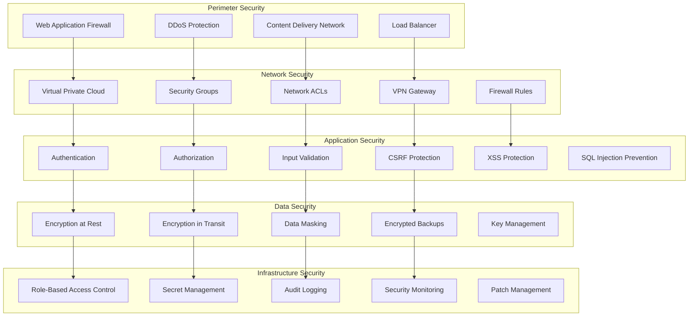
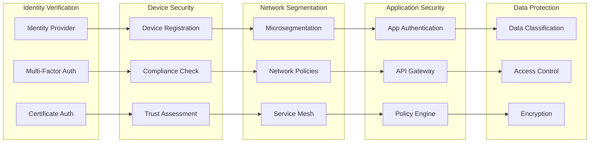
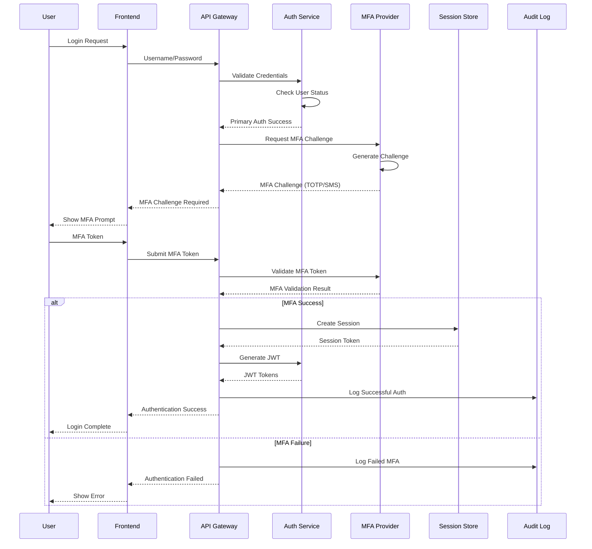

# Security Architecture

## Overview

The Splunk MCP Integration platform implements a comprehensive security architecture based on defense-in-depth principles, zero-trust networking, and industry best practices. This document outlines the security design patterns, implementation strategies, and architectural decisions that protect the platform and its data.

## Security Architecture Principles

### 1. Defense in Depth

The platform implements multiple layers of security controls to protect against various threat vectors:



### 2. Zero Trust Architecture

The platform assumes no implicit trust and verifies every access request:



### 3. Principle of Least Privilege

Every user, service, and system component has the minimum necessary permissions:

```python
from enum import Enum
from typing import Set, Dict, List, Optional
from dataclasses import dataclass

class ResourceType(Enum):
    USER = "user"
    DASHBOARD = "dashboard"
    QUERY = "query"
    ALERT = "alert"
    EXPORT = "export"
    ADMIN = "admin"

class Permission(Enum):
    CREATE = "create"
    READ = "read"
    UPDATE = "update"
    DELETE = "delete"
    EXECUTE = "execute"
    SHARE = "share"
    MANAGE = "manage"

@dataclass
class AccessPolicy:
    """Access policy definition"""
    resource_type: ResourceType
    permissions: Set[Permission]
    conditions: Dict[str, any] = None
    time_constraints: Dict[str, any] = None
    ip_restrictions: List[str] = None

class RoleBasedAccessControl:
    """Enhanced RBAC with attribute-based controls"""
    
    def __init__(self):
        self.roles = {
            "viewer": [
                AccessPolicy(ResourceType.DASHBOARD, {Permission.READ}),
                AccessPolicy(ResourceType.QUERY, {Permission.READ, Permission.EXECUTE})
            ],
            "analyst": [
                AccessPolicy(ResourceType.DASHBOARD, {Permission.READ, Permission.CREATE, Permission.UPDATE}),
                AccessPolicy(ResourceType.QUERY, {Permission.READ, Permission.CREATE, Permission.EXECUTE}),
                AccessPolicy(ResourceType.ALERT, {Permission.READ, Permission.CREATE})
            ],
            "manager": [
                AccessPolicy(ResourceType.DASHBOARD, {Permission.READ, Permission.CREATE, Permission.UPDATE, Permission.SHARE}),
                AccessPolicy(ResourceType.QUERY, {Permission.READ, Permission.CREATE, Permission.EXECUTE, Permission.SHARE}),
                AccessPolicy(ResourceType.ALERT, {Permission.READ, Permission.CREATE, Permission.UPDATE, Permission.MANAGE}),
                AccessPolicy(ResourceType.EXPORT, {Permission.READ, Permission.CREATE})
            ],
            "admin": [
                AccessPolicy(ResourceType.USER, {Permission.CREATE, Permission.READ, Permission.UPDATE, Permission.DELETE}),
                AccessPolicy(ResourceType.DASHBOARD, {Permission.CREATE, Permission.READ, Permission.UPDATE, Permission.DELETE, Permission.SHARE}),
                AccessPolicy(ResourceType.QUERY, {Permission.CREATE, Permission.READ, Permission.UPDATE, Permission.DELETE, Permission.EXECUTE, Permission.SHARE}),
                AccessPolicy(ResourceType.ALERT, {Permission.CREATE, Permission.READ, Permission.UPDATE, Permission.DELETE, Permission.MANAGE}),
                AccessPolicy(ResourceType.EXPORT, {Permission.CREATE, Permission.READ, Permission.UPDATE, Permission.DELETE}),
                AccessPolicy(ResourceType.ADMIN, {Permission.MANAGE})
            ]
        }
    
    def check_access(self, user_roles: List[str], resource_type: ResourceType, 
                    permission: Permission, context: Dict[str, any] = None) -> bool:
        """Check if user has required access"""
        for role in user_roles:
            policies = self.roles.get(role, [])
            for policy in policies:
                if (policy.resource_type == resource_type and 
                    permission in policy.permissions):
                    
                    # Check additional conditions
                    if self._check_conditions(policy, context):
                        return True
        
        return False
    
    def _check_conditions(self, policy: AccessPolicy, context: Dict[str, any]) -> bool:
        """Check policy conditions"""
        if not context:
            return True
            
        # Time-based restrictions
        if policy.time_constraints:
            if not self._check_time_constraints(policy.time_constraints, context):
                return False
        
        # IP-based restrictions
        if policy.ip_restrictions:
            user_ip = context.get("ip_address")
            if user_ip not in policy.ip_restrictions:
                return False
        
        # Custom conditions
        if policy.conditions:
            for condition, expected_value in policy.conditions.items():
                if context.get(condition) != expected_value:
                    return False
        
        return True
```

## Authentication Architecture

### 1. Multi-Factor Authentication Flow



### 2. JWT Token Management

```python
import jwt
import redis
from datetime import datetime, timedelta
from typing import Dict, Any, Optional, List
from cryptography.hazmat.primitives import hashes
from cryptography.hazmat.primitives.kdf.pbkdf2 import PBKDF2HMAC
import secrets
import base64

class JWTSecurityManager:
    """Enhanced JWT management with security features"""
    
    def __init__(self, secret_key: str, redis_client: redis.Redis):
        self.secret_key = secret_key
        self.redis = redis_client
        self.algorithm = "HS256"
        self.access_token_expire_minutes = 15  # Short-lived access tokens
        self.refresh_token_expire_days = 30
        self.blacklist_prefix = "jwt_blacklist:"
        
    def create_token_pair(self, user_data: Dict[str, Any]) -> Dict[str, str]:
        """Create access and refresh token pair"""
        now = datetime.utcnow()
        
        # Generate unique JTI for token tracking
        jti_access = secrets.token_urlsafe(32)
        jti_refresh = secrets.token_urlsafe(32)
        
        # Access token payload
        access_payload = {
            "sub": user_data["user_id"],
            "username": user_data["username"],
            "email": user_data["email"],
            "roles": user_data["roles"],
            "permissions": user_data["permissions"],
            "session_id": user_data["session_id"],
            "jti": jti_access,
            "token_type": "access",
            "iat": now,
            "exp": now + timedelta(minutes=self.access_token_expire_minutes),
            "iss": "splunk-mcp",
            "aud": "splunk-mcp-api"
        }
        
        # Refresh token payload (minimal data)
        refresh_payload = {
            "sub": user_data["user_id"],
            "session_id": user_data["session_id"],
            "jti": jti_refresh,
            "token_type": "refresh",
            "iat": now,
            "exp": now + timedelta(days=self.refresh_token_expire_days),
            "iss": "splunk-mcp",
            "aud": "splunk-mcp-api"
        }
        
        access_token = jwt.encode(access_payload, self.secret_key, algorithm=self.algorithm)
        refresh_token = jwt.encode(refresh_payload, self.secret_key, algorithm=self.algorithm)
        
        # Store token metadata for tracking
        self._store_token_metadata(jti_access, access_payload)
        self._store_token_metadata(jti_refresh, refresh_payload)
        
        return {
            "access_token": access_token,
            "refresh_token": refresh_token,
            "token_type": "Bearer",
            "expires_in": self.access_token_expire_minutes * 60,
            "expires_at": access_payload["exp"].isoformat()
        }
    
    def verify_token(self, token: str, token_type: str = "access") -> Dict[str, Any]:
        """Verify JWT token with security checks"""
        try:
            # Decode token
            payload = jwt.decode(
                token,
                self.secret_key,
                algorithms=[self.algorithm],
                audience="splunk-mcp-api",
                issuer="splunk-mcp"
            )
            
            # Verify token type
            if payload.get("token_type") != token_type:
                raise jwt.InvalidTokenError(f"Expected {token_type} token")
            
            # Check if token is blacklisted
            jti = payload.get("jti")
            if jti and self._is_token_blacklisted(jti):
                raise jwt.InvalidTokenError("Token has been revoked")
            
            # Verify session is still active
            session_id = payload.get("session_id")
            if session_id and not self._is_session_valid(session_id):
                raise jwt.InvalidTokenError("Session no longer valid")
            
            return payload
            
        except jwt.ExpiredSignatureError:
            raise jwt.InvalidTokenError("Token has expired")
        except jwt.InvalidTokenError:
            raise
        except Exception as e:
            raise jwt.InvalidTokenError(f"Token verification failed: {str(e)}")
    
    def refresh_token_pair(self, refresh_token: str) -> Dict[str, str]:
        """Create new token pair using refresh token"""
        # Verify refresh token
        payload = self.verify_token(refresh_token, "refresh")
        
        # Get current user data
        user_data = self._get_user_data(payload["sub"])
        if not user_data:
            raise jwt.InvalidTokenError("User no longer exists")
        
        # Blacklist old refresh token
        old_jti = payload.get("jti")
        if old_jti:
            self._blacklist_token(old_jti, payload["exp"])
        
        # Create new token pair
        return self.create_token_pair(user_data)
    
    def revoke_token(self, token: str):
        """Revoke specific token"""
        try:
            payload = jwt.decode(
                token,
                self.secret_key,
                algorithms=[self.algorithm],
                options={"verify_exp": False}  # Allow expired tokens for revocation
            )
            
            jti = payload.get("jti")
            exp = payload.get("exp")
            
            if jti and exp:
                self._blacklist_token(jti, exp)
                
        except jwt.InvalidTokenError:
            # Token might be invalid, but still try to blacklist if possible
            pass
    
    def revoke_user_tokens(self, user_id: str):
        """Revoke all tokens for a user"""
        # Get all active sessions for user
        session_pattern = f"user_sessions:{user_id}:*"
        session_keys = self.redis.keys(session_pattern)
        
        for session_key in session_keys:
            # Invalidate session
            self.redis.delete(session_key)
        
        # Blacklist all tokens for user (requires token tracking)
        token_pattern = f"token_metadata:*:user:{user_id}"
        token_keys = self.redis.keys(token_pattern)
        
        for token_key in token_keys:
            token_data = self.redis.hgetall(token_key)
            jti = token_data.get("jti")
            exp = token_data.get("exp")
            
            if jti and exp:
                self._blacklist_token(jti, int(exp))
    
    def _store_token_metadata(self, jti: str, payload: Dict[str, Any]):
        """Store token metadata for tracking"""
        metadata = {
            "jti": jti,
            "user_id": payload["sub"],
            "token_type": payload["token_type"],
            "issued_at": payload["iat"].timestamp() if isinstance(payload["iat"], datetime) else payload["iat"],
            "expires_at": payload["exp"].timestamp() if isinstance(payload["exp"], datetime) else payload["exp"],
            "session_id": payload.get("session_id", "")
        }
        
        key = f"token_metadata:{jti}"
        ttl = int(payload["exp"].timestamp() - datetime.utcnow().timestamp()) if isinstance(payload["exp"], datetime) else payload["exp"] - int(datetime.utcnow().timestamp())
        
        self.redis.hmset(key, metadata)
        self.redis.expire(key, ttl)
    
    def _blacklist_token(self, jti: str, exp: int):
        """Add token to blacklist"""
        key = f"{self.blacklist_prefix}{jti}"
        ttl = exp - int(datetime.utcnow().timestamp())
        
        if ttl > 0:
            self.redis.setex(key, ttl, "blacklisted")
    
    def _is_token_blacklisted(self, jti: str) -> bool:
        """Check if token is blacklisted"""
        key = f"{self.blacklist_prefix}{jti}"
        return self.redis.exists(key)
    
    def _is_session_valid(self, session_id: str) -> bool:
        """Check if session is still valid"""
        session_key = f"user_sessions:{session_id}"
        return self.redis.exists(session_key)
```

### 3. API Key Management

```python
import hashlib
import secrets
from datetime import datetime, timedelta
from typing import Dict, Any, List, Optional

class APIKeyManager:
    """Secure API key management system"""
    
    def __init__(self, database_client, redis_client):
        self.db = database_client
        self.redis = redis_client
        self.key_prefix = "smc_"  # Splunk MCP prefix
        self.key_length = 32
        
    async def generate_api_key(self, user_id: str, name: str, 
                              scopes: List[str], rate_limit: int = 1000,
                              expires_at: Optional[datetime] = None) -> Dict[str, Any]:
        """Generate new API key with security features"""
        
        # Generate cryptographically secure key
        random_part = secrets.token_urlsafe(self.key_length)
        api_key = f"{self.key_prefix}{random_part}"
        
        # Create secure hash for storage
        key_hash = hashlib.sha256(api_key.encode()).hexdigest()
        
        # Set default expiration (1 year)
        if not expires_at:
            expires_at = datetime.utcnow() + timedelta(days=365)
        
        # Validate scopes
        valid_scopes = await self._get_valid_scopes()
        invalid_scopes = set(scopes) - set(valid_scopes)
        if invalid_scopes:
            raise ValueError(f"Invalid scopes: {invalid_scopes}")
        
        # Store in database
        key_data = {
            "id": secrets.token_urlsafe(16),
            "user_id": user_id,
            "name": name,
            "key_hash": key_hash,
            "scopes": scopes,
            "rate_limit_per_hour": rate_limit,
            "created_at": datetime.utcnow(),
            "expires_at": expires_at,
            "last_used": None,
            "usage_count": 0,
            "is_active": True
        }
        
        await self._store_api_key(key_data)
        
        # Cache key metadata for fast validation
        await self._cache_key_metadata(key_hash, key_data)
        
        return {
            "api_key": api_key,  # Only returned once
            "key_id": key_data["id"],
            "scopes": scopes,
            "rate_limit": rate_limit,
            "expires_at": expires_at.isoformat()
        }
    
    async def validate_api_key(self, api_key: str, required_scope: str = None) -> Optional[Dict[str, Any]]:
        """Validate API key and check permissions"""
        
        # Hash the provided key
        key_hash = hashlib.sha256(api_key.encode()).hexdigest()
        
        # Try cache first
        key_data = await self._get_cached_key_metadata(key_hash)
        
        if not key_data:
            # Fall back to database
            key_data = await self._get_key_by_hash(key_hash)
            
            if key_data:
                # Update cache
                await self._cache_key_metadata(key_hash, key_data)
        
        if not key_data:
            return None
        
        # Check if key is active
        if not key_data.get("is_active"):
            return None
        
        # Check expiration
        expires_at = key_data.get("expires_at")
        if expires_at and datetime.utcnow() > expires_at:
            # Mark as expired
            await self._deactivate_key(key_data["id"])
            return None
        
        # Check scope if required
        if required_scope:
            key_scopes = key_data.get("scopes", [])
            if required_scope not in key_scopes and "admin" not in key_scopes:
                return None
        
        # Check rate limit
        if not await self._check_rate_limit(key_data["id"], key_data["rate_limit_per_hour"]):
            return None
        
        # Update usage tracking
        await self._update_key_usage(key_data["id"])
        
        return key_data
    
    async def rotate_api_key(self, key_id: str) -> Dict[str, str]:
        """Rotate API key (generate new, invalidate old)"""
        old_key_data = await self._get_key_by_id(key_id)
        
        if not old_key_data:
            raise ValueError("API key not found")
        
        # Generate new key with same properties
        new_key = await self.generate_api_key(
            user_id=old_key_data["user_id"],
            name=old_key_data["name"],
            scopes=old_key_data["scopes"],
            rate_limit=old_key_data["rate_limit_per_hour"],
            expires_at=old_key_data["expires_at"]
        )
        
        # Deactivate old key
        await self._deactivate_key(key_id)
        
        # Clear old key from cache
        old_key_hash = await self._get_key_hash(key_id)
        if old_key_hash:
            await self._clear_cached_key(old_key_hash)
        
        return new_key
    
    async def _check_rate_limit(self, key_id: str, limit_per_hour: int) -> bool:
        """Check API key rate limit"""
        current_time = int(datetime.utcnow().timestamp())
        window_start = current_time - 3600  # 1 hour window
        
        rate_key = f"api_key_rate_limit:{key_id}"
        
        # Remove expired entries
        await self.redis.zremrangebyscore(rate_key, 0, window_start)
        
        # Count current requests
        current_count = await self.redis.zcard(rate_key)
        
        if current_count >= limit_per_hour:
            return False
        
        # Add current request
        await self.redis.zadd(rate_key, {str(current_time): current_time})
        await self.redis.expire(rate_key, 3600)
        
        return True
    
    async def _cache_key_metadata(self, key_hash: str, key_data: Dict[str, Any]):
        """Cache key metadata for fast validation"""
        cache_key = f"api_key_metadata:{key_hash}"
        cache_data = {
            "id": key_data["id"],
            "user_id": key_data["user_id"],
            "scopes": ",".join(key_data["scopes"]),
            "rate_limit_per_hour": str(key_data["rate_limit_per_hour"]),
            "is_active": str(key_data["is_active"]),
            "expires_at": key_data["expires_at"].isoformat() if key_data["expires_at"] else ""
        }
        
        await self.redis.hmset(cache_key, cache_data)
        await self.redis.expire(cache_key, 3600)  # 1 hour cache
```

## Data Security Architecture

### 1. Encryption Strategy

```python
from cryptography.fernet import Fernet
from cryptography.hazmat.primitives import hashes, serialization
from cryptography.hazmat.primitives.asymmetric import rsa, padding
from cryptography.hazmat.primitives.kdf.pbkdf2 import PBKDF2HMAC
import base64
import os
from typing import Dict, Any, Optional

class EncryptionManager:
    """Comprehensive encryption management system"""
    
    def __init__(self, master_key: str):
        self.master_key = master_key.encode()
        self.fernet = self._create_fernet_key()
        self.rsa_key_pair = self._generate_rsa_key_pair()
    
    def _create_fernet_key(self) -> Fernet:
        """Create Fernet encryption key from master key"""
        salt = b'splunk_mcp_salt'  # In production, use random salt per encryption
        kdf = PBKDF2HMAC(
            algorithm=hashes.SHA256(),
            length=32,
            salt=salt,
            iterations=100000,
        )
        key = base64.urlsafe_b64encode(kdf.derive(self.master_key))
        return Fernet(key)
    
    def _generate_rsa_key_pair(self) -> Dict[str, Any]:
        """Generate RSA key pair for asymmetric encryption"""
        private_key = rsa.generate_private_key(
            public_exponent=65537,
            key_size=2048
        )
        public_key = private_key.public_key()
        
        return {
            "private_key": private_key,
            "public_key": public_key,
            "private_pem": private_key.private_bytes(
                encoding=serialization.Encoding.PEM,
                format=serialization.PrivateFormat.PKCS8,
                encryption_algorithm=serialization.NoEncryption()
            ),
            "public_pem": public_key.public_bytes(
                encoding=serialization.Encoding.PEM,
                format=serialization.PublicFormat.SubjectPublicKeyInfo
            )
        }
    
    def encrypt_sensitive_data(self, data: str, use_asymmetric: bool = False) -> str:
        """Encrypt sensitive data"""
        if use_asymmetric:
            # Use RSA for small data that needs to be shared
            encrypted = self.rsa_key_pair["public_key"].encrypt(
                data.encode(),
                padding.OAEP(
                    mgf=padding.MGF1(algorithm=hashes.SHA256()),
                    algorithm=hashes.SHA256(),
                    label=None
                )
            )
            return base64.b64encode(encrypted).decode()
        else:
            # Use Fernet for general purpose encryption
            encrypted = self.fernet.encrypt(data.encode())
            return base64.b64encode(encrypted).decode()
    
    def decrypt_sensitive_data(self, encrypted_data: str, use_asymmetric: bool = False) -> str:
        """Decrypt sensitive data"""
        encrypted_bytes = base64.b64decode(encrypted_data.encode())
        
        if use_asymmetric:
            decrypted = self.rsa_key_pair["private_key"].decrypt(
                encrypted_bytes,
                padding.OAEP(
                    mgf=padding.MGF1(algorithm=hashes.SHA256()),
                    algorithm=hashes.SHA256(),
                    label=None
                )
            )
            return decrypted.decode()
        else:
            decrypted = self.fernet.decrypt(encrypted_bytes)
            return decrypted.decode()
    
    def encrypt_database_field(self, table: str, field: str, value: str) -> str:
        """Encrypt database field with context"""
        context = f"{table}:{field}"
        data_with_context = f"{context}|{value}"
        return self.encrypt_sensitive_data(data_with_context)
    
    def decrypt_database_field(self, table: str, field: str, encrypted_value: str) -> str:
        """Decrypt database field with context verification"""
        decrypted_data = self.decrypt_sensitive_data(encrypted_value)
        context, value = decrypted_data.split('|', 1)
        
        expected_context = f"{table}:{field}"
        if context != expected_context:
            raise ValueError("Decryption context mismatch")
        
        return value

class DataClassificationManager:
    """Data classification and protection system"""
    
    def __init__(self, encryption_manager: EncryptionManager):
        self.encryption = encryption_manager
        self.classification_levels = {
            "PUBLIC": {"encrypt": False, "mask": False, "audit": False},
            "INTERNAL": {"encrypt": False, "mask": True, "audit": True},
            "CONFIDENTIAL": {"encrypt": True, "mask": True, "audit": True},
            "RESTRICTED": {"encrypt": True, "mask": True, "audit": True, "access_control": "strict"},
            "TOP_SECRET": {"encrypt": True, "mask": True, "audit": True, "access_control": "admin_only"}
        }
    
    def classify_data(self, data: Any, context: Dict[str, Any]) -> str:
        """Automatically classify data based on content and context"""
        data_str = str(data).lower()
        
        # Check for PII patterns
        if self._contains_pii(data_str):
            return "CONFIDENTIAL"
        
        # Check for financial data
        if self._contains_financial_data(data_str):
            return "CONFIDENTIAL"
        
        # Check for security-related data
        if self._contains_security_data(data_str):
            return "RESTRICTED"
        
        # Check for admin operations
        if context.get("user_role") == "admin":
            return "RESTRICTED"
        
        # Default classification
        return "INTERNAL"
    
    def protect_data(self, data: Any, classification: str, context: Dict[str, Any]) -> Any:
        """Apply protection based on classification"""
        protection_rules = self.classification_levels.get(classification, {})
        
        if protection_rules.get("encrypt"):
            if isinstance(data, str):
                return self.encryption.encrypt_sensitive_data(data)
            else:
                return self.encryption.encrypt_sensitive_data(str(data))
        
        if protection_rules.get("mask"):
            return self._mask_sensitive_data(data, classification)
        
        return data
    
    def _contains_pii(self, data: str) -> bool:
        """Check if data contains personally identifiable information"""
        import re
        
        pii_patterns = [
            r'\b\d{3}-\d{2}-\d{4}\b',  # SSN
            r'\b\d{4}[\s-]?\d{4}[\s-]?\d{4}[\s-]?\d{4}\b',  # Credit card
            r'\b[A-Za-z0-9._%+-]+@[A-Za-z0-9.-]+\.[A-Z|a-z]{2,}\b',  # Email
            r'\b\d{3}-\d{3}-\d{4}\b',  # Phone number
        ]
        
        for pattern in pii_patterns:
            if re.search(pattern, data):
                return True
        
        return False
    
    def _mask_sensitive_data(self, data: Any, classification: str) -> str:
        """Mask sensitive data based on classification"""
        data_str = str(data)
        
        if classification in ["CONFIDENTIAL", "RESTRICTED", "TOP_SECRET"]:
            # Mask all but first and last 2 characters
            if len(data_str) > 4:
                return data_str[:2] + "*" * (len(data_str) - 4) + data_str[-2:]
            else:
                return "*" * len(data_str)
        
        return data_str
```

### 2. Database Security

```sql
-- Database security configuration
-- Enable row-level security
ALTER TABLE users ENABLE ROW LEVEL SECURITY;
ALTER TABLE dashboards ENABLE ROW LEVEL SECURITY;
ALTER TABLE queries ENABLE ROW LEVEL SECURITY;

-- Create security policies
CREATE POLICY user_access_policy ON users
    FOR ALL
    TO application_user
    USING (id = current_setting('app.current_user_id')::uuid OR 
           current_setting('app.user_role') = 'admin');

CREATE POLICY dashboard_access_policy ON dashboards
    FOR ALL
    TO application_user
    USING (user_id = current_setting('app.current_user_id')::uuid OR
           permissions ? current_setting('app.current_user_id') OR
           current_setting('app.user_role') = 'admin');

-- Audit trigger function
CREATE OR REPLACE FUNCTION audit_trigger_function()
RETURNS TRIGGER AS $$
BEGIN
    INSERT INTO audit_logs (
        table_name,
        operation,
        old_data,
        new_data,
        user_id,
        timestamp
    ) VALUES (
        TG_TABLE_NAME,
        TG_OP,
        CASE WHEN TG_OP IN ('UPDATE', 'DELETE') THEN row_to_json(OLD) END,
        CASE WHEN TG_OP IN ('INSERT', 'UPDATE') THEN row_to_json(NEW) END,
        current_setting('app.current_user_id', true),
        NOW()
    );
    
    RETURN CASE TG_OP
        WHEN 'DELETE' THEN OLD
        ELSE NEW
    END;
END;
$$ LANGUAGE plpgsql;

-- Apply audit triggers to sensitive tables
CREATE TRIGGER users_audit_trigger
    AFTER INSERT OR UPDATE OR DELETE ON users
    FOR EACH ROW EXECUTE FUNCTION audit_trigger_function();

CREATE TRIGGER dashboards_audit_trigger
    AFTER INSERT OR UPDATE OR DELETE ON dashboards
    FOR EACH ROW EXECUTE FUNCTION audit_trigger_function();

-- Create encrypted columns for sensitive data
ALTER TABLE users ADD COLUMN encrypted_personal_data BYTEA;
ALTER TABLE api_keys ADD COLUMN encrypted_key_data BYTEA;

-- Function to encrypt data before storage
CREATE OR REPLACE FUNCTION encrypt_data(data TEXT, key_id TEXT)
RETURNS BYTEA AS $$
BEGIN
    -- In production, integrate with proper key management system
    RETURN pgp_sym_encrypt(data, key_id);
END;
$$ LANGUAGE plpgsql;

-- Function to decrypt data after retrieval
CREATE OR REPLACE FUNCTION decrypt_data(encrypted_data BYTEA, key_id TEXT)
RETURNS TEXT AS $$
BEGIN
    RETURN pgp_sym_decrypt(encrypted_data, key_id);
END;
$$ LANGUAGE plpgsql;
```

## Network Security

### 1. Network Segmentation

```yaml
# Kubernetes Network Policies
apiVersion: networking.k8s.io/v1
kind: NetworkPolicy
metadata:
  name: api-gateway-network-policy
  namespace: splunk-mcp
spec:
  podSelector:
    matchLabels:
      app: api-gateway
  policyTypes:
  - Ingress
  - Egress
  ingress:
  - from:
    - namespaceSelector:
        matchLabels:
          name: ingress-nginx
    - podSelector:
        matchLabels:
          app: load-balancer
    ports:
    - protocol: TCP
      port: 8000
  egress:
  - to:
    - podSelector:
        matchLabels:
          app: nlp-engine
    - podSelector:
        matchLabels:
          app: visualization
    - podSelector:
        matchLabels:
          app: alert-manager
    ports:
    - protocol: TCP
      port: 8001
    - protocol: TCP
      port: 8002
    - protocol: TCP
      port: 8003
  - to: []  # Allow DNS resolution
    ports:
    - protocol: UDP
      port: 53

---
apiVersion: networking.k8s.io/v1
kind: NetworkPolicy
metadata:
  name: database-network-policy
  namespace: splunk-mcp
spec:
  podSelector:
    matchLabels:
      app: postgresql
  policyTypes:
  - Ingress
  ingress:
  - from:
    - podSelector:
        matchLabels:
          tier: backend
    ports:
    - protocol: TCP
      port: 5432

---
apiVersion: networking.k8s.io/v1
kind: NetworkPolicy
metadata:
  name: default-deny-all
  namespace: splunk-mcp
spec:
  podSelector: {}
  policyTypes:
  - Ingress
  - Egress
```

### 2. TLS/SSL Configuration

```python
import ssl
import asyncio
from typing import Dict, Any
from fastapi import FastAPI
import uvicorn

class SSLConfigManager:
    """SSL/TLS configuration management"""
    
    def __init__(self):
        self.ssl_config = {
            "certfile": "/etc/ssl/certs/splunk-mcp.crt",
            "keyfile": "/etc/ssl/private/splunk-mcp.key",
            "ca_certs": "/etc/ssl/certs/ca-bundle.crt",
            "ssl_version": ssl.PROTOCOL_TLS_SERVER,
            "ciphers": "ECDHE+AESGCM:ECDHE+CHACHA20:DHE+AESGCM:DHE+CHACHA20:!aNULL:!MD5:!DSS",
            "ssl_context": None
        }
    
    def create_ssl_context(self) -> ssl.SSLContext:
        """Create secure SSL context"""
        context = ssl.create_default_context(ssl.Purpose.CLIENT_AUTH)
        
        # Load certificate and key
        context.load_cert_chain(
            self.ssl_config["certfile"],
            self.ssl_config["keyfile"]
        )
        
        # Set security options
        context.options |= ssl.OP_NO_SSLv2
        context.options |= ssl.OP_NO_SSLv3
        context.options |= ssl.OP_NO_TLSv1
        context.options |= ssl.OP_NO_TLSv1_1
        context.options |= ssl.OP_SINGLE_DH_USE
        context.options |= ssl.OP_SINGLE_ECDH_USE
        
        # Set cipher suites
        context.set_ciphers(self.ssl_config["ciphers"])
        
        # Require client certificates for mutual TLS (optional)
        context.verify_mode = ssl.CERT_OPTIONAL
        context.check_hostname = False
        
        return context
    
    def run_secure_server(self, app: FastAPI, host: str = "0.0.0.0", port: int = 8000):
        """Run server with SSL configuration"""
        ssl_context = self.create_ssl_context()
        
        uvicorn.run(
            app,
            host=host,
            port=port,
            ssl_context=ssl_context,
            ssl_keyfile=self.ssl_config["keyfile"],
            ssl_certfile=self.ssl_config["certfile"],
            ssl_ca_certs=self.ssl_config["ca_certs"],
            ssl_version=ssl.PROTOCOL_TLS_SERVER
        )

# Security headers middleware
from fastapi import Request, Response
from fastapi.middleware.base import BaseHTTPMiddleware

class SecurityHeadersMiddleware(BaseHTTPMiddleware):
    """Add security headers to all responses"""
    
    async def dispatch(self, request: Request, call_next):
        response = await call_next(request)
        
        # Security headers
        response.headers["Strict-Transport-Security"] = "max-age=31536000; includeSubDomains; preload"
        response.headers["X-Content-Type-Options"] = "nosniff"
        response.headers["X-Frame-Options"] = "DENY"
        response.headers["X-XSS-Protection"] = "1; mode=block"
        response.headers["Content-Security-Policy"] = (
            "default-src 'self'; "
            "script-src 'self' 'unsafe-inline' https://cdn.jsdelivr.net; "
            "style-src 'self' 'unsafe-inline' https://fonts.googleapis.com; "
            "font-src 'self' https://fonts.gstatic.com; "
            "img-src 'self' data: https:; "
            "connect-src 'self' https://api.splunk-mcp.com"
        )
        response.headers["Referrer-Policy"] = "strict-origin-when-cross-origin"
        response.headers["Permissions-Policy"] = (
            "geolocation=(), microphone=(), camera=(), "
            "payment=(), usb=(), magnetometer=(), gyroscope=()"
        )
        
        # Remove server information
        if "server" in response.headers:
            del response.headers["server"]
        
        return response
```

## Security Monitoring and Incident Response

### 1. Security Event Detection

```python
import asyncio
from datetime import datetime, timedelta
from typing import Dict, Any, List
from enum import Enum

class ThreatLevel(Enum):
    LOW = "low"
    MEDIUM = "medium"
    HIGH = "high"
    CRITICAL = "critical"

class SecurityEventDetector:
    """Real-time security event detection system"""
    
    def __init__(self, redis_client, alert_manager):
        self.redis = redis_client
        self.alert_manager = alert_manager
        self.detection_rules = self._load_detection_rules()
    
    def _load_detection_rules(self) -> Dict[str, Any]:
        """Load security detection rules"""
        return {
            "failed_login_attempts": {
                "threshold": 5,
                "window_minutes": 5,
                "threat_level": ThreatLevel.MEDIUM,
                "action": "block_ip"
            },
            "privilege_escalation": {
                "pattern": "role_change_to_admin",
                "threat_level": ThreatLevel.HIGH,
                "action": "alert_admin"
            },
            "suspicious_query_patterns": {
                "patterns": [
                    r".*\bUNION\b.*\bSELECT\b.*",
                    r".*\bDROP\b.*\bTABLE\b.*",
                    r".*\bEXEC\b.*\bxp_cmdshell\b.*"
                ],
                "threat_level": ThreatLevel.HIGH,
                "action": "block_user"
            },
            "data_exfiltration": {
                "threshold": 1000,  # MB
                "window_minutes": 10,
                "threat_level": ThreatLevel.CRITICAL,
                "action": "emergency_response"
            }
        }
    
    async def analyze_security_event(self, event: Dict[str, Any]) -> Optional[Dict[str, Any]]:
        """Analyze security event and determine threat level"""
        event_type = event.get("event_type")
        
        if event_type == "login_failed":
            return await self._detect_brute_force(event)
        elif event_type == "role_changed":
            return await self._detect_privilege_escalation(event)
        elif event_type == "query_executed":
            return await self._detect_suspicious_queries(event)
        elif event_type == "data_exported":
            return await self._detect_data_exfiltration(event)
        
        return None
    
    async def _detect_brute_force(self, event: Dict[str, Any]) -> Optional[Dict[str, Any]]:
        """Detect brute force login attempts"""
        ip_address = event.get("ip_address")
        user_id = event.get("user_id")
        
        rule = self.detection_rules["failed_login_attempts"]
        threshold = rule["threshold"]
        window_minutes = rule["window_minutes"]
        
        # Check failed attempts by IP
        ip_key = f"failed_logins:ip:{ip_address}"
        ip_count = await self._count_events_in_window(ip_key, window_minutes)
        
        # Check failed attempts by user
        user_key = f"failed_logins:user:{user_id}" if user_id else None
        user_count = 0
        if user_key:
            user_count = await self._count_events_in_window(user_key, window_minutes)
        
        if ip_count >= threshold or user_count >= threshold:
            return {
                "threat_type": "brute_force_attack",
                "threat_level": rule["threat_level"],
                "details": {
                    "ip_address": ip_address,
                    "user_id": user_id,
                    "failed_attempts_by_ip": ip_count,
                    "failed_attempts_by_user": user_count,
                    "threshold": threshold,
                    "window_minutes": window_minutes
                },
                "recommended_action": rule["action"]
            }
        
        return None
    
    async def _detect_privilege_escalation(self, event: Dict[str, Any]) -> Optional[Dict[str, Any]]:
        """Detect privilege escalation attempts"""
        old_roles = set(event.get("old_roles", []))
        new_roles = set(event.get("new_roles", []))
        
        # Check if admin role was added
        if "admin" in new_roles and "admin" not in old_roles:
            # Check if change was authorized
            if not await self._is_authorized_role_change(event):
                rule = self.detection_rules["privilege_escalation"]
                return {
                    "threat_type": "unauthorized_privilege_escalation",
                    "threat_level": rule["threat_level"],
                    "details": {
                        "user_id": event.get("target_user_id"),
                        "changed_by": event.get("user_id"),
                        "old_roles": list(old_roles),
                        "new_roles": list(new_roles),
                        "timestamp": event.get("timestamp")
                    },
                    "recommended_action": rule["action"]
                }
        
        return None
    
    async def _detect_suspicious_queries(self, event: Dict[str, Any]) -> Optional[Dict[str, Any]]:
        """Detect suspicious query patterns"""
        query = event.get("query", "").upper()
        rule = self.detection_rules["suspicious_query_patterns"]
        
        import re
        for pattern in rule["patterns"]:
            if re.search(pattern, query, re.IGNORECASE):
                return {
                    "threat_type": "suspicious_query_pattern",
                    "threat_level": rule["threat_level"],
                    "details": {
                        "user_id": event.get("user_id"),
                        "query": event.get("query"),
                        "matched_pattern": pattern,
                        "ip_address": event.get("ip_address"),
                        "timestamp": event.get("timestamp")
                    },
                    "recommended_action": rule["action"]
                }
        
        return None
    
    async def _count_events_in_window(self, key: str, window_minutes: int) -> int:
        """Count events in time window"""
        current_time = int(datetime.utcnow().timestamp())
        window_start = current_time - (window_minutes * 60)
        
        # Add current event
        await self.redis.zadd(key, {str(current_time): current_time})
        
        # Remove old events
        await self.redis.zremrangebyscore(key, 0, window_start)
        
        # Count events in window
        count = await self.redis.zcard(key)
        
        # Set expiration
        await self.redis.expire(key, window_minutes * 60)
        
        return count

class IncidentResponseManager:
    """Automated incident response system"""
    
    def __init__(self, security_detector: SecurityEventDetector):
        self.detector = security_detector
        self.response_actions = {
            "block_ip": self._block_ip_address,
            "block_user": self._block_user_account,
            "alert_admin": self._alert_administrators,
            "emergency_response": self._trigger_emergency_response
        }
    
    async def handle_security_incident(self, threat: Dict[str, Any]):
        """Handle security incident with automated response"""
        threat_level = threat.get("threat_level")
        recommended_action = threat.get("recommended_action")
        
        # Log incident
        await self._log_security_incident(threat)
        
        # Execute automated response
        if recommended_action in self.response_actions:
            await self.response_actions[recommended_action](threat)
        
        # Escalate based on threat level
        if threat_level in [ThreatLevel.HIGH, ThreatLevel.CRITICAL]:
            await self._escalate_incident(threat)
    
    async def _block_ip_address(self, threat: Dict[str, Any]):
        """Block IP address automatically"""
        ip_address = threat["details"].get("ip_address")
        if ip_address:
            # Add to firewall block list
            await self._add_to_ip_blocklist(ip_address)
            
            # Notify security team
            await self._notify_security_team("IP Blocked", threat)
    
    async def _block_user_account(self, threat: Dict[str, Any]):
        """Block user account temporarily"""
        user_id = threat["details"].get("user_id")
        if user_id:
            # Disable user account
            await self._disable_user_account(user_id)
            
            # Revoke all active sessions
            await self._revoke_user_sessions(user_id)
            
            # Notify administrators
            await self._notify_administrators("User Account Blocked", threat)
    
    async def _alert_administrators(self, threat: Dict[str, Any]):
        """Alert system administrators"""
        await self._notify_administrators("Security Alert", threat)
    
    async def _trigger_emergency_response(self, threat: Dict[str, Any]):
        """Trigger emergency security response"""
        # Immediately alert security team
        await self._emergency_alert(threat)
        
        # Consider system lockdown for critical threats
        if threat.get("threat_level") == ThreatLevel.CRITICAL:
            await self._initiate_lockdown_procedures(threat)
```

---

*This security architecture document provides comprehensive guidance for implementing and maintaining security controls across the Splunk MCP Integration platform. It should be regularly reviewed and updated to address emerging threats and security requirements.*

*Last Updated: January 22, 2025*  
*Version: 1.0*