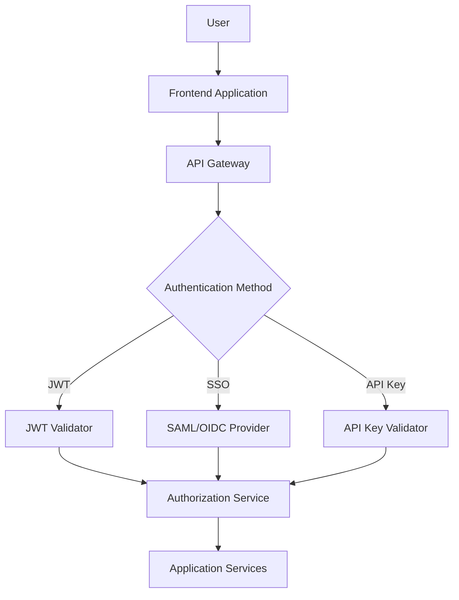

# Authentication and Identity Management

## Overview

This document provides detailed procedures for authentication and identity management in the Splunk MCP Integration platform, including user authentication, service authentication, token management, and multi-factor authentication.

## Authentication Architecture

### Identity Provider Integration



### Supported Authentication Methods

#### 1. JWT (JSON Web Tokens)
- **Primary method** for API authentication
- **Stateless** authentication with configurable expiration
- **Refresh token** support for extended sessions
- **Claims-based** authorization with role and permission information

#### 2. Single Sign-On (SSO)
- **SAML 2.0** integration with enterprise identity providers
- **OpenID Connect** support for modern OAuth 2.0 flows
- **Azure AD**, **Okta**, **OneLogin** integration
- **Automatic user provisioning** from SSO attributes

#### 3. API Keys
- **Service-to-service** authentication
- **Rate limiting** and scope restrictions
- **Automatic rotation** and expiration
- **Usage tracking** and analytics

#### 4. Multi-Factor Authentication (MFA)
- **TOTP** (Time-based One-Time Password)
- **SMS** verification (backup method)
- **Hardware tokens** (FIDO2/WebAuthn)
- **Biometric authentication** (mobile apps)

## JWT Authentication Implementation

### Token Structure
```json
{
  "header": {
    "alg": "HS256",
    "typ": "JWT"
  },
  "payload": {
    "sub": "user123",
    "username": "john.doe",
    "email": "john.doe@company.com",
    "roles": ["analyst", "dashboard_viewer"],
    "permissions": ["read", "write", "dashboard:create"],
    "session_id": "sess_abc123",
    "iat": 1674741600,
    "exp": 1674745200,
    "iss": "splunk-mcp",
    "aud": "splunk-mcp-users"
  }
}
```

### Token Validation Process
```python
import jwt
from datetime import datetime, timedelta
from typing import Optional

class JWTAuthenticator:
    def __init__(self, secret_key: str, algorithm: str = "HS256"):
        self.secret_key = secret_key
        self.algorithm = algorithm
        self.blacklisted_tokens = set()  # In production, use Redis
        
    def create_token(self, user_data: dict, expires_in: int = 3600) -> dict:
        """Create a new JWT token with user data"""
        now = datetime.utcnow()
        payload = {
            "sub": user_data["user_id"],
            "username": user_data["username"],
            "email": user_data["email"],
            "roles": user_data["roles"],
            "permissions": user_data["permissions"],
            "session_id": user_data["session_id"],
            "iat": now,
            "exp": now + timedelta(seconds=expires_in),
            "iss": "splunk-mcp",
            "aud": "splunk-mcp-users"
        }
        
        token = jwt.encode(payload, self.secret_key, algorithm=self.algorithm)
        
        return {
            "access_token": token,
            "token_type": "Bearer",
            "expires_in": expires_in,
            "expires_at": payload["exp"].isoformat()
        }
    
    def validate_token(self, token: str) -> Optional[dict]:
        """Validate and decode JWT token"""
        try:
            # Check if token is blacklisted
            if token in self.blacklisted_tokens:
                raise jwt.InvalidTokenError("Token has been revoked")
            
            # Decode and validate token
            payload = jwt.decode(
                token, 
                self.secret_key, 
                algorithms=[self.algorithm],
                audience="splunk-mcp-users",
                issuer="splunk-mcp"
            )
            
            # Additional validation
            if not self.is_session_valid(payload.get("session_id")):
                raise jwt.InvalidTokenError("Session no longer valid")
            
            return payload
            
        except jwt.ExpiredSignatureError:
            raise jwt.InvalidTokenError("Token has expired")
        except jwt.InvalidTokenError as e:
            raise jwt.InvalidTokenError(f"Invalid token: {str(e)}")
    
    def refresh_token(self, refresh_token: str) -> dict:
        """Create new access token using refresh token"""
        try:
            payload = jwt.decode(
                refresh_token,
                self.secret_key,
                algorithms=[self.algorithm]
            )
            
            # Verify this is a refresh token
            if payload.get("type") != "refresh":
                raise jwt.InvalidTokenError("Invalid refresh token")
            
            # Get user data and create new access token
            user_data = self.get_user_data(payload["sub"])
            return self.create_token(user_data)
            
        except jwt.InvalidTokenError as e:
            raise jwt.InvalidTokenError(f"Invalid refresh token: {str(e)}")
    
    def revoke_token(self, token: str):
        """Add token to blacklist"""
        self.blacklisted_tokens.add(token)
        # In production, store in Redis with TTL
```

### Token Management Procedures
```bash
#!/bin/bash
# JWT Token Management

# Generate new JWT secret
generate_jwt_secret() {
    openssl rand -base64 64
}

# Rotate JWT secret (zero-downtime)
rotate_jwt_secret() {
    local new_secret=$(generate_jwt_secret)
    
    # Update configuration with both old and new secrets
    kubectl patch secret jwt-config \
        --type='json' \
        -p='[{
            "op": "add",
            "path": "/data/new_secret",
            "value": "'$(echo -n "$new_secret" | base64)'"
        }]'
    
    # Rolling restart of services
    kubectl rollout restart deployment/api-gateway
    kubectl rollout restart deployment/nlp-engine
    
    # Wait for rollout to complete
    kubectl rollout status deployment/api-gateway
    kubectl rollout status deployment/nlp-engine
    
    # Switch to new secret as primary
    kubectl patch secret jwt-config \
        --type='json' \
        -p='[{
            "op": "replace",
            "path": "/data/secret",
            "value": "'$(echo -n "$new_secret" | base64)'"
        }, {
            "op": "remove",
            "path": "/data/new_secret"
        }]'
    
    echo "JWT secret rotation completed successfully"
}

# Cleanup expired tokens from blacklist
cleanup_blacklisted_tokens() {
    redis-cli --scan --pattern "blacklist:*" | while read key; do
        ttl=$(redis-cli ttl "$key")
        if [ "$ttl" -lt 0 ]; then
            redis-cli del "$key"
        fi
    done
}
```

## Single Sign-On (SSO) Integration

### SAML 2.0 Configuration
```xml
<!-- SAML Service Provider Configuration -->
<EntityDescriptor xmlns="urn:oasis:names:tc:SAML:2.0:metadata" 
                  entityID="https://yourdomain.com/saml/metadata">
  <SPSSODescriptor AuthnRequestsSigned="true" 
                   WantAssertionsSigned="true" 
                   protocolSupportEnumeration="urn:oasis:names:tc:SAML:2.0:protocol">
    
    <KeyDescriptor use="signing">
      <KeyInfo xmlns="http://www.w3.org/2000/09/xmldsig#">
        <X509Data>
          <X509Certificate>{{SIGNING_CERTIFICATE}}</X509Certificate>
        </X509Data>
      </KeyInfo>
    </KeyDescriptor>
    
    <KeyDescriptor use="encryption">
      <KeyInfo xmlns="http://www.w3.org/2000/09/xmldsig#">
        <X509Data>
          <X509Certificate>{{ENCRYPTION_CERTIFICATE}}</X509Certificate>
        </X509Data>
      </KeyInfo>
    </KeyDescriptor>
    
    <AssertionConsumerService Binding="urn:oasis:names:tc:SAML:2.0:bindings:HTTP-POST"
                              Location="https://yourdomain.com/saml/acs"
                              index="1"/>
    
    <AttributeConsumingService index="1">
      <RequestedAttribute Name="http://schemas.xmlsoap.org/ws/2005/05/identity/claims/emailaddress"/>
      <RequestedAttribute Name="http://schemas.xmlsoap.org/ws/2005/05/identity/claims/givenname"/>
      <RequestedAttribute Name="http://schemas.xmlsoap.org/ws/2005/05/identity/claims/surname"/>
      <RequestedAttribute Name="http://schemas.xmlsoap.org/ws/2005/05/identity/claims/groups"/>
    </AttributeConsumingService>
  </SPSSODescriptor>
</EntityDescriptor>
```

### SAML Authentication Flow
```python
from saml2 import BINDING_HTTP_POST, BINDING_HTTP_REDIRECT
from saml2.client import Saml2Client
from saml2.config import Config as Saml2Config

class SAMLAuthenticator:
    def __init__(self, config_file: str):
        self.config = Saml2Config()
        self.config.load_file(config_file)
        self.client = Saml2Client(config=self.config)
    
    def initiate_login(self, relay_state: str = None) -> dict:
        """Initiate SAML authentication request"""
        try:
            # Create authentication request
            reqid, info = self.client.prepare_for_authenticate(
                relay_state=relay_state,
                binding=BINDING_HTTP_REDIRECT
            )
            
            # Get redirect URL
            redirect_url = None
            for key, value in info["headers"]:
                if key == "Location":
                    redirect_url = value
                    break
            
            return {
                "request_id": reqid,
                "redirect_url": redirect_url,
                "method": "GET"
            }
            
        except Exception as e:
            raise Exception(f"Failed to initiate SAML login: {str(e)}")
    
    def process_response(self, saml_response: str, request_id: str) -> dict:
        """Process SAML response and extract user information"""
        try:
            # Parse SAML response
            response = self.client.parse_authn_request_response(
                saml_response,
                BINDING_HTTP_POST,
                outstanding={request_id: ""}
            )
            
            # Extract user attributes
            user_info = {
                "nameid": response.name_id.text,
                "session_index": response.session_index,
                "attributes": {}
            }
            
            # Map SAML attributes to user data
            for attribute in response.ava:
                user_info["attributes"][attribute] = response.ava[attribute]
            
            # Create user session
            user_data = self.map_saml_attributes(user_info)
            
            return user_data
            
        except Exception as e:
            raise Exception(f"Failed to process SAML response: {str(e)}")
    
    def map_saml_attributes(self, saml_info: dict) -> dict:
        """Map SAML attributes to application user data"""
        attributes = saml_info["attributes"]
        
        # Extract required attributes
        email = attributes.get("http://schemas.xmlsoap.org/ws/2005/05/identity/claims/emailaddress", [""])[0]
        first_name = attributes.get("http://schemas.xmlsoap.org/ws/2005/05/identity/claims/givenname", [""])[0]
        last_name = attributes.get("http://schemas.xmlsoap.org/ws/2005/05/identity/claims/surname", [""])[0]
        groups = attributes.get("http://schemas.xmlsoap.org/ws/2005/05/identity/claims/groups", [])
        
        # Map groups to roles
        roles = self.map_groups_to_roles(groups)
        
        return {
            "user_id": saml_info["nameid"],
            "username": email.split("@")[0],
            "email": email,
            "first_name": first_name,
            "last_name": last_name,
            "roles": roles,
            "session_index": saml_info["session_index"],
            "auth_method": "saml"
        }
    
    def logout(self, user_id: str, session_index: str) -> dict:
        """Initiate SAML logout"""
        try:
            # Create logout request
            reqid, info = self.client.global_logout(
                name_id=user_id,
                session_index=session_index
            )
            
            return {
                "request_id": reqid,
                "logout_url": info["url"],
                "method": "GET"
            }
            
        except Exception as e:
            raise Exception(f"Failed to initiate SAML logout: {str(e)}")
```

### OpenID Connect Integration
```python
from authlib.integrations.requests_client import OAuth2Session
from authlib.common.security import generate_token

class OIDCAuthenticator:
    def __init__(self, client_id: str, client_secret: str, 
                 discovery_url: str, redirect_uri: str):
        self.client_id = client_id
        self.client_secret = client_secret
        self.discovery_url = discovery_url
        self.redirect_uri = redirect_uri
        self.provider_config = self.load_provider_config()
    
    def load_provider_config(self) -> dict:
        """Load OpenID Connect provider configuration"""
        import requests
        response = requests.get(self.discovery_url)
        response.raise_for_status()
        return response.json()
    
    def initiate_login(self, state: str = None, nonce: str = None) -> dict:
        """Initiate OIDC authentication flow"""
        if not state:
            state = generate_token(32)
        if not nonce:
            nonce = generate_token(32)
        
        oauth = OAuth2Session(
            self.client_id,
            redirect_uri=self.redirect_uri,
            scope="openid profile email"
        )
        
        authorization_url, state = oauth.create_authorization_url(
            self.provider_config["authorization_endpoint"],
            state=state,
            nonce=nonce
        )
        
        return {
            "authorization_url": authorization_url,
            "state": state,
            "nonce": nonce
        }
    
    def exchange_code(self, code: str, state: str) -> dict:
        """Exchange authorization code for tokens"""
        oauth = OAuth2Session(
            self.client_id,
            redirect_uri=self.redirect_uri
        )
        
        # Exchange code for tokens
        token = oauth.fetch_token(
            self.provider_config["token_endpoint"],
            code=code,
            client_secret=self.client_secret
        )
        
        # Get user info
        userinfo_response = oauth.get(
            self.provider_config["userinfo_endpoint"],
            token=token
        )
        userinfo = userinfo_response.json()
        
        # Verify ID token
        id_token_claims = self.verify_id_token(token["id_token"])
        
        return {
            "access_token": token["access_token"],
            "id_token": token["id_token"],
            "userinfo": userinfo,
            "claims": id_token_claims
        }
    
    def verify_id_token(self, id_token: str) -> dict:
        """Verify and decode ID token"""
        from authlib.jose import jwt
        import requests
        
        # Get public keys
        jwks_response = requests.get(self.provider_config["jwks_uri"])
        jwks = jwks_response.json()
        
        # Verify token
        claims = jwt.decode(
            id_token,
            jwks,
            claims_options={
                "aud": {"essential": True, "value": self.client_id},
                "iss": {"essential": True, "value": self.provider_config["issuer"]}
            }
        )
        
        return claims
```

## Multi-Factor Authentication (MFA)

### TOTP Implementation
```python
import pyotp
import qrcode
from io import BytesIO
import base64

class TOTPManager:
    def __init__(self):
        self.issuer = "Splunk MCP"
    
    def generate_secret(self, user_id: str) -> dict:
        """Generate TOTP secret for user"""
        secret = pyotp.random_base32()
        
        # Create provisioning URI
        totp = pyotp.TOTP(secret)
        provisioning_uri = totp.provisioning_uri(
            name=user_id,
            issuer_name=self.issuer
        )
        
        # Generate QR code
        qr = qrcode.QRCode(version=1, box_size=10, border=5)
        qr.add_data(provisioning_uri)
        qr.make(fit=True)
        
        qr_img = qr.make_image(fill_color="black", back_color="white")
        
        # Convert to base64
        buffer = BytesIO()
        qr_img.save(buffer, format="PNG")
        qr_base64 = base64.b64encode(buffer.getvalue()).decode()
        
        return {
            "secret": secret,
            "provisioning_uri": provisioning_uri,
            "qr_code": f"data:image/png;base64,{qr_base64}"
        }
    
    def verify_token(self, secret: str, token: str) -> bool:
        """Verify TOTP token"""
        totp = pyotp.TOTP(secret)
        return totp.verify(token, valid_window=1)  # Allow 30-second window
    
    def generate_backup_codes(self, count: int = 10) -> list:
        """Generate backup codes for account recovery"""
        import secrets
        backup_codes = []
        
        for _ in range(count):
            code = "-".join([
                secrets.token_hex(2).upper() 
                for _ in range(3)
            ])
            backup_codes.append(code)
        
        return backup_codes
```

### SMS Verification
```python
import random
import string
from datetime import datetime, timedelta

class SMSVerification:
    def __init__(self, sms_provider):
        self.sms_provider = sms_provider
        self.verification_codes = {}  # In production, use Redis
    
    def send_verification_code(self, phone_number: str, user_id: str) -> dict:
        """Send SMS verification code"""
        # Generate 6-digit code
        code = ''.join(random.choices(string.digits, k=6))
        
        # Store code with expiration
        self.verification_codes[phone_number] = {
            "code": code,
            "user_id": user_id,
            "created_at": datetime.utcnow(),
            "expires_at": datetime.utcnow() + timedelta(minutes=5),
            "attempts": 0
        }
        
        # Send SMS
        message = f"Your Splunk MCP verification code is: {code}. Valid for 5 minutes."
        
        try:
            self.sms_provider.send_message(phone_number, message)
            return {"success": True, "message": "Verification code sent"}
        except Exception as e:
            return {"success": False, "error": str(e)}
    
    def verify_code(self, phone_number: str, code: str) -> dict:
        """Verify SMS code"""
        stored_code = self.verification_codes.get(phone_number)
        
        if not stored_code:
            return {"success": False, "error": "No verification code found"}
        
        # Check expiration
        if datetime.utcnow() > stored_code["expires_at"]:
            del self.verification_codes[phone_number]
            return {"success": False, "error": "Verification code expired"}
        
        # Check attempts
        stored_code["attempts"] += 1
        if stored_code["attempts"] > 3:
            del self.verification_codes[phone_number]
            return {"success": False, "error": "Too many failed attempts"}
        
        # Verify code
        if code == stored_code["code"]:
            user_id = stored_code["user_id"]
            del self.verification_codes[phone_number]
            return {"success": True, "user_id": user_id}
        else:
            return {"success": False, "error": "Invalid verification code"}
```

## API Key Management

### API Key Structure
```python
import secrets
import hashlib
from datetime import datetime, timedelta
from typing import Optional, List

class APIKeyManager:
    def __init__(self):
        self.prefix = "smc_"  # Splunk MCP prefix
        self.key_length = 32
    
    def generate_key(self, user_id: str, name: str, scopes: List[str], 
                     expires_at: Optional[datetime] = None) -> dict:
        """Generate new API key"""
        # Generate random key
        random_part = secrets.token_urlsafe(self.key_length)
        api_key = f"{self.prefix}{random_part}"
        
        # Create hash for storage
        key_hash = hashlib.sha256(api_key.encode()).hexdigest()
        
        # Set default expiration (1 year)
        if not expires_at:
            expires_at = datetime.utcnow() + timedelta(days=365)
        
        key_data = {
            "id": secrets.token_urlsafe(16),
            "user_id": user_id,
            "name": name,
            "key_hash": key_hash,
            "scopes": scopes,
            "created_at": datetime.utcnow(),
            "expires_at": expires_at,
            "last_used": None,
            "is_active": True,
            "usage_count": 0
        }
        
        # Store in database
        self.store_key(key_data)
        
        return {
            "api_key": api_key,
            "key_id": key_data["id"],
            "expires_at": expires_at.isoformat()
        }
    
    def validate_key(self, api_key: str) -> Optional[dict]:
        """Validate API key and return key data"""
        # Hash the provided key
        key_hash = hashlib.sha256(api_key.encode()).hexdigest()
        
        # Look up key in database
        key_data = self.get_key_by_hash(key_hash)
        
        if not key_data:
            return None
        
        # Check if key is active
        if not key_data["is_active"]:
            return None
        
        # Check expiration
        if datetime.utcnow() > key_data["expires_at"]:
            return None
        
        # Update usage tracking
        self.update_key_usage(key_data["id"])
        
        return key_data
    
    def rotate_key(self, key_id: str) -> dict:
        """Rotate API key (generate new key, invalidate old)"""
        old_key_data = self.get_key_by_id(key_id)
        
        if not old_key_data:
            raise ValueError("Key not found")
        
        # Generate new key with same properties
        new_key = self.generate_key(
            user_id=old_key_data["user_id"],
            name=old_key_data["name"],
            scopes=old_key_data["scopes"],
            expires_at=old_key_data["expires_at"]
        )
        
        # Deactivate old key
        self.deactivate_key(key_id)
        
        return new_key
    
    def revoke_key(self, key_id: str):
        """Revoke API key"""
        self.deactivate_key(key_id)
```

### API Key Security Procedures
```bash
#!/bin/bash
# API Key Management Procedures

# Generate API key for service account
generate_service_api_key() {
    local service_name=$1
    local scopes=$2
    local expiry_days=${3:-365}
    
    curl -X POST https://api.yourdomain.com/admin/api-keys \
        -H "Authorization: Bearer $ADMIN_TOKEN" \
        -H "Content-Type: application/json" \
        -d "{
            \"name\": \"$service_name\",
            \"scopes\": [$(echo $scopes | tr ',' '\n' | sed 's/.*/"&"/' | tr '\n' ',' | sed 's/,$//')]",
            \"expires_in_days\": $expiry_days
        }"
}

# Rotate API keys nearing expiration
rotate_expiring_keys() {
    local days_before_expiry=${1:-30}
    
    # Get keys expiring soon
    expiring_keys=$(curl -s -X GET \
        "https://api.yourdomain.com/admin/api-keys?expires_in_days=$days_before_expiry" \
        -H "Authorization: Bearer $ADMIN_TOKEN")
    
    # Rotate each key
    echo "$expiring_keys" | jq -r '.data[].id' | while read key_id; do
        echo "Rotating API key: $key_id"
        
        new_key=$(curl -s -X POST \
            "https://api.yourdomain.com/admin/api-keys/$key_id/rotate" \
            -H "Authorization: Bearer $ADMIN_TOKEN")
        
        # Notify key owner
        notify_key_rotation "$key_id" "$new_key"
    done
}

# Audit API key usage
audit_api_key_usage() {
    local start_date=$1
    local end_date=$2
    
    curl -X GET \
        "https://api.yourdomain.com/admin/api-keys/usage?start=$start_date&end=$end_date" \
        -H "Authorization: Bearer $ADMIN_TOKEN" \
        > "api_key_usage_$(date +%Y%m%d).json"
    
    # Generate usage report
    python3 scripts/generate_api_usage_report.py \
        "api_key_usage_$(date +%Y%m%d).json"
}

# Cleanup unused API keys
cleanup_unused_keys() {
    local inactive_days=${1:-90}
    
    # Get keys not used in specified period
    unused_keys=$(curl -s -X GET \
        "https://api.yourdomain.com/admin/api-keys?inactive_days=$inactive_days" \
        -H "Authorization: Bearer $ADMIN_TOKEN")
    
    # Review and deactivate
    echo "$unused_keys" | jq -r '.data[] | "\(.id) \(.name) \(.last_used)"' | \
    while read key_id name last_used; do
        echo "Unused key found: $key_id ($name) - Last used: $last_used"
        read -p "Deactivate this key? (y/N): " confirm
        
        if [ "$confirm" = "y" ]; then
            curl -X DELETE \
                "https://api.yourdomain.com/admin/api-keys/$key_id" \
                -H "Authorization: Bearer $ADMIN_TOKEN"
            echo "Key $key_id deactivated"
        fi
    done
}
```

## Session Management

### Session Storage and Lifecycle
```python
import redis
import json
from datetime import datetime, timedelta
from typing import Optional, Dict, Any

class SessionManager:
    def __init__(self, redis_client: redis.Redis):
        self.redis = redis_client
        self.session_prefix = "session:"
        self.user_sessions_prefix = "user_sessions:"
        self.default_ttl = 3600  # 1 hour
        self.max_sessions_per_user = 5
    
    def create_session(self, user_id: str, user_data: dict, 
                      session_data: dict = None) -> str:
        """Create new user session"""
        import uuid
        
        session_id = str(uuid.uuid4())
        session_key = f"{self.session_prefix}{session_id}"
        user_sessions_key = f"{self.user_sessions_prefix}{user_id}"
        
        # Session data
        session_info = {
            "session_id": session_id,
            "user_id": user_id,
            "user_data": user_data,
            "created_at": datetime.utcnow().isoformat(),
            "last_accessed": datetime.utcnow().isoformat(),
            "ip_address": session_data.get("ip_address") if session_data else None,
            "user_agent": session_data.get("user_agent") if session_data else None,
            "is_active": True
        }
        
        # Store session
        self.redis.setex(
            session_key,
            self.default_ttl,
            json.dumps(session_info, default=str)
        )
        
        # Track user sessions
        self.redis.sadd(user_sessions_key, session_id)
        self.redis.expire(user_sessions_key, self.default_ttl * 2)
        
        # Enforce session limit
        self._enforce_session_limit(user_id)
        
        return session_id
    
    def get_session(self, session_id: str) -> Optional[Dict[Any, Any]]:
        """Retrieve session data"""
        session_key = f"{self.session_prefix}{session_id}"
        session_data = self.redis.get(session_key)
        
        if not session_data:
            return None
        
        session_info = json.loads(session_data)
        
        # Update last accessed time
        session_info["last_accessed"] = datetime.utcnow().isoformat()
        self.redis.setex(
            session_key,
            self.default_ttl,
            json.dumps(session_info, default=str)
        )
        
        return session_info
    
    def update_session(self, session_id: str, data: dict):
        """Update session data"""
        session_key = f"{self.session_prefix}{session_id}"
        session_info = self.get_session(session_id)
        
        if session_info:
            session_info.update(data)
            session_info["last_accessed"] = datetime.utcnow().isoformat()
            
            self.redis.setex(
                session_key,
                self.default_ttl,
                json.dumps(session_info, default=str)
            )
    
    def revoke_session(self, session_id: str):
        """Revoke specific session"""
        session_key = f"{self.session_prefix}{session_id}"
        session_info = self.get_session(session_id)
        
        if session_info:
            user_id = session_info["user_id"]
            user_sessions_key = f"{self.user_sessions_prefix}{user_id}"
            
            # Remove session
            self.redis.delete(session_key)
            self.redis.srem(user_sessions_key, session_id)
    
    def revoke_user_sessions(self, user_id: str, except_session: str = None):
        """Revoke all sessions for user"""
        user_sessions_key = f"{self.user_sessions_prefix}{user_id}"
        session_ids = self.redis.smembers(user_sessions_key)
        
        for session_id in session_ids:
            session_id_str = session_id.decode() if isinstance(session_id, bytes) else session_id
            
            if except_session and session_id_str == except_session:
                continue
            
            self.revoke_session(session_id_str)
    
    def _enforce_session_limit(self, user_id: str):
        """Enforce maximum sessions per user"""
        user_sessions_key = f"{self.user_sessions_prefix}{user_id}"
        session_ids = list(self.redis.smembers(user_sessions_key))
        
        if len(session_ids) > self.max_sessions_per_user:
            # Get session creation times
            sessions_with_time = []
            for session_id in session_ids:
                session_info = self.get_session(session_id.decode() if isinstance(session_id, bytes) else session_id)
                if session_info:
                    sessions_with_time.append((
                        session_id,
                        datetime.fromisoformat(session_info["created_at"])
                    ))
            
            # Sort by creation time and remove oldest
            sessions_with_time.sort(key=lambda x: x[1])
            sessions_to_remove = sessions_with_time[:-self.max_sessions_per_user]
            
            for session_id, _ in sessions_to_remove:
                self.revoke_session(session_id.decode() if isinstance(session_id, bytes) else session_id)
```

---

*Last Updated: January 22, 2025*
*Version: 1.0*