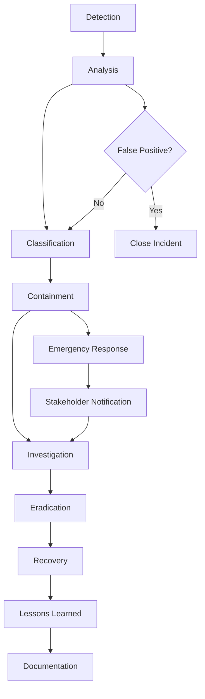

# Incident Response Procedures

## Overview

This document provides comprehensive incident response procedures for the Splunk MCP Integration platform, including incident classification, response workflows, forensic investigation procedures, and recovery processes.

## Incident Response Framework

### Incident Response Lifecycle



### Incident Response Team (IRT)

#### Core Team Members
- **Incident Commander**: Overall incident coordination and decision-making
- **Security Analyst**: Security investigation and threat analysis
- **System Administrator**: Technical response and system recovery
- **Communications Lead**: Internal and external communications
- **Legal Counsel**: Legal and regulatory compliance guidance

#### Extended Team (as needed)
- **Forensics Specialist**: Digital forensics and evidence collection
- **Public Relations**: External communications and media relations
- **Business Stakeholders**: Business impact assessment and decisions
- **External Partners**: Law enforcement, security vendors, consultants

## Incident Classification

### Severity Levels

#### CRITICAL (P1)
- **Definition**: Complete system compromise or major data breach
- **Response Time**: 15 minutes
- **Escalation**: Immediate C-level notification
- **Examples**:
  - Ransomware attack
  - Large-scale data breach (>1000 records)
  - Complete system outage
  - Active data exfiltration

#### HIGH (P2)
- **Definition**: Significant security incident with limited impact
- **Response Time**: 30 minutes
- **Escalation**: Security team and management within 1 hour
- **Examples**:
  - Successful unauthorized access
  - Malware infection (contained)
  - Small data breach (<1000 records)
  - System defacement

#### MEDIUM (P3)
- **Definition**: Security concern requiring investigation
- **Response Time**: 2 hours
- **Escalation**: Security team within 4 hours
- **Examples**:
  - Failed intrusion attempts
  - Suspicious user activity
  - Security policy violations
  - Vulnerability exploits (unsuccessful)

#### LOW (P4)
- **Definition**: Minor security events or policy violations
- **Response Time**: 4 hours
- **Escalation**: Next business day
- **Examples**:
  - Automated security alerts
  - Policy violations (non-critical)
  - Educational security events

### Incident Types

```yaml
incident_types:
  data_breach:
    description: "Unauthorized access or disclosure of sensitive data"
    severity: "critical"
    regulatory_requirements: ["gdpr", "hipaa", "sox"]
    notification_timeline: "72_hours"
    
  malware_infection:
    description: "Malicious software detected on systems"
    severity: "high"
    containment_priority: "immediate"
    forensics_required: true
    
  unauthorized_access:
    description: "Unauthorized access to systems or data"
    severity: "high"
    investigation_priority: "high"
    credential_reset_required: true
    
  denial_of_service:
    description: "Service disruption due to attack"
    severity: "medium"
    business_impact: "service_degradation"
    mitigation: "traffic_filtering"
    
  insider_threat:
    description: "Malicious activity by authorized users"
    severity: "high"
    investigation_approach: "covert"
    hr_involvement: true
    
  phishing_attack:
    description: "Social engineering attack via email"
    severity: "medium"
    user_education_required: true
    email_filtering_update: true
    
  vulnerability_exploit:
    description: "Exploitation of system vulnerabilities"
    severity: "medium"
    patch_priority: "immediate"
    system_hardening: true
```

## Incident Detection and Alerting

### Detection Sources

#### Automated Detection
- **SIEM Alerts**: Security Information and Event Management system
- **IDS/IPS**: Intrusion Detection/Prevention Systems
- **Endpoint Detection**: Antivirus and endpoint protection platforms
- **Network Monitoring**: Network traffic analysis and anomaly detection
- **Application Monitoring**: Application-level security events
- **Log Analysis**: Automated log analysis and correlation

#### Manual Detection
- **User Reports**: End-user security incident reports
- **Security Assessments**: Penetration testing and vulnerability assessments
- **Threat Intelligence**: External threat intelligence feeds
- **Partner Notifications**: Notifications from security partners or vendors

### Alert Processing Workflow

```python
import json
import uuid
from datetime import datetime
from enum import Enum
from typing import Dict, List, Any

class AlertSeverity(Enum):
    CRITICAL = 1
    HIGH = 2
    MEDIUM = 3
    LOW = 4
    INFO = 5

class IncidentStatus(Enum):
    NEW = "new"
    INVESTIGATING = "investigating"
    CONTAINED = "contained"
    RESOLVED = "resolved"
    CLOSED = "closed"

class IncidentProcessor:
    def __init__(self):
        self.correlation_rules = self.load_correlation_rules()
        self.escalation_matrix = self.load_escalation_matrix()
        
    def process_alert(self, alert: Dict[str, Any]) -> Dict[str, Any]:
        """Process incoming security alert"""
        
        # Initial alert assessment
        alert_assessment = self.assess_alert(alert)
        
        # Check for correlation with existing incidents
        correlations = self.check_correlations(alert)
        
        if correlations:
            # Update existing incident
            incident_id = correlations[0]['incident_id']
            self.update_incident(incident_id, alert)
            return {"action": "correlated", "incident_id": incident_id}
        else:
            # Create new incident
            incident = self.create_incident(alert, alert_assessment)
            
            # Auto-escalate based on severity
            if alert_assessment['severity'] in [AlertSeverity.CRITICAL, AlertSeverity.HIGH]:
                self.auto_escalate(incident)
            
            return {"action": "created", "incident": incident}
    
    def assess_alert(self, alert: Dict[str, Any]) -> Dict[str, Any]:
        """Assess alert severity and priority"""
        
        assessment = {
            "severity": AlertSeverity.INFO,
            "confidence": 0.5,
            "risk_score": 0,
            "business_impact": "low",
            "false_positive_probability": 0.1
        }
        
        # Assess based on alert type
        alert_type = alert.get("type", "unknown")
        
        if alert_type in ["malware_detected", "data_exfiltration", "privilege_escalation"]:
            assessment["severity"] = AlertSeverity.CRITICAL
            assessment["confidence"] = 0.9
            assessment["business_impact"] = "high"
            
        elif alert_type in ["unauthorized_access", "suspicious_activity", "policy_violation"]:
            assessment["severity"] = AlertSeverity.HIGH
            assessment["confidence"] = 0.7
            assessment["business_impact"] = "medium"
            
        # Adjust based on asset criticality
        asset_criticality = alert.get("asset_criticality", "low")
        if asset_criticality == "critical":
            assessment["severity"] = min(assessment["severity"], AlertSeverity.HIGH)
            assessment["business_impact"] = "high"
        
        # Check threat intelligence
        threat_intel_match = self.check_threat_intelligence(alert)
        if threat_intel_match:
            assessment["confidence"] = min(assessment["confidence"] + 0.3, 1.0)
            assessment["severity"] = min(assessment["severity"], AlertSeverity.HIGH)
        
        return assessment
    
    def create_incident(self, alert: Dict[str, Any], assessment: Dict[str, Any]) -> Dict[str, Any]:
        """Create new security incident"""
        
        incident_id = str(uuid.uuid4())
        
        incident = {
            "id": incident_id,
            "title": self.generate_incident_title(alert),
            "description": alert.get("description", ""),
            "severity": assessment["severity"].name,
            "status": IncidentStatus.NEW.value,
            "created_at": datetime.utcnow().isoformat(),
            "created_by": "automated_system",
            "source_alert": alert,
            "assessment": assessment,
            "timeline": [],
            "affected_systems": alert.get("affected_systems", []),
            "indicators": self.extract_indicators(alert),
            "tags": self.generate_tags(alert, assessment)
        }
        
        # Store incident
        self.store_incident(incident)
        
        # Add initial timeline entry
        self.add_timeline_entry(incident_id, "incident_created", {
            "alert_id": alert.get("id"),
            "severity": assessment["severity"].name,
            "auto_created": True
        })
        
        return incident
    
    def auto_escalate(self, incident: Dict[str, Any]):
        """Auto-escalate incident based on severity"""
        
        severity = incident["severity"]
        escalation_rules = self.escalation_matrix.get(severity, {})
        
        # Notify stakeholders
        stakeholders = escalation_rules.get("stakeholders", [])
        for stakeholder in stakeholders:
            self.notify_stakeholder(stakeholder, incident)
        
        # Execute automated responses
        automated_actions = escalation_rules.get("automated_actions", [])
        for action in automated_actions:
            self.execute_automated_action(action, incident)
        
        # Update incident status
        self.update_incident_status(incident["id"], IncidentStatus.INVESTIGATING)
    
    def check_correlations(self, alert: Dict[str, Any]) -> List[Dict[str, Any]]:
        """Check for correlations with existing incidents"""
        
        correlations = []
        
        # Time-based correlation (events within last hour)
        time_window = 3600  # 1 hour
        recent_incidents = self.get_recent_incidents(time_window)
        
        for incident in recent_incidents:
            correlation_score = self.calculate_correlation_score(alert, incident)
            
            if correlation_score > 0.7:  # Threshold for correlation
                correlations.append({
                    "incident_id": incident["id"],
                    "correlation_score": correlation_score,
                    "correlation_factors": self.get_correlation_factors(alert, incident)
                })
        
        return sorted(correlations, key=lambda x: x["correlation_score"], reverse=True)
    
    def calculate_correlation_score(self, alert: Dict[str, Any], incident: Dict[str, Any]) -> float:
        """Calculate correlation score between alert and incident"""
        
        score = 0.0
        factors = 0
        
        # IP address correlation
        alert_ips = set(alert.get("source_ips", []) + alert.get("dest_ips", []))
        incident_ips = set()
        for timeline_entry in incident.get("timeline", []):
            incident_ips.update(timeline_entry.get("data", {}).get("source_ips", []))
            incident_ips.update(timeline_entry.get("data", {}).get("dest_ips", []))
        
        if alert_ips & incident_ips:  # Common IPs
            score += 0.3
        factors += 1
        
        # User correlation
        alert_users = set(alert.get("users", []))
        incident_users = set()
        for timeline_entry in incident.get("timeline", []):
            incident_users.update(timeline_entry.get("data", {}).get("users", []))
        
        if alert_users & incident_users:  # Common users
            score += 0.2
        factors += 1
        
        # Asset correlation
        alert_assets = set(alert.get("affected_systems", []))
        incident_assets = set(incident.get("affected_systems", []))
        
        if alert_assets & incident_assets:  # Common assets
            score += 0.3
        factors += 1
        
        # Attack pattern correlation
        alert_patterns = set(alert.get("attack_patterns", []))
        incident_patterns = set(incident.get("tags", []))
        
        if alert_patterns & incident_patterns:  # Common patterns
            score += 0.2
        factors += 1
        
        return score / factors if factors > 0 else 0.0
```

## Containment Procedures

### Immediate Containment Actions

#### System Isolation
```bash
#!/bin/bash
# Emergency System Isolation Script

isolate_system() {
    local system_ip=$1
    local reason=$2
    local incident_id=$3
    
    echo "EMERGENCY: Isolating system $system_ip"
    echo "Reason: $reason"
    echo "Incident ID: $incident_id"
    
    # Block network access
    isolate_network_access "$system_ip"
    
    # Disable user accounts on system
    disable_system_accounts "$system_ip"
    
    # Stop critical services
    stop_critical_services "$system_ip"
    
    # Preserve evidence
    preserve_system_evidence "$system_ip" "$incident_id"
    
    # Log isolation action
    log_isolation_action "$system_ip" "$reason" "$incident_id"
}

isolate_network_access() {
    local system_ip=$1
    
    echo "Blocking network access for $system_ip"
    
    # Firewall rules
    iptables -I INPUT -s "$system_ip" -j DROP
    iptables -I OUTPUT -d "$system_ip" -j DROP
    
    # Switch port shutdown (if managed switches)
    # snmp_set_port_status "$system_ip" "down"
    
    # DNS blackhole
    echo "$system_ip quarantine.internal" >> /etc/hosts
}

disable_system_accounts() {
    local system_ip=$1
    
    echo "Disabling user accounts on $system_ip"
    
    # Get active sessions
    active_sessions=$(ssh -o ConnectTimeout=5 "$system_ip" "who | awk '{print \$1}' | sort -u" 2>/dev/null)
    
    if [ $? -eq 0 ]; then
        # Disable accounts
        echo "$active_sessions" | while read username; do
            if [ "$username" != "root" ] && [ "$username" != "admin" ]; then
                ssh "$system_ip" "usermod -L $username" 2>/dev/null
                echo "Disabled account: $username"
            fi
        done
        
        # Kill active sessions
        ssh "$system_ip" "pkill -KILL -u \$(echo '$active_sessions' | tr '\n' ',')"
    else
        echo "Warning: Could not connect to $system_ip to disable accounts"
    fi
}

stop_critical_services() {
    local system_ip=$1
    
    echo "Stopping critical services on $system_ip"
    
    # Define critical services to stop
    services=(
        "apache2"
        "nginx"
        "mysql"
        "postgresql"
        "redis-server"
        "docker"
        "kubelet"
    )
    
    for service in "${services[@]}"; do
        ssh -o ConnectTimeout=5 "$system_ip" "systemctl stop $service" 2>/dev/null
        if [ $? -eq 0 ]; then
            echo "Stopped service: $service"
        fi
    done
}

preserve_system_evidence() {
    local system_ip=$1
    local incident_id=$2
    
    echo "Preserving evidence from $system_ip"
    
    evidence_dir="/forensics/$incident_id"
    mkdir -p "$evidence_dir"
    
    # Memory dump
    ssh -o ConnectTimeout=10 "$system_ip" "sudo dd if=/dev/mem of=/tmp/memory_dump_$incident_id.img bs=1M count=1024" 2>/dev/null &
    
    # Process list
    ssh "$system_ip" "ps aux > /tmp/processes_$incident_id.txt" 2>/dev/null
    scp "$system_ip:/tmp/processes_$incident_id.txt" "$evidence_dir/" 2>/dev/null
    
    # Network connections
    ssh "$system_ip" "netstat -antup > /tmp/network_$incident_id.txt" 2>/dev/null
    scp "$system_ip:/tmp/network_$incident_id.txt" "$evidence_dir/" 2>/dev/null
    
    # Recent logs
    ssh "$system_ip" "journalctl --since='1 hour ago' > /tmp/logs_$incident_id.txt" 2>/dev/null
    scp "$system_ip:/tmp/logs_$incident_id.txt" "$evidence_dir/" 2>/dev/null
    
    echo "Evidence collection initiated for $system_ip"
}
```

#### Account Lockdown
```bash
#!/bin/bash
# Emergency Account Lockdown Script

lockdown_compromised_account() {
    local username=$1
    local reason=$2
    local incident_id=$3
    
    echo "EMERGENCY: Locking down account $username"
    echo "Reason: $reason"
    echo "Incident ID: $incident_id"
    
    # Disable account
    disable_user_account "$username"
    
    # Revoke active sessions
    revoke_user_sessions "$username"
    
    # Revoke API keys
    revoke_user_api_keys "$username"
    
    # Reset password
    reset_user_password "$username"
    
    # Notify security team
    notify_account_lockdown "$username" "$reason" "$incident_id"
}

disable_user_account() {
    local username=$1
    
    echo "Disabling account: $username"
    
    # Disable in authentication system
    curl -X PUT "https://api.yourdomain.com/admin/users/$username/status" \
        -H "Authorization: Bearer $ADMIN_TOKEN" \
        -H "Content-Type: application/json" \
        -d '{"status": "disabled", "reason": "security_incident"}'
    
    # Disable in directory service (if applicable)
    # ldapmodify -x -D "$LDAP_ADMIN_DN" -w "$LDAP_ADMIN_PASS" <<EOF
    # dn: uid=$username,ou=users,dc=company,dc=com
    # changetype: modify
    # replace: accountStatus
    # accountStatus: disabled
    # EOF
}

revoke_user_sessions() {
    local username=$1
    
    echo "Revoking sessions for: $username"
    
    # Get user ID
    user_id=$(curl -s "https://api.yourdomain.com/admin/users/$username" \
        -H "Authorization: Bearer $ADMIN_TOKEN" | jq -r '.data.id')
    
    # Revoke all sessions
    curl -X DELETE "https://api.yourdomain.com/admin/users/$user_id/sessions" \
        -H "Authorization: Bearer $ADMIN_TOKEN"
    
    # Add to session blacklist
    curl -X POST "https://api.yourdomain.com/admin/blacklist/users" \
        -H "Authorization: Bearer $ADMIN_TOKEN" \
        -H "Content-Type: application/json" \
        -d "{\"user_id\": \"$user_id\", \"duration\": 86400}"
}

revoke_user_api_keys() {
    local username=$1
    
    echo "Revoking API keys for: $username"
    
    # Get user's API keys
    api_keys=$(curl -s "https://api.yourdomain.com/admin/users/$username/api-keys" \
        -H "Authorization: Bearer $ADMIN_TOKEN" | jq -r '.data[].id')
    
    # Revoke each key
    echo "$api_keys" | while read key_id; do
        curl -X DELETE "https://api.yourdomain.com/admin/api-keys/$key_id" \
            -H "Authorization: Bearer $ADMIN_TOKEN"
        echo "Revoked API key: $key_id"
    done
}
```

### Network-Level Containment

#### Traffic Blocking
```python
import ipaddress
import subprocess
from typing import List, Dict, Any
from datetime import datetime, timedelta

class NetworkContainment:
    def __init__(self):
        self.blocked_ips = set()
        self.blocked_domains = set()
        self.firewall_rules = []
        
    def block_ip_addresses(self, ip_list: List[str], duration: int = 3600, 
                          reason: str = "security_incident") -> Dict[str, Any]:
        """Block list of IP addresses"""
        
        results = {
            "blocked": [],
            "failed": [],
            "rules_added": 0
        }
        
        for ip in ip_list:
            try:
                # Validate IP address
                ipaddress.ip_address(ip)
                
                # Add firewall rule
                rule_id = self.add_firewall_rule(
                    action="DROP",
                    source_ip=ip,
                    duration=duration,
                    reason=reason
                )
                
                self.blocked_ips.add(ip)
                results["blocked"].append({
                    "ip": ip,
                    "rule_id": rule_id,
                    "expires_at": (datetime.utcnow() + timedelta(seconds=duration)).isoformat()
                })
                results["rules_added"] += 1
                
                # Log action
                self.log_containment_action("ip_block", ip, reason)
                
            except Exception as e:
                results["failed"].append({
                    "ip": ip,
                    "error": str(e)
                })
        
        return results
    
    def block_domains(self, domain_list: List[str], duration: int = 3600,
                     reason: str = "security_incident") -> Dict[str, Any]:
        """Block list of domains via DNS sinkhole"""
        
        results = {
            "blocked": [],
            "failed": [],
            "dns_entries": 0
        }
        
        for domain in domain_list:
            try:
                # Add DNS sinkhole entry
                self.add_dns_sinkhole(domain, duration)
                
                self.blocked_domains.add(domain)
                results["blocked"].append({
                    "domain": domain,
                    "sinkhole_ip": "127.0.0.1",
                    "expires_at": (datetime.utcnow() + timedelta(seconds=duration)).isoformat()
                })
                results["dns_entries"] += 1
                
                # Log action
                self.log_containment_action("domain_block", domain, reason)
                
            except Exception as e:
                results["failed"].append({
                    "domain": domain,
                    "error": str(e)
                })
        
        return results
    
    def isolate_network_segment(self, segment: str, exceptions: List[str] = None) -> Dict[str, Any]:
        """Isolate network segment with optional exceptions"""
        
        if exceptions is None:
            exceptions = []
        
        try:
            network = ipaddress.ip_network(segment)
            
            # Create isolation rules
            isolation_rules = []
            
            # Block incoming traffic to segment
            rule_in = self.add_firewall_rule(
                action="DROP",
                dest_network=str(network),
                reason=f"segment_isolation_{segment}"
            )
            isolation_rules.append(rule_in)
            
            # Block outgoing traffic from segment
            rule_out = self.add_firewall_rule(
                action="DROP",
                source_network=str(network),
                reason=f"segment_isolation_{segment}"
            )
            isolation_rules.append(rule_out)
            
            # Add exception rules
            for exception_ip in exceptions:
                exception_rule_in = self.add_firewall_rule(
                    action="ACCEPT",
                    dest_ip=exception_ip,
                    priority=100,  # Higher priority than block rules
                    reason=f"isolation_exception_{exception_ip}"
                )
                isolation_rules.append(exception_rule_in)
                
                exception_rule_out = self.add_firewall_rule(
                    action="ACCEPT",
                    source_ip=exception_ip,
                    priority=100,
                    reason=f"isolation_exception_{exception_ip}"
                )
                isolation_rules.append(exception_rule_out)
            
            return {
                "success": True,
                "segment": segment,
                "rules_added": len(isolation_rules),
                "exceptions": exceptions,
                "isolation_rules": isolation_rules
            }
            
        except Exception as e:
            return {
                "success": False,
                "segment": segment,
                "error": str(e)
            }
    
    def add_firewall_rule(self, action: str, source_ip: str = None, 
                         dest_ip: str = None, source_network: str = None,
                         dest_network: str = None, port: int = None,
                         protocol: str = "tcp", priority: int = 50,
                         duration: int = 3600, reason: str = "security") -> str:
        """Add firewall rule"""
        
        import uuid
        rule_id = str(uuid.uuid4())
        
        # Build iptables command
        cmd = ["iptables", "-I", "INPUT"]
        
        if source_ip:
            cmd.extend(["-s", source_ip])
        if source_network:
            cmd.extend(["-s", source_network])
        if dest_ip:
            cmd.extend(["-d", dest_ip])
        if dest_network:
            cmd.extend(["-d", dest_network])
        if port:
            cmd.extend(["-p", protocol, "--dport", str(port)])
        
        cmd.extend(["-j", action])
        cmd.extend(["-m", "comment", "--comment", f"SECURITY_{rule_id}_{reason}"])
        
        # Execute command
        try:
            subprocess.run(cmd, check=True, capture_output=True, text=True)
            
            # Store rule for later removal
            self.firewall_rules.append({
                "id": rule_id,
                "command": cmd,
                "created_at": datetime.utcnow(),
                "expires_at": datetime.utcnow() + timedelta(seconds=duration),
                "reason": reason
            })
            
            return rule_id
            
        except subprocess.CalledProcessError as e:
            raise Exception(f"Failed to add firewall rule: {e.stderr}")
    
    def remove_firewall_rule(self, rule_id: str) -> bool:
        """Remove firewall rule by ID"""
        
        for rule in self.firewall_rules:
            if rule["id"] == rule_id:
                # Build removal command
                cmd = rule["command"].copy()
                cmd[1] = "-D"  # Change from INSERT to DELETE
                
                try:
                    subprocess.run(cmd, check=True, capture_output=True, text=True)
                    self.firewall_rules.remove(rule)
                    return True
                except subprocess.CalledProcessError:
                    return False
        
        return False
    
    def cleanup_expired_rules(self):
        """Remove expired firewall rules"""
        
        now = datetime.utcnow()
        expired_rules = [rule for rule in self.firewall_rules if rule["expires_at"] < now]
        
        for rule in expired_rules:
            self.remove_firewall_rule(rule["id"])
    
    def log_containment_action(self, action_type: str, target: str, reason: str):
        """Log containment action"""
        
        log_entry = {
            "timestamp": datetime.utcnow().isoformat(),
            "action_type": action_type,
            "target": target,
            "reason": reason,
            "actor": "automated_containment"
        }
        
        # In production, send to SIEM or logging system
        print(f"CONTAINMENT: {log_entry}")
```

## Investigation Procedures

### Digital Forensics

#### Evidence Collection
```bash
#!/bin/bash
# Comprehensive Digital Forensics Collection

collect_evidence() {
    local incident_id=$1
    local target_system=$2
    local collection_type=${3:-"standard"}
    
    # Create evidence directory
    evidence_dir="/forensics/$incident_id/$(date +%Y%m%d_%H%M%S)"
    mkdir -p "$evidence_dir"
    
    echo "Starting evidence collection for incident: $incident_id"
    echo "Target system: $target_system"
    echo "Collection type: $collection_type"
    echo "Evidence directory: $evidence_dir"
    
    # Chain of custody log
    create_custody_log "$incident_id" "$target_system" "$evidence_dir"
    
    case $collection_type in
        "live")
            collect_live_evidence "$target_system" "$evidence_dir"
            ;;
        "memory")
            collect_memory_evidence "$target_system" "$evidence_dir"
            ;;
        "disk")
            collect_disk_evidence "$target_system" "$evidence_dir"
            ;;
        "network")
            collect_network_evidence "$target_system" "$evidence_dir"
            ;;
        "standard")
            collect_live_evidence "$target_system" "$evidence_dir"
            collect_memory_evidence "$target_system" "$evidence_dir"
            collect_network_evidence "$target_system" "$evidence_dir"
            ;;
        "comprehensive")
            collect_live_evidence "$target_system" "$evidence_dir"
            collect_memory_evidence "$target_system" "$evidence_dir"
            collect_disk_evidence "$target_system" "$evidence_dir"
            collect_network_evidence "$target_system" "$evidence_dir"
            collect_application_evidence "$target_system" "$evidence_dir"
            ;;
    esac
    
    # Generate checksums and package evidence
    finalize_evidence_collection "$evidence_dir"
    
    echo "Evidence collection completed: $evidence_dir"
}

collect_live_evidence() {
    local target=$1
    local evidence_dir=$2
    
    echo "Collecting live system evidence from $target"
    
    # System information
    ssh "$target" "uname -a" > "$evidence_dir/system_info.txt"
    ssh "$target" "uptime" >> "$evidence_dir/system_info.txt"
    ssh "$target" "date" >> "$evidence_dir/system_info.txt"
    
    # Process information
    ssh "$target" "ps aux" > "$evidence_dir/processes.txt"
    ssh "$target" "ps -ef" >> "$evidence_dir/processes.txt"
    ssh "$target" "pstree -p" >> "$evidence_dir/processes.txt"
    
    # Network connections
    ssh "$target" "netstat -antup" > "$evidence_dir/network_connections.txt"
    ssh "$target" "ss -antup" >> "$evidence_dir/network_connections.txt"
    ssh "$target" "lsof -i" >> "$evidence_dir/network_connections.txt"
    
    # Open files
    ssh "$target" "lsof" > "$evidence_dir/open_files.txt"
    
    # Mounted filesystems
    ssh "$target" "mount" > "$evidence_dir/mounts.txt"
    ssh "$target" "df -h" >> "$evidence_dir/mounts.txt"
    
    # Users and groups
    ssh "$target" "w" > "$evidence_dir/logged_in_users.txt"
    ssh "$target" "last -50" >> "$evidence_dir/logged_in_users.txt"
    ssh "$target" "cat /etc/passwd" > "$evidence_dir/users.txt"
    ssh "$target" "cat /etc/group" > "$evidence_dir/groups.txt"
    
    # Environment
    ssh "$target" "env" > "$evidence_dir/environment.txt"
    ssh "$target" "printenv" >> "$evidence_dir/environment.txt"
    
    # Scheduled tasks
    ssh "$target" "crontab -l" > "$evidence_dir/crontab.txt" 2>/dev/null
    ssh "$target" "ls -la /etc/cron*" >> "$evidence_dir/crontab.txt"
    
    # System configuration
    ssh "$target" "cat /etc/hosts" > "$evidence_dir/hosts.txt"
    ssh "$target" "cat /etc/resolv.conf" > "$evidence_dir/dns.txt"
    ssh "$target" "route -n" > "$evidence_dir/routing.txt"
    ssh "$target" "iptables -L -n" > "$evidence_dir/firewall.txt"
}

collect_memory_evidence() {
    local target=$1
    local evidence_dir=$2
    
    echo "Collecting memory evidence from $target"
    
    # Memory dump using different methods
    echo "Attempting memory dump..."
    
    # Method 1: dd from /dev/mem (requires root and may not work on all systems)
    ssh "$target" "sudo dd if=/dev/mem of=/tmp/memory_dump.img bs=1M count=1024" 2>/dev/null || {
        echo "Method 1 failed, trying method 2..."
        
        # Method 2: dump from /proc/kcore
        ssh "$target" "sudo cat /proc/kcore > /tmp/memory_dump.img" 2>/dev/null || {
            echo "Method 2 failed, trying method 3..."
            
            # Method 3: use crash utility if available
            ssh "$target" "which crash && sudo crash --memory /tmp/memory_dump.img" 2>/dev/null || {
                echo "All memory dump methods failed"
            }
        }
    }
    
    # Transfer memory dump if created
    if ssh "$target" "test -f /tmp/memory_dump.img"; then
        echo "Transferring memory dump..."
        scp "$target:/tmp/memory_dump.img" "$evidence_dir/memory_dump.img"
        ssh "$target" "sudo rm /tmp/memory_dump.img"
    fi
    
    # Process memory maps
    ssh "$target" "find /proc -name maps -exec head -5 {} \;" > "$evidence_dir/process_maps.txt" 2>/dev/null
    
    # Kernel modules
    ssh "$target" "lsmod" > "$evidence_dir/kernel_modules.txt"
    ssh "$target" "cat /proc/modules" >> "$evidence_dir/kernel_modules.txt"
}

collect_disk_evidence() {
    local target=$1
    local evidence_dir=$2
    
    echo "Collecting disk evidence from $target"
    
    # Disk information
    ssh "$target" "fdisk -l" > "$evidence_dir/disk_info.txt" 2>/dev/null
    ssh "$target" "lsblk" >> "$evidence_dir/disk_info.txt"
    ssh "$target" "blkid" >> "$evidence_dir/disk_info.txt"
    
    # Create disk image (this may take a long time)
    read -p "Create full disk image? This may take hours. (y/N): " create_image
    
    if [ "$create_image" = "y" ]; then
        echo "Creating disk image (this will take time)..."
        ssh "$target" "sudo dd if=/dev/sda of=/tmp/disk_image.img bs=512 conv=noerror,sync" &
        dd_pid=$!
        
        echo "Disk imaging started (PID: $dd_pid). You can monitor progress on $target."
        echo "When complete, the image will be at /tmp/disk_image.img"
    fi
    
    # File metadata (recent modifications)
    ssh "$target" "find / -type f -mtime -1 -ls" > "$evidence_dir/recent_files.txt" 2>/dev/null
    ssh "$target" "find / -type f -atime -1 -ls" > "$evidence_dir/recent_access.txt" 2>/dev/null
    
    # Deleted files (if possible)
    ssh "$target" "lsof | grep deleted" > "$evidence_dir/deleted_files.txt" 2>/dev/null
}

collect_network_evidence() {
    local target=$1
    local evidence_dir=$2
    
    echo "Collecting network evidence from $target"
    
    # Current network state
    ssh "$target" "ip addr show" > "$evidence_dir/network_interfaces.txt"
    ssh "$target" "ip route show" >> "$evidence_dir/network_interfaces.txt"
    ssh "$target" "arp -a" > "$evidence_dir/arp_table.txt"
    
    # Network configuration
    ssh "$target" "find /etc -name '*network*' -type f -exec head -20 {} \;" > "$evidence_dir/network_config.txt" 2>/dev/null
    
    # Start packet capture
    echo "Starting packet capture on $target"
    ssh "$target" "sudo tcpdump -i any -w /tmp/packet_capture.pcap" &
    tcpdump_pid=$!
    
    echo "Packet capture started (PID: $tcpdump_pid)"
    echo "Run 'kill $tcpdump_pid' to stop capture"
    echo "Capture file will be at /tmp/packet_capture.pcap"
}

create_custody_log() {
    local incident_id=$1
    local target_system=$2
    local evidence_dir=$3
    
    cat > "$evidence_dir/chain_of_custody.txt" << EOF
CHAIN OF CUSTODY LOG
===================

Incident ID: $incident_id
Target System: $target_system
Evidence Collection Started: $(date)
Investigator: $(whoami)
Workstation: $(hostname)

Evidence Items:
- Live system data
- Memory dump
- Network capture
- System logs
- Process information

Collection Method: Remote forensic collection
Tools Used: ssh, dd, tcpdump, standard Unix utilities

Integrity Verification:
- SHA256 checksums generated for all evidence files
- Files stored in read-only format
- Access logged and monitored

Authorized Personnel:
- Primary Investigator: $(whoami)
- Incident Commander: [TO BE FILLED]
- Legal Counsel: [TO BE FILLED]

Evidence Transfer Log:
$(date): Evidence collected by $(whoami)
[Additional entries to be added as evidence is transferred]

EOF
}

finalize_evidence_collection() {
    local evidence_dir=$1
    
    echo "Finalizing evidence collection..."
    
    # Generate checksums
    find "$evidence_dir" -type f -exec sha256sum {} \; > "$evidence_dir/checksums.sha256"
    
    # Create compressed archive
    tar -czf "$evidence_dir.tar.gz" -C "$(dirname "$evidence_dir")" "$(basename "$evidence_dir")"
    
    # Generate archive checksum
    sha256sum "$evidence_dir.tar.gz" > "$evidence_dir.tar.gz.sha256"
    
    # Set read-only permissions
    chmod -R 444 "$evidence_dir"
    chmod 444 "$evidence_dir.tar.gz"
    
    echo "Evidence package created: $evidence_dir.tar.gz"
    echo "Evidence checksum: $(cat "$evidence_dir.tar.gz.sha256")"
}
```

#### Timeline Analysis
```python
from datetime import datetime
from typing import List, Dict, Any
import json

class TimelineAnalyzer:
    def __init__(self):
        self.events = []
        self.timeline = []
        
    def add_event(self, timestamp: str, event_type: str, source: str, 
                  description: str, details: Dict[str, Any] = None):
        """Add event to timeline"""
        
        event = {
            "timestamp": timestamp,
            "datetime": datetime.fromisoformat(timestamp.replace('Z', '+00:00')),
            "event_type": event_type,
            "source": source,
            "description": description,
            "details": details or {},
            "confidence": 1.0,
            "correlation_id": None
        }
        
        self.events.append(event)
    
    def import_log_events(self, log_file: str, log_format: str):
        """Import events from log files"""
        
        parsers = {
            "syslog": self.parse_syslog,
            "apache": self.parse_apache_log,
            "nginx": self.parse_nginx_log,
            "auth": self.parse_auth_log,
            "audit": self.parse_audit_log
        }
        
        if log_format in parsers:
            parsers[log_format](log_file)
        else:
            raise ValueError(f"Unsupported log format: {log_format}")
    
    def parse_syslog(self, log_file: str):
        """Parse syslog format"""
        
        with open(log_file, 'r') as f:
            for line in f:
                # Simple syslog parsing (month day time host process message)
                parts = line.strip().split(' ', 5)
                if len(parts) >= 6:
                    timestamp = f"2024 {parts[0]} {parts[1]} {parts[2]}"
                    host = parts[3]
                    process = parts[4].rstrip(':')
                    message = parts[5]
                    
                    try:
                        dt = datetime.strptime(timestamp, "%Y %b %d %H:%M:%S")
                        self.add_event(
                            timestamp=dt.isoformat(),
                            event_type="system_log",
                            source=f"syslog_{host}",
                            description=message,
                            details={"host": host, "process": process}
                        )
                    except ValueError:
                        continue  # Skip malformed lines
    
    def parse_auth_log(self, log_file: str):
        """Parse authentication logs"""
        
        with open(log_file, 'r') as f:
            for line in f:
                if 'authentication failure' in line.lower():
                    # Extract authentication failure details
                    self.extract_auth_failure(line)
                elif 'session opened' in line.lower():
                    self.extract_session_open(line)
                elif 'session closed' in line.lower():
                    self.extract_session_close(line)
    
    def extract_auth_failure(self, line: str):
        """Extract authentication failure details"""
        
        # Example: Jan 15 10:30:45 server sshd[1234]: authentication failure; logname= uid=0 euid=0 tty=ssh ruser= rhost=192.168.1.100 user=admin
        import re
        
        # Extract timestamp
        timestamp_match = re.search(r'^(\w{3}\s+\d{1,2}\s+\d{2}:\d{2}:\d{2})', line)
        if timestamp_match:
            timestamp_str = timestamp_match.group(1)
            timestamp = f"2024 {timestamp_str}"
            
            try:
                dt = datetime.strptime(timestamp, "%Y %b %d %H:%M:%S")
                
                # Extract details
                user_match = re.search(r'user=(\w+)', line)
                host_match = re.search(r'rhost=([^\s]+)', line)
                
                user = user_match.group(1) if user_match else "unknown"
                host = host_match.group(1) if host_match else "unknown"
                
                self.add_event(
                    timestamp=dt.isoformat(),
                    event_type="authentication_failure",
                    source="auth_log",
                    description=f"Authentication failure for user {user} from {host}",
                    details={"user": user, "source_ip": host, "severity": "high"}
                )
            except ValueError:
                pass
    
    def build_timeline(self) -> List[Dict[str, Any]]:
        """Build chronological timeline"""
        
        # Sort events by timestamp
        sorted_events = sorted(self.events, key=lambda x: x["datetime"])
        
        # Group related events
        self.correlate_events(sorted_events)
        
        # Build timeline with analysis
        timeline = []
        for event in sorted_events:
            timeline_entry = {
                "timestamp": event["timestamp"],
                "event_type": event["event_type"],
                "source": event["source"],
                "description": event["description"],
                "details": event["details"],
                "significance": self.assess_event_significance(event),
                "related_events": self.find_related_events(event, sorted_events)
            }
            timeline.append(timeline_entry)
        
        return timeline
    
    def correlate_events(self, events: List[Dict[str, Any]]):
        """Correlate related events"""
        
        for i, event in enumerate(events):
            # Look for events within 5 minutes
            related_window = 300  # 5 minutes
            
            for j, other_event in enumerate(events[i+1:], i+1):
                time_diff = (other_event["datetime"] - event["datetime"]).total_seconds()
                
                if time_diff > related_window:
                    break  # Beyond correlation window
                
                correlation_score = self.calculate_event_correlation(event, other_event)
                
                if correlation_score > 0.7:
                    correlation_id = f"corr_{i}_{j}"
                    event["correlation_id"] = correlation_id
                    other_event["correlation_id"] = correlation_id
    
    def calculate_event_correlation(self, event1: Dict[str, Any], event2: Dict[str, Any]) -> float:
        """Calculate correlation score between two events"""
        
        score = 0.0
        
        # Same source IP
        ip1 = event1["details"].get("source_ip")
        ip2 = event2["details"].get("source_ip")
        if ip1 and ip2 and ip1 == ip2:
            score += 0.3
        
        # Same user
        user1 = event1["details"].get("user")
        user2 = event2["details"].get("user")
        if user1 and user2 and user1 == user2:
            score += 0.3
        
        # Related event types
        related_types = {
            "authentication_failure": ["session_open", "privilege_escalation"],
            "session_open": ["file_access", "command_execution"],
            "file_access": ["data_exfiltration", "file_modification"]
        }
        
        type1 = event1["event_type"]
        type2 = event2["event_type"]
        
        if type1 in related_types and type2 in related_types[type1]:
            score += 0.4
        
        return score
    
    def assess_event_significance(self, event: Dict[str, Any]) -> str:
        """Assess significance of event for investigation"""
        
        high_significance = [
            "authentication_failure",
            "privilege_escalation", 
            "data_exfiltration",
            "malware_detection",
            "unauthorized_access"
        ]
        
        medium_significance = [
            "session_open",
            "file_access",
            "command_execution",
            "network_connection"
        ]
        
        event_type = event["event_type"]
        
        if event_type in high_significance:
            return "high"
        elif event_type in medium_significance:
            return "medium"
        else:
            return "low"
    
    def find_related_events(self, target_event: Dict[str, Any], 
                           all_events: List[Dict[str, Any]]) -> List[str]:
        """Find events related to target event"""
        
        related = []
        
        for event in all_events:
            if event == target_event:
                continue
            
            # Same correlation ID
            if (target_event.get("correlation_id") and 
                event.get("correlation_id") == target_event["correlation_id"]):
                related.append(event["timestamp"])
            
            # Same source IP within time window
            target_ip = target_event["details"].get("source_ip")
            event_ip = event["details"].get("source_ip")
            
            if target_ip and event_ip and target_ip == event_ip:
                time_diff = abs((event["datetime"] - target_event["datetime"]).total_seconds())
                if time_diff <= 1800:  # 30 minutes
                    related.append(event["timestamp"])
        
        return related
    
    def generate_timeline_report(self) -> str:
        """Generate human-readable timeline report"""
        
        timeline = self.build_timeline()
        
        report = "INCIDENT TIMELINE ANALYSIS\n"
        report += "=" * 50 + "\n\n"
        
        for entry in timeline:
            report += f"[{entry['timestamp']}] ({entry['significance'].upper()})\n"
            report += f"Source: {entry['source']}\n"
            report += f"Event: {entry['description']}\n"
            
            if entry["related_events"]:
                report += f"Related Events: {len(entry['related_events'])} events\n"
            
            report += "\n"
        
        # Summary
        total_events = len(timeline)
        high_sig_events = len([e for e in timeline if e["significance"] == "high"])
        
        report += f"\nSUMMARY:\n"
        report += f"Total Events: {total_events}\n"
        report += f"High Significance Events: {high_sig_events}\n"
        report += f"Timeline Span: {timeline[0]['timestamp']} to {timeline[-1]['timestamp']}\n"
        
        return report
```

## Recovery Procedures

### System Recovery
```bash
#!/bin/bash
# System Recovery Procedures

initiate_recovery() {
    local incident_id=$1
    local recovery_type=$2
    local systems=("${@:3}")
    
    echo "Initiating recovery for incident: $incident_id"
    echo "Recovery type: $recovery_type"
    echo "Affected systems: ${systems[*]}"
    
    # Pre-recovery verification
    verify_threat_elimination "$incident_id"
    
    case $recovery_type in
        "full_restore")
            full_system_restore "${systems[@]}"
            ;;
        "partial_restore")
            partial_system_restore "${systems[@]}"
            ;;
        "rebuild")
            system_rebuild "${systems[@]}"
            ;;
        "patch_and_restart")
            patch_and_restart_systems "${systems[@]}"
            ;;
        *)
            echo "Unknown recovery type: $recovery_type"
            exit 1
            ;;
    esac
    
    # Post-recovery verification
    verify_system_integrity "${systems[@]}"
    
    # Update incident status
    update_incident_status "$incident_id" "recovered"
}

verify_threat_elimination() {
    local incident_id=$1
    
    echo "Verifying threat elimination for incident: $incident_id"
    
    # Run security scans
    run_security_scans
    
    # Check for indicators of compromise
    check_iocs
    
    # Verify containment measures
    verify_containment_effectiveness
    
    # Get approval from security team
    get_recovery_approval "$incident_id"
}

full_system_restore() {
    local systems=("$@")
    
    for system in "${systems[@]}"; do
        echo "Performing full restore for system: $system"
        
        # Find latest clean backup
        latest_backup=$(find_latest_clean_backup "$system")
        
        if [ -z "$latest_backup" ]; then
            echo "Error: No clean backup found for $system"
            continue
        fi
        
        # Shut down system
        shutdown_system "$system"
        
        # Restore from backup
        restore_from_backup "$system" "$latest_backup"
        
        # Apply post-restore security patches
        apply_security_patches "$system"
        
        # Update security configurations
        update_security_configs "$system"
        
        # Start system
        start_system "$system"
        
        # Verify system health
        verify_system_health "$system"
        
        echo "Full restore completed for system: $system"
    done
}

patch_and_restart_systems() {
    local systems=("$@")
    
    for system in "${systems[@]}"; do
        echo "Patching and restarting system: $system"
        
        # Apply security patches
        apply_security_patches "$system"
        
        # Update antivirus definitions
        update_antivirus "$system"
        
        # Update security configurations
        update_security_configs "$system"
        
        # Restart services
        restart_critical_services "$system"
        
        # Verify system health
        verify_system_health "$system"
        
        echo "Patch and restart completed for system: $system"
    done
}

verify_system_integrity() {
    local systems=("$@")
    
    echo "Verifying system integrity..."
    
    for system in "${systems[@]}"; do
        echo "Checking integrity of system: $system"
        
        # File integrity check
        ssh "$system" "aide --check" 2>/dev/null || echo "AIDE check failed or not available"
        
        # System file verification
        ssh "$system" "rpm -Va" 2>/dev/null || ssh "$system" "debsums -c" 2>/dev/null || echo "System file verification failed"
        
        # Check for rootkits
        ssh "$system" "rkhunter --check --skip-keypress" 2>/dev/null || echo "Rootkit check failed or not available"
        
        # Verify critical system files
        verify_critical_files "$system"
        
        # Check system logs for anomalies
        check_system_logs "$system"
        
        echo "Integrity check completed for system: $system"
    done
}

verify_critical_files() {
    local system=$1
    
    critical_files=(
        "/etc/passwd"
        "/etc/shadow"
        "/etc/group"
        "/etc/sudoers"
        "/etc/ssh/sshd_config"
        "/etc/hosts"
        "/etc/resolv.conf"
    )
    
    for file in "${critical_files[@]}"; do
        # Check if file exists and has correct permissions
        ssh "$system" "ls -la $file" 2>/dev/null || echo "Critical file missing: $file"
        
        # Check for recent modifications
        modified=$(ssh "$system" "stat -c %Y $file" 2>/dev/null)
        current_time=$(date +%s)
        
        if [ -n "$modified" ] && [ $((current_time - modified)) -lt 86400 ]; then
            echo "Warning: Critical file $file was modified recently"
        fi
    done
}
```

### Business Continuity
```python
from typing import Dict, List, Any
from datetime import datetime, timedelta
import json

class BusinessContinuityManager:
    def __init__(self):
        self.critical_services = self.load_critical_services()
        self.recovery_procedures = self.load_recovery_procedures()
        self.communication_plan = self.load_communication_plan()
        
    def assess_business_impact(self, incident: Dict[str, Any]) -> Dict[str, Any]:
        """Assess business impact of security incident"""
        
        impact_assessment = {
            "incident_id": incident["id"],
            "timestamp": datetime.utcnow().isoformat(),
            "overall_impact": "low",
            "affected_services": [],
            "estimated_downtime": 0,
            "financial_impact": 0,
            "regulatory_impact": False,
            "customer_impact": False
        }
        
        affected_systems = incident.get("affected_systems", [])
        
        for system in affected_systems:
            service_impact = self.assess_service_impact(system)
            impact_assessment["affected_services"].append(service_impact)
            
            # Update overall impact
            if service_impact["criticality"] == "critical":
                impact_assessment["overall_impact"] = "critical"
            elif service_impact["criticality"] == "high" and impact_assessment["overall_impact"] != "critical":
                impact_assessment["overall_impact"] = "high"
            elif service_impact["criticality"] == "medium" and impact_assessment["overall_impact"] == "low":
                impact_assessment["overall_impact"] = "medium"
            
            # Accumulate estimated downtime
            impact_assessment["estimated_downtime"] += service_impact.get("estimated_downtime", 0)
            
            # Calculate financial impact
            impact_assessment["financial_impact"] += self.calculate_financial_impact(service_impact)
            
            # Check for regulatory/customer impact
            if service_impact.get("regulatory_impact"):
                impact_assessment["regulatory_impact"] = True
            if service_impact.get("customer_facing"):
                impact_assessment["customer_impact"] = True
        
        return impact_assessment
    
    def assess_service_impact(self, system: str) -> Dict[str, Any]:
        """Assess impact on specific service"""
        
        service_info = self.critical_services.get(system, {})
        
        return {
            "system": system,
            "service_name": service_info.get("name", system),
            "criticality": service_info.get("criticality", "low"),
            "customer_facing": service_info.get("customer_facing", False),
            "regulatory_impact": service_info.get("regulatory_impact", False),
            "dependencies": service_info.get("dependencies", []),
            "estimated_downtime": service_info.get("recovery_time", 60),  # minutes
            "alternative_procedures": service_info.get("alternatives", [])
        }
    
    def calculate_financial_impact(self, service_impact: Dict[str, Any]) -> float:
        """Calculate financial impact of service disruption"""
        
        base_rates = {
            "critical": 10000.0,  # $10k per hour
            "high": 5000.0,       # $5k per hour
            "medium": 1000.0,     # $1k per hour
            "low": 100.0          # $100 per hour
        }
        
        criticality = service_impact.get("criticality", "low")
        downtime_hours = service_impact.get("estimated_downtime", 60) / 60.0
        
        base_cost = base_rates.get(criticality, 100.0) * downtime_hours
        
        # Multiply by customer impact factor
        if service_impact.get("customer_facing"):
            base_cost *= 2.0
        
        # Add regulatory fines if applicable
        if service_impact.get("regulatory_impact"):
            base_cost += 50000.0  # Base regulatory fine
        
        return base_cost
    
    def activate_business_continuity(self, impact_assessment: Dict[str, Any]) -> Dict[str, Any]:
        """Activate business continuity procedures"""
        
        continuity_plan = {
            "activated_at": datetime.utcnow().isoformat(),
            "incident_id": impact_assessment["incident_id"],
            "overall_impact": impact_assessment["overall_impact"],
            "procedures_activated": [],
            "notifications_sent": [],
            "alternative_services": [],
            "estimated_recovery": None
        }
        
        # Activate procedures based on impact level
        if impact_assessment["overall_impact"] in ["critical", "high"]:
            # Activate crisis management team
            continuity_plan["procedures_activated"].append("crisis_management_team")
            self.activate_crisis_team()
            
            # Notify senior management
            continuity_plan["notifications_sent"].append("senior_management")
            self.notify_senior_management(impact_assessment)
            
            # Activate alternative services
            for service in impact_assessment["affected_services"]:
                alternatives = self.activate_alternative_services(service)
                continuity_plan["alternative_services"].extend(alternatives)
        
        # Customer communications
        if impact_assessment["customer_impact"]:
            continuity_plan["procedures_activated"].append("customer_communications")
            self.initiate_customer_communications(impact_assessment)
            continuity_plan["notifications_sent"].append("customers")
        
        # Regulatory notifications
        if impact_assessment["regulatory_impact"]:
            continuity_plan["procedures_activated"].append("regulatory_notifications")
            self.initiate_regulatory_notifications(impact_assessment)
            continuity_plan["notifications_sent"].append("regulators")
        
        # Calculate estimated recovery time
        max_recovery_time = max(
            [s.get("estimated_downtime", 0) for s in impact_assessment["affected_services"]],
            default=0
        )
        
        continuity_plan["estimated_recovery"] = (
            datetime.utcnow() + timedelta(minutes=max_recovery_time)
        ).isoformat()
        
        return continuity_plan
    
    def activate_crisis_team(self):
        """Activate crisis management team"""
        
        crisis_team = [
            {"role": "incident_commander", "contact": "ic@company.com"},
            {"role": "technical_lead", "contact": "tech-lead@company.com"},
            {"role": "communications_lead", "contact": "comms@company.com"},
            {"role": "business_lead", "contact": "business@company.com"},
            {"role": "legal_counsel", "contact": "legal@company.com"}
        ]
        
        for member in crisis_team:
            self.send_notification(
                recipient=member["contact"],
                subject="URGENT: Crisis Management Team Activation",
                message=f"You are being activated as {member['role']} for a critical security incident. Please join the crisis bridge immediately.",
                priority="critical"
            )
    
    def notify_senior_management(self, impact_assessment: Dict[str, Any]):
        """Notify senior management of incident"""
        
        senior_management = [
            "ceo@company.com",
            "cto@company.com", 
            "ciso@company.com",
            "coo@company.com"
        ]
        
        message = f"""
        CRITICAL SECURITY INCIDENT NOTIFICATION
        
        Incident ID: {impact_assessment['incident_id']}
        Overall Impact: {impact_assessment['overall_impact'].upper()}
        Estimated Financial Impact: ${impact_assessment['financial_impact']:,.2f}
        Customer Impact: {'Yes' if impact_assessment['customer_impact'] else 'No'}
        Regulatory Impact: {'Yes' if impact_assessment['regulatory_impact'] else 'No'}
        
        Affected Services: {len(impact_assessment['affected_services'])}
        Estimated Recovery Time: {impact_assessment.get('estimated_downtime', 0)} minutes
        
        Crisis management team has been activated.
        Regular updates will be provided every 30 minutes.
        """
        
        for executive in senior_management:
            self.send_notification(
                recipient=executive,
                subject=f"CRITICAL: Security Incident {impact_assessment['incident_id']}",
                message=message,
                priority="critical"
            )
    
    def activate_alternative_services(self, service_impact: Dict[str, Any]) -> List[Dict[str, Any]]:
        """Activate alternative services for affected system"""
        
        alternatives = []
        alternative_procedures = service_impact.get("alternative_procedures", [])
        
        for procedure in alternative_procedures:
            try:
                # Execute alternative activation
                result = self.execute_alternative_procedure(procedure)
                alternatives.append({
                    "procedure": procedure,
                    "status": "activated",
                    "result": result
                })
            except Exception as e:
                alternatives.append({
                    "procedure": procedure,
                    "status": "failed",
                    "error": str(e)
                })
        
        return alternatives
    
    def send_notification(self, recipient: str, subject: str, message: str, priority: str = "normal"):
        """Send notification (email, SMS, etc.)"""
        
        notification = {
            "timestamp": datetime.utcnow().isoformat(),
            "recipient": recipient,
            "subject": subject,
            "message": message,
            "priority": priority,
            "delivery_method": "email"  # Could be enhanced to support multiple methods
        }
        
        # In production, integrate with actual notification system
        print(f"NOTIFICATION SENT: {json.dumps(notification, indent=2)}")
        
        return notification
```

---

*Last Updated: January 22, 2025*
*Version: 1.0*