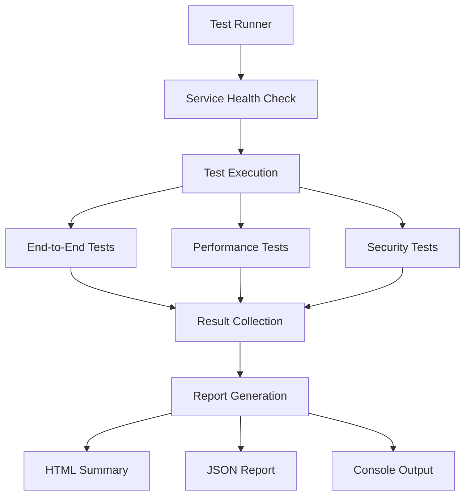
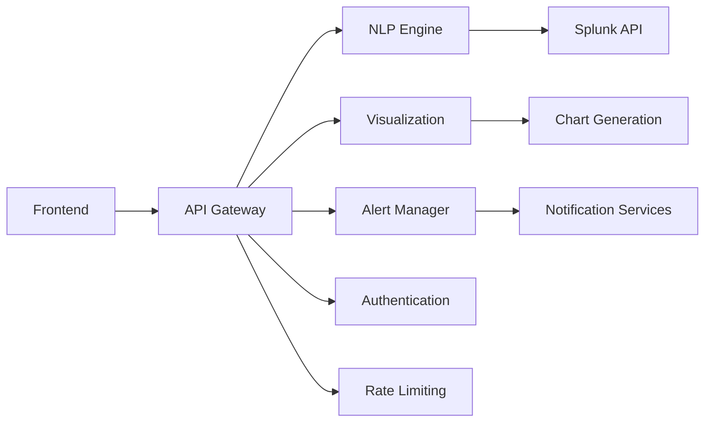

# Integration Testing Framework

## Overview

This directory contains comprehensive integration tests for the Splunk MCP Integration project. The testing framework validates end-to-end functionality, cross-service communication, performance characteristics, and security controls across all microservices.

## Test Categories

### 🔄 End-to-End Tests (`test_e2e_conversation_flow.py`)
- **Complete Conversation Flows**: Natural language query → SPL translation → visualization → dashboard
- **Cross-Service Integration**: API Gateway → NLP Engine → Visualization → Alert Manager
- **Bot Integration**: Slack and Teams bot integration workflows
- **Data Flow Validation**: Session consistency, caching, error propagation

### ⚡ Performance Tests (`test_performance_integration.py`)
- **Response Time Testing**: Service response time under various loads
- **Concurrent User Simulation**: Multi-user scenarios with realistic usage patterns
- **Database Performance**: CRUD operations under concurrent load
- **Memory Usage Monitoring**: Resource consumption during intensive operations
- **Rate Limiting**: Enforcement and performance impact testing
- **Scalability Testing**: Queue performance, WebSocket scaling, export job processing

### 🔒 Security Tests (`test_security_integration.py`)
- **Authentication Flows**: JWT token propagation and validation across services
- **Authorization Controls**: Role-based access control (RBAC) enforcement
- **Input Validation**: SQL injection, XSS, command injection prevention
- **Data Protection**: Sensitive data masking, encryption in transit
- **Security Headers**: Proper security header implementation
- **CORS Policy**: Cross-origin resource sharing policy enforcement

## Quick Start

### Prerequisites

```bash
# Python 3.9+ required
python3 --version

# Install dependencies
pip install -r requirements-test.txt

# Set up environment (optional)
make setup-env
source venv/bin/activate
```

### Running Tests

```bash
# Quick health check and smoke tests
make test-quick

# Run all integration tests
make test-all

# Run specific test categories
make test-e2e          # End-to-end tests only
make test-performance  # Performance tests only  
make test-security     # Security tests only

# Check service health
make test-health

# Generate reports only
make generate-report
```

### Test Output

Tests generate comprehensive reports:
- **HTML Summary**: `test_results/integration_summary.html` - Visual dashboard
- **JSON Report**: `test_results/integration_test_report.json` - Detailed data
- **Console Output**: Real-time test progress and summary

## Configuration

### Environment Variables

Key environment variables for test configuration:

```bash
# Service Endpoints
API_GATEWAY_HOST=localhost
API_GATEWAY_PORT=8000
NLP_ENGINE_HOST=localhost
NLP_ENGINE_PORT=8001
VISUALIZATION_HOST=localhost
VISUALIZATION_PORT=8002
ALERT_MANAGER_HOST=localhost
ALERT_MANAGER_PORT=8003

# Database Configuration
POSTGRES_HOST=localhost
POSTGRES_PORT=5432
POSTGRES_TEST_DB=test_splunk_mcp
REDIS_HOST=localhost
REDIS_PORT=6379
REDIS_TEST_DB=15

# Test Behavior
TEST_TIMEOUT=30
SKIP_SLOW_TESTS=false
```

### Test Configuration File

Create `test_config.json` for custom service configurations:

```json
{
  "api_gateway": {"host": "localhost", "port": 8000},
  "nlp_engine": {"host": "localhost", "port": 8001},
  "visualization": {"host": "localhost", "port": 8002},
  "alert_manager": {"host": "localhost", "port": 8003},
  "timeout": 30
}
```

## Test Architecture

### Framework Components

```
tests/integration/
├── conftest.py                    # Test fixtures and configuration
├── test_e2e_conversation_flow.py  # End-to-end integration tests
├── test_performance_integration.py # Performance and load tests
├── test_security_integration.py   # Security validation tests
├── test_runner.py                 # Test runner and reporting
├── Makefile                       # Test automation commands
└── README.md                      # This documentation
```

### Test Data Flow



### Service Dependencies

Tests validate communication across service boundaries:



## Test Scenarios

### 1. Complete User Journey
```python
# Natural language query → Visualization → Dashboard → Export
user_input = "Show me errors from the last hour and create a chart"
→ NLP Engine translates to SPL
→ Query execution (mocked)
→ Chart generation
→ Dashboard addition
→ PDF export
```

### 2. Cross-Service Data Flow
```python
# Session consistency across services
session_id = create_session()
→ Use session in NLP Engine
→ Use session in Alert Manager  
→ Validate session tracking
→ Verify audit trail
```

### 3. Performance Under Load
```python
# Concurrent user simulation
concurrent_users = 10
requests_per_user = 5
→ Simulate realistic usage patterns
→ Measure response times
→ Validate success rates
→ Check resource utilization
```

### 4. Security Validation
```python
# Authentication and authorization
→ Test JWT token validation
→ Verify RBAC enforcement
→ Validate input sanitization
→ Check data protection
```

## Advanced Usage

### Custom Test Execution

```bash
# Run with custom markers
python test_runner.py --markers="not slow" --paths=test_e2e_conversation_flow.py

# Skip health checks (for CI)
python test_runner.py --skip-health-check --output-dir=ci_results

# Debug mode with verbose output
make debug

# Profile test performance
make profile
```

### CI/CD Integration

```yaml
# Example GitHub Actions workflow
- name: Run Integration Tests
  run: |
    make ci-install
    make test-ci
    
- name: Upload Test Reports
  uses: actions/upload-artifact@v2
  with:
    name: integration-test-reports
    path: test_results/
```

### Docker Testing

```bash
# Run tests in Docker container
make docker-test

# Or manually
docker run --rm -v $(pwd):/workspace python:3.9 \
  bash -c "cd /workspace && pip install -r requirements-test.txt && make test-all"
```

## Test Development

### Adding New Tests

1. **Choose Test Category**: End-to-end, performance, or security
2. **Follow Patterns**: Use existing test structure and fixtures
3. **Use Helpers**: Leverage utility functions from `conftest.py`
4. **Add Documentation**: Include docstrings and comments

### Test Structure Example

```python
class TestNewFeature:
    """Test new feature integration."""
    
    @pytest.mark.asyncio
    async def test_feature_flow(
        self,
        auth_headers: Dict[str, str],
        sample_data: Dict[str, Any]
    ):
        """Test complete feature workflow."""
        # Step 1: Setup
        # Step 2: Execute
        # Step 3: Validate
        # Step 4: Cleanup
```

### Best Practices

- **Isolation**: Tests should not depend on each other
- **Mocking**: Mock external dependencies (Splunk API, email services)
- **Timeouts**: Use appropriate timeouts for async operations
- **Cleanup**: Clean up test data and resources
- **Assertions**: Use descriptive assertion messages
- **Documentation**: Document test purpose and expected behavior

### Debugging Tests

```bash
# Run single test with debug output
pytest test_e2e_conversation_flow.py::TestCompleteConversationFlow::test_query_to_visualization_flow -v -s

# Debug with breakpoints
pytest --pdb test_security_integration.py

# Capture logs
pytest --log-cli-level=DEBUG test_performance_integration.py
```

## Troubleshooting

### Common Issues

1. **Service Unavailable**: Check service health with `make test-health`
2. **Authentication Errors**: Verify JWT token configuration
3. **Timeout Errors**: Increase timeout values in test configuration
4. **Connection Refused**: Ensure services are running on expected ports
5. **Database Errors**: Check PostgreSQL and Redis connectivity

### Health Checks

```bash
# Manual service health checks
curl http://localhost:8000/health  # API Gateway
curl http://localhost:8001/health  # NLP Engine
curl http://localhost:8002/health  # Visualization
curl http://localhost:8003/health  # Alert Manager
```

### Log Analysis

```bash
# Check service logs
docker-compose logs api-gateway
docker-compose logs nlp-engine

# Test framework logs
tail -f test_results/integration_test.log
```

## Performance Benchmarks

### Expected Performance Metrics

| Test Category | Response Time | Success Rate | Concurrent Users |
|---------------|---------------|--------------|------------------|
| NLP Translation | < 2.0s | > 95% | 10 |
| Chart Generation | < 3.0s | > 90% | 5 |
| Dashboard Loading | < 1.0s | > 95% | 15 |
| Alert Creation | < 1.5s | > 95% | 10 |
| PDF Export | < 10.0s | > 85% | 3 |

### Performance Thresholds

Tests will fail if performance degrades beyond these thresholds:
- **Average Response Time**: > 3.0s for any API endpoint
- **Success Rate**: < 80% for any operation
- **Memory Usage**: > 500MB per service during normal operations
- **Database Response**: > 2.0s for CRUD operations

## Contributing

### Test Development Guidelines

1. **Follow Naming Conventions**: `test_<category>_<feature>.py`
2. **Use Type Hints**: All function parameters and returns
3. **Add Docstrings**: Describe test purpose and expected behavior
4. **Include Markers**: Use pytest markers for test categorization
5. **Update Documentation**: Update this README for new test categories

### Code Quality

```bash
# Run linting
make lint

# Check test coverage
make coverage

# Verify setup
make verify-setup
```

### Pull Request Checklist

- [ ] Tests pass locally (`make test-all`)
- [ ] New tests added for new features
- [ ] Documentation updated
- [ ] Performance impact assessed
- [ ] Security implications reviewed

## Support

For questions or issues with the integration testing framework:

1. Check this documentation
2. Review existing test patterns
3. Run diagnostic commands (`make verify-setup`)
4. Check service logs and health
5. Create GitHub issue with test output and logs

---

*This integration testing framework ensures the reliability, performance, and security of the Splunk MCP Integration across all service boundaries and user workflows.*